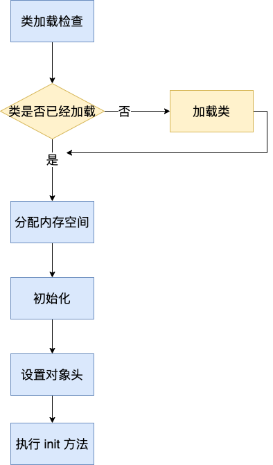
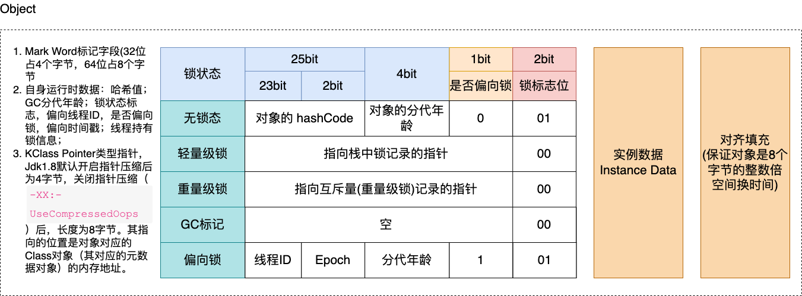

# JVM 内存结构
JVM 在运行的时候会将自己管理的区域划分为若干个不同的数据区域，如图所示：

1. 堆：程序运行过程中创建的的对象以及数组都要在堆上分配，这块区域是线程共享区域；
2. 栈：也可以称之为线程栈，存放线程的相关数据。因为程序启动就会有一个主线程开始执行，期间产生的数据就存放到栈内存中。比如：
   存储局部变量表、操作栈、动态链接、方法出口，对象指针；这块区域是线程私有的。
3. 本地方法栈：和栈一样，只不过这里是 C/C++ 代码运行的区域；这块区域是线程私有的；
4. 程序计数器：当前线程所执行的字节码的行号指示器。指向下一条要执行的指令。这块区域是线程私有的；
5. 方法区：存储了每个类的信息（包括类的名称、方法信息、字段信息）、静态变量、常量以及编译器编译后的代码等；

# 栈
前面也说过在主程序执行的时候，JVM 会为这个线程分配栈，存放线程中的局部变量，对象等信息。
下面以一个简单的例子说明一下栈的布局：
```java
public class TestExample {
    public static final int initData = 666;

    public int compute(){ // 一个方法对应一块栈帧区域
        int a = 1;  // 局部变量
        int b = 2;

        int c = (a+b)*10;

        return c;
    }

    public static void main(String[] args) {  // 主线程
        TestExample testExample = new TestExample();
        int count = testExample.compute();
        System.out.println("test=" + count);
    }
}
```
使用 javap 命令对 TestExample.class 文件进行反汇编，输出到 TestExample.txt 文档中。
也可以用 javap -c -l -p -v 这个命令进行反汇编，会把操作栈的深度、以及占用槽的大小都表示出来。
```text
Compiled from "TestExample.java"
public class com.anzhi.jvmmemorystructure.TestExample {
  public static final int initData;

  public com.anzhi.jvmmemorystructure.TestExample();
    Code:
       0: aload_0
       1: invokespecial #1                  // Method java/lang/Object."<init>":()V
       4: return

  public int compute();
    Code:
       0: iconst_1
       1: istore_1
       2: iconst_2
       3: istore_2
       4: iload_1
       5: iload_2
       6: iadd
       7: bipush        10
       9: imul
      10: istore_3
      11: iload_3
      12: ireturn

  public static void main(java.lang.String[]);
    Code:
       0: new           #2                  // class com/anzhi/jvmmemorystructure/TestExample
       3: dup
       4: invokespecial #3                  // Method "<init>":()V
       7: astore_1
       8: aload_1
       9: invokevirtual #4                  // Method compute:()I
      12: istore_2
      13: getstatic     #5                  // Field java/lang/System.out:Ljava/io/PrintStream;
      16: new           #6                  // class java/lang/StringBuilder
      19: dup
      20: invokespecial #7                  // Method java/lang/StringBuilder."<init>":()V
      23: ldc           #8                  // String test=
      25: invokevirtual #9                  // Method java/lang/StringBuilder.append:(Ljava/lang/String;)Ljava/lang/StringBuilder;
      28: iload_2
      29: invokevirtual #10                 // Method java/lang/StringBuilder.append:(I)Ljava/lang/StringBuilder;
      32: invokevirtual #11                 // Method java/lang/StringBuilder.toString:()Ljava/lang/String;
      35: invokevirtual #12                 // Method java/io/PrintStream.println:(Ljava/lang/String;)V
      38: return
}
```
具体过程参考 JVM 内存结构的图

根据图上的分析我们可以看到，程序开始运行，JVM 会分配一块儿"栈"区存放主线程的相关数据。上述代代码中：
1. 先将常量 1 放入操作数栈中，然后给局部变量的 a 赋值; 变量 b 的赋值过程也是如此；
2. 赋值完成之后，从局部变量中取出对应的值进行相加，然后压入栈中；
3. 再向操作栈中放入带符号的整型 10，进行相乘，放入栈中；
4. 将操作数栈中的数据取出，赋值给局部变量，然后再从局部变量取出返回

小结：
1. 操作数栈：从上面我们可以看出操作数栈主要用于保存计算的中间结果，同时作为临时变量的存储空间； 
2. 局部变量：局部变量表(Local Variable Table)是一组变量值存储空间，用于存放方法参数和方法内定义的局部变量。局部变量表的容量以变量槽
(Variable Slot)为最小单位，Java虚拟机规范并没有定义一个槽所应该占用内存空间的大小，但是规定了一个槽应该可以存放一个32位以内的数据类型。
虚拟机通过索引定位的方法查找相应的局部变量，索引的范围是从0~局部变量表最大容量。如果Slot是32位的，则遇到一个64位数据类型的变量
(如long或double型)，则会连续使用两个连续的Slot来存储。
3. 动态链接：在 Java 的 class 文件中，一个方法需要调用另一个方法，需要将这些方法的符号应用转换为其内存地址中的直接引用。而符号引用存在
于方法区中的运行时常量池。Java虚拟机栈中，每个栈帧都包含一个指向运行时常量池中该栈所属方法的符号引用，持有这个引用的目的是为了支持方法调
用过程中的动态连接(Dynamic Linking)。这些符号引用一部分会在类加载阶段或者第一次使用时就直接转化为直接引用，这类转化称为静态解析。另一部
分将在每次运行期间转化为直接引用，这类转化称为动态连接。
4. 方法返回：一般来说，方法正常退出时，调用者的PC计数值可以作为返回地址，栈帧中可能保存此计数值。而方法异常退出时，返回地址是通过异常处
理器表确定的，栈帧中一般不会保存此部分信息。

# 堆-JVM 创建对象过程
对象创建的主要流程如图所示：

## 类检查：
虚拟机遇到一条new指令时，首先将去检查这个指令的参数是否能在常量池中定位到一个类的符号引用，并且检查这个
符号引用代表的类是否已被加载、解析和初始化过。如果没有，那必须先执行相应的类加载过程。 new指令对应到语言层面上讲是， 
new关键词、对象克隆、对象序列化等。 

## 分配内存：
在类加载检查通过后，接下来虚拟机将为新生对象分配内存。对象所需内存的大小在类 加载完成后便可完全确定，为
对象分配空间的任务等同于把 一块确定大小的内存从Java堆中划分出来。 这个步骤有两个问题:
1. 如何划分内存。
2. 在并发情况下， 可能出现正在给对象A分配内存，指针还没来得及修改，对象B又同时使用了原来的指针来分配内存的 情况。

解决办法：
1. CAS(compare and swap)：虚拟机采用CAS配上失败重试的方式保证更新操作的原子性来对分配内存空间的动作进行同步处理。
2. 本地线程分配缓冲(Thread Local Allocation Buffer,TLAB)：把内存分配的动作按照线程划分在不同的空间之中进行，即每个线程在Java堆中预
   先分配一小块内存。通过 `-XX:+UseTLAB`.参数来设定虚拟机是否使用TLAB(JVM会默认开`-XX:+UseTLAB`), `-XX:TLABSize` 指定TLAB大小。

## 初始化
内存分配完成后，虚拟机需要将分配到的内存空间都初始化为零值(不包括对象头)， 如果使用TLAB，这一工作过程也 可以提前至TLAB分配时进行。这一
步操作保证了对象的实例字段在Java代码中可以不赋初始值就直接使用，程序能访问 到这些字段的数据类型所对应的零值。

## 设置对象头
如图是对象头的组成：

初始化零值之后，虚拟机要对对象进行必要的设置，例如这个对象是哪个类的实例、如何才能找到类的元数据信息、对 象的哈希码、对象的GC分代年龄等
信息。这些信息存放在对象的对象头Object Header之中。

在HotSpot虚拟机中，对象在内存中存储的布局可以分为3块区域:对象头(Header)、 实例数据(Instance Data) 和对齐填充(Padding)。 HotSpot虚
拟机的对象头包括两部分信息，第一部分用于存储对象自身的运行时数据， 如哈'希码(HashCode)、GC分代年龄、锁状态标志、线程持有的锁、
偏向线程ID、偏向时 间戳等。对象头的另外一部分 是类型指针，即对象指向它的类元数据的指针，虚拟机通过这个指针来确定这个对象是哪个类的实例。

下面这个 demo 可以查看对象在 JVM 中的信息：

引入依赖：
```xml
<!--查看对象头依赖-->
<dependency>
   <groupId>org.openjdk.jol</groupId>
   <artifactId>jol-core</artifactId>
   <version>0.14</version>
</dependency>
```
### 测试
代码：
```java
/**
 * 查看对象大小
 */
public class ObjectHeaderMsgDemo {
   public static void main(String[] args) {
      System.out.println("------------------Object对象头-----------------");
      ClassLayout layout = ClassLayout.parseInstance(new Object());
      System.out.println(layout.toPrintable());

      System.out.println("------------------数组对象---------------------");
      ClassLayout layout1 = ClassLayout.parseInstance(new int[]{});
      System.out.println(layout1.toPrintable());

      System.out.println("------------------我们创建的对象----------------");
      ClassLayout layout2 = ClassLayout.parseInstance(new MyClass());
      System.out.println(layout2.toPrintable());
   }

   static class MyClass {
      int id;
      String name;
      byte b;
      Object o;
   }
}
```
### 输出结果：
```text
------------------Object对象头-----------------
# WARNING: Unable to attach Serviceability Agent. You can try again with escalated privileges. Two options: a) use -Djol.tryWithSudo=true to try with sudo; b) echo 0 | sudo tee /proc/sys/kernel/yama/ptrace_scope
java.lang.Object object internals:
 OFFSET  SIZE   TYPE DESCRIPTION                               VALUE
      0     4        (object header)                           01 00 00 00 (00000001 00000000 00000000 00000000) (1)
      4     4        (object header)                           00 00 00 00 (00000000 00000000 00000000 00000000) (0)
      8     4        (object header)                           e5 01 00 f8 (11100101 00000001 00000000 11111000) (-134217243)
     12     4        (loss due to the next object alignment)
Instance size: 16 bytes
Space losses: 0 bytes internal + 4 bytes external = 4 bytes total

------------------数组对象---------------------
[I object internals:
 OFFSET  SIZE   TYPE DESCRIPTION                               VALUE
      0     4        (object header)                           01 00 00 00 (00000001 00000000 00000000 00000000) (1)
      4     4        (object header)                           00 00 00 00 (00000000 00000000 00000000 00000000) (0)
      8     4        (object header)                           6d 01 00 f8 (01101101 00000001 00000000 11111000) (-134217363)
     12     4        (object header)                           00 00 00 00 (00000000 00000000 00000000 00000000) (0)
     16     0    int [I.<elements>                             N/A
Instance size: 16 bytes
Space losses: 0 bytes internal + 0 bytes external = 0 bytes total

------------------我们创建的对象----------------
com.anzhi.objectheadermsg.ObjectHeaderMsgDemo$MyClass object internals:
 OFFSET  SIZE               TYPE DESCRIPTION                               VALUE
      0     4                    (object header)                           01 00 00 00 (00000001 00000000 00000000 00000000) (1)
      4     4                    (object header)                           00 00 00 00 (00000000 00000000 00000000 00000000) (0)
      8     4                    (object header)                           d6 cb 00 f8 (11010110 11001011 00000000 11111000) (-134165546)
     12     4                int MyClass.id                                0
     16     1               byte MyClass.b                                 0
     17     3                    (alignment/padding gap)                  
     20     4   java.lang.String MyClass.name                              null
     24     4   java.lang.Object MyClass.o                                 null
     28     4                    (loss due to the next object alignment)
Instance size: 32 bytes
Space losses: 3 bytes internal + 4 bytes external = 7 bytes total
```
### 分析
`loss due to the next object alignment` 由于对象补齐而造成的损失。可以看到不足 8 的倍数，虚拟机会自动补齐。为什么要这样做是因为计算机底层
系统确定的，这样读取效率更高。空间换时间。

`24     4   java.lang.Object MyClass.o`：jdk 8 默认开启指针压缩，占 4 个字节，否则占 8 个字节

### 为什么要进行指针压缩

1. 在64位平台的HotSpot中使用32位指针，内存使用会多出1.5倍左右，使用较大指针在主内存和缓存之间移动数据， 占用较大宽带，同时GC也会承受较大压力 
2. 为了减少64位平台下内存的消耗，启用指针压缩功能
3. 在jvm中，32位地址最大支持4G内存(2的32次方)，可以通过对对象指针的压缩编码、解码方式进行优化，使得jvm 只用32位地址就可以支持更大的内
存配置(小于等于32G) 
4. 堆内存小于4G时，不需要启用指针压缩，jvm会直接去除高32位地址，即使用低虚拟地址空间 
5. 堆内存大于32G时，压缩指针会失效，会强制使用64位(即8字节)来对java对象寻址，这就会出现1的问题，所以堆内 存不要大于32G为好

从 dk1.6 update14开始，在64bit操作系统中，JVM支持指针压缩。启用指针压缩:-XX:+UseCompressedOops(默认开启)，禁止指针压缩：
-XX:-UseCompressedOops