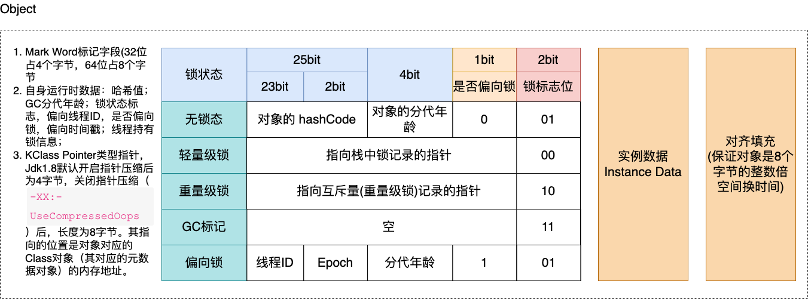
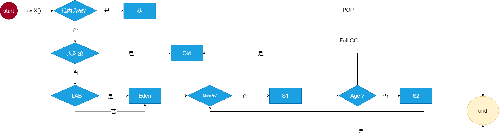

# JVM 内存结构
JVM 在运行的时候会将自己管理的区域划分为若干个不同的数据区域，如图所示：

1. 堆：程序运行过程中创建的的对象以及数组都要在堆上分配，这块区域是线程共享区域；
2. 栈：也可以称之为线程栈，存放线程的相关数据。因为程序启动就会有一个主线程开始执行，期间产生的数据就存放到栈内存中。比如：
   存储局部变量表、操作栈、动态链接、方法出口，对象指针；这块区域是线程私有的。
3. 本地方法栈：和栈一样，只不过这里是 C/C++ 代码运行的区域；这块区域是线程私有的；
4. 程序计数器：当前线程所执行的字节码的行号指示器。指向下一条要执行的指令。这块区域是线程私有的；
5. 方法区：存储了每个类的信息（包括类的名称、方法信息、字段信息）、静态变量、常量以及编译器编译后的代码等；

# 栈
前面也说过在主程序执行的时候，JVM 会为这个线程分配栈，存放线程中的局部变量，对象等信息。
下面以一个简单的例子说明一下栈的布局：
```java
public class TestExample {
    public static final int initData = 666;

    public int compute(){ // 一个方法对应一块栈帧区域
        int a = 1;  // 局部变量
        int b = 2;

        int c = (a+b)*10;

        return c;
    }

    public static void main(String[] args) {  // 主线程
        TestExample testExample = new TestExample();
        int count = testExample.compute();
        System.out.println("test=" + count);
    }
}
```
使用 javap 命令对 TestExample.class 文件进行反汇编，输出到 TestExample.txt 文档中。
也可以用 javap -c -l -p -v 这个命令进行反汇编，会把操作栈的深度、以及占用槽的大小都表示出来。
```text
Compiled from "TestExample.java"
public class com.anzhi.jvmmemorystructure.TestExample {
  public static final int initData;

  public com.anzhi.jvmmemorystructure.TestExample();
    Code:
       0: aload_0
       1: invokespecial #1                  // Method java/lang/Object."<init>":()V
       4: return

  public int compute();
    Code:
       0: iconst_1
       1: istore_1
       2: iconst_2
       3: istore_2
       4: iload_1
       5: iload_2
       6: iadd
       7: bipush        10
       9: imul
      10: istore_3
      11: iload_3
      12: ireturn

  public static void main(java.lang.String[]);
    Code:
       0: new           #2                  // class com/anzhi/jvmmemorystructure/TestExample
       3: dup
       4: invokespecial #3                  // Method "<init>":()V
       7: astore_1
       8: aload_1
       9: invokevirtual #4                  // Method compute:()I
      12: istore_2
      13: getstatic     #5                  // Field java/lang/System.out:Ljava/io/PrintStream;
      16: new           #6                  // class java/lang/StringBuilder
      19: dup
      20: invokespecial #7                  // Method java/lang/StringBuilder."<init>":()V
      23: ldc           #8                  // String test=
      25: invokevirtual #9                  // Method java/lang/StringBuilder.append:(Ljava/lang/String;)Ljava/lang/StringBuilder;
      28: iload_2
      29: invokevirtual #10                 // Method java/lang/StringBuilder.append:(I)Ljava/lang/StringBuilder;
      32: invokevirtual #11                 // Method java/lang/StringBuilder.toString:()Ljava/lang/String;
      35: invokevirtual #12                 // Method java/io/PrintStream.println:(Ljava/lang/String;)V
      38: return
}
```
具体过程参考 JVM 内存结构的图

根据图上的分析我们可以看到，程序开始运行，JVM 会分配一块儿"栈"区存放主线程的相关数据。上述代代码中：
1. 先将常量 1 放入操作数栈中，然后给局部变量的 a 赋值; 变量 b 的赋值过程也是如此；
2. 赋值完成之后，从局部变量中取出对应的值进行相加，然后压入栈中；
3. 再向操作栈中放入带符号的整型 10，进行相乘，放入栈中；
4. 将操作数栈中的数据取出，赋值给局部变量，然后再从局部变量取出返回

小结：
1. 操作数栈：从上面我们可以看出操作数栈主要用于保存计算的中间结果，同时作为临时变量的存储空间； 
2. 局部变量：局部变量表(Local Variable Table)是一组变量值存储空间，用于存放方法参数和方法内定义的局部变量。局部变量表的容量以变量槽
(Variable Slot)为最小单位，Java虚拟机规范并没有定义一个槽所应该占用内存空间的大小，但是规定了一个槽应该可以存放一个32位以内的数据类型。
虚拟机通过索引定位的方法查找相应的局部变量，索引的范围是从0~局部变量表最大容量。如果Slot是32位的，则遇到一个64位数据类型的变量
(如long或double型)，则会连续使用两个连续的Slot来存储。
3. 动态链接：在 Java 的 class 文件中，一个方法需要调用另一个方法，需要将这些方法的符号应用转换为其内存地址中的直接引用。而符号引用存在
于方法区中的运行时常量池。Java虚拟机栈中，每个栈帧都包含一个指向运行时常量池中该栈所属方法的符号引用，持有这个引用的目的是为了支持方法调
用过程中的动态连接(Dynamic Linking)。这些符号引用一部分会在类加载阶段或者第一次使用时就直接转化为直接引用，这类转化称为静态解析。另一部
分将在每次运行期间转化为直接引用，这类转化称为动态连接。
4. 方法返回：一般来说，方法正常退出时，调用者的PC计数值可以作为返回地址，栈帧中可能保存此计数值。而方法异常退出时，返回地址是通过异常处
理器表确定的，栈帧中一般不会保存此部分信息。

# 堆-JVM 创建对象过程
对象创建的主要流程如图所示：

## 类检查：
虚拟机遇到一条new指令时，首先将去检查这个指令的参数是否能在常量池中定位到一个类的符号引用，并且检查这个
符号引用代表的类是否已被加载、解析和初始化过。如果没有，那必须先执行相应的类加载过程。 new指令对应到语言层面上讲是， 
new关键词、对象克隆、对象序列化等。 

## 分配内存：
在类加载检查通过后，接下来虚拟机将为新生对象分配内存。对象所需内存的大小在类 加载完成后便可完全确定，为
对象分配空间的任务等同于把 一块确定大小的内存从Java堆中划分出来。 这个步骤有两个问题:
1. 如何划分内存。
2. 在并发情况下， 可能出现正在给对象A分配内存，指针还没来得及修改，对象B又同时使用了原来的指针来分配内存的 情况。

解决办法：
1. CAS(compare and swap)：虚拟机采用CAS配上失败重试的方式保证更新操作的原子性来对分配内存空间的动作进行同步处理。
2. 本地线程分配缓冲(Thread Local Allocation Buffer,TLAB)：把内存分配的动作按照线程划分在不同的空间之中进行，即每个线程在Java堆中预
   先分配一小块内存。通过 `-XX:+UseTLAB`.参数来设定虚拟机是否使用TLAB(JVM会默认开`-XX:+UseTLAB`), `-XX:TLABSize` 指定TLAB大小。

## 初始化
内存分配完成后，虚拟机需要将分配到的内存空间都初始化为零值(不包括对象头)， 如果使用TLAB，这一工作过程也 可以提前至TLAB分配时进行。这一
步操作保证了对象的实例字段在Java代码中可以不赋初始值就直接使用，程序能访问 到这些字段的数据类型所对应的零值。

## 设置对象头
如图是对象头的组成：

初始化零值之后，虚拟机要对对象进行必要的设置，例如这个对象是哪个类的实例、如何才能找到类的元数据信息、对 象的哈希码、对象的GC分代年龄等
信息。这些信息存放在对象的对象头Object Header之中。

在HotSpot虚拟机中，对象在内存中存储的布局可以分为3块区域:对象头(Header)、 实例数据(Instance Data) 和对齐填充(Padding)。 HotSpot虚
拟机的对象头包括两部分信息，第一部分用于存储对象自身的运行时数据， 如哈'希码(HashCode)、GC分代年龄、锁状态标志、线程持有的锁、
偏向线程ID、偏向时 间戳等。对象头的另外一部分 是类型指针，即对象指向它的类元数据的指针，虚拟机通过这个指针来确定这个对象是哪个类的实例。

下面这个 demo 可以查看对象在 JVM 中的信息：

引入依赖：
```xml
<!--查看对象头依赖-->
<dependency>
   <groupId>org.openjdk.jol</groupId>
   <artifactId>jol-core</artifactId>
   <version>0.14</version>
</dependency>
```
### 测试
代码：
```java
/**
 * 查看对象大小
 */
public class ObjectHeaderMsgDemo {
   public static void main(String[] args) {
      System.out.println("------------------Object对象头-----------------");
      ClassLayout layout = ClassLayout.parseInstance(new Object());
      System.out.println(layout.toPrintable());

      System.out.println("------------------数组对象---------------------");
      ClassLayout layout1 = ClassLayout.parseInstance(new int[]{});
      System.out.println(layout1.toPrintable());

      System.out.println("------------------我们创建的对象----------------");
      ClassLayout layout2 = ClassLayout.parseInstance(new MyClass());
      System.out.println(layout2.toPrintable());
   }

   static class MyClass {
      int id;
      String name;
      byte b;
      Object o;
   }
}
```
### 输出结果：
```text
------------------Object对象头-----------------
# WARNING: Unable to attach Serviceability Agent. You can try again with escalated privileges. Two options: a) use -Djol.tryWithSudo=true to try with sudo; b) echo 0 | sudo tee /proc/sys/kernel/yama/ptrace_scope
java.lang.Object object internals:
 OFFSET  SIZE   TYPE DESCRIPTION                               VALUE
      0     4        (object header)                           01 00 00 00 (00000001 00000000 00000000 00000000) (1)
      4     4        (object header)                           00 00 00 00 (00000000 00000000 00000000 00000000) (0)
      8     4        (object header)                           e5 01 00 f8 (11100101 00000001 00000000 11111000) (-134217243)
     12     4        (loss due to the next object alignment)
Instance size: 16 bytes
Space losses: 0 bytes internal + 4 bytes external = 4 bytes total

------------------数组对象---------------------
[I object internals:
 OFFSET  SIZE   TYPE DESCRIPTION                               VALUE
      0     4        (object header)                           01 00 00 00 (00000001 00000000 00000000 00000000) (1)
      4     4        (object header)                           00 00 00 00 (00000000 00000000 00000000 00000000) (0)
      8     4        (object header)                           6d 01 00 f8 (01101101 00000001 00000000 11111000) (-134217363)
     12     4        (object header)                           00 00 00 00 (00000000 00000000 00000000 00000000) (0)
     16     0    int [I.<elements>                             N/A
Instance size: 16 bytes
Space losses: 0 bytes internal + 0 bytes external = 0 bytes total

------------------我们创建的对象----------------
com.anzhi.objectheadermsg.ObjectHeaderMsgDemo$MyClass object internals:
 OFFSET  SIZE               TYPE DESCRIPTION                               VALUE
      0     4                    (object header)                           01 00 00 00 (00000001 00000000 00000000 00000000) (1)
      4     4                    (object header)                           00 00 00 00 (00000000 00000000 00000000 00000000) (0)
      8     4                    (object header)                           d6 cb 00 f8 (11010110 11001011 00000000 11111000) (-134165546)
     12     4                int MyClass.id                                0
     16     1               byte MyClass.b                                 0
     17     3                    (alignment/padding gap)                  
     20     4   java.lang.String MyClass.name                              null
     24     4   java.lang.Object MyClass.o                                 null
     28     4                    (loss due to the next object alignment)
Instance size: 32 bytes
Space losses: 3 bytes internal + 4 bytes external = 7 bytes total
```
### 分析
`loss due to the next object alignment` 由于对象补齐而造成的损失。可以看到不足 8 的倍数，虚拟机会自动补齐。为什么要这样做是因为计算机底层
系统确定的，这样读取效率更高。空间换时间。

`24     4   java.lang.Object MyClass.o`：jdk 8 默认开启指针压缩，占 4 个字节，否则占 8 个字节

### 为什么要进行指针压缩

1. 在64位平台的HotSpot中使用32位指针，内存使用会多出1.5倍左右，使用较大指针在主内存和缓存之间移动数据， 占用较大宽带，同时GC也会承受较大压力 
2. 为了减少64位平台下内存的消耗，启用指针压缩功能
3. 在jvm中，32位地址最大支持4G内存(2的32次方)，可以通过对对象指针的压缩编码、解码方式进行优化，使得jvm 只用32位地址就可以支持更大的内
存配置(小于等于32G) 
4. 堆内存小于4G时，不需要启用指针压缩，jvm会直接去除高32位地址，即使用低虚拟地址空间 
5. 堆内存大于32G时，压缩指针会失效，会强制使用64位(即8字节)来对java对象寻址，这就会出现1的问题，所以堆内 存不要大于32G为好

从 dk1.6 update14开始，在64bit操作系统中，JVM支持指针压缩。启用指针压缩:-XX:+UseCompressedOops(默认开启)，禁止指针压缩：
-XX:-UseCompressedOops(压缩所有指针)；-XX:+UseCompressedClassPointers：默认开启，只压缩对象头里的类型指针 KClass Pointer

### 32位最大支持4G内存，到底是怎么算出来的？
内存也是存储介质，内存里存放的数据其实也是只是存放0或者1这两个二进制数字，所以可以内存里有海量的小格子，每1个格子是1个bit，小格子里面就只能存放
0或1。计算机规定8bit=1byte 就是1字节=8位。所以一个 8 byte大小内存如图所示：

那就将4GB转换为bit就可以了

4GB = 2^2 GB = 2^12 MB = 2^22 KB = 2^32 byte = 2^35 bit

如果每一个格子一个地址的话？那么要想全部都访问4GB的内存就需要 35位，32位是不够的。

那么32位系统是如何访问4GB的内存的呢？

**实际上内存是把8个bit排成1组， 每1组成为1个单位， 大小是1byte(字节）， cpu每一次只能访问1个byte， 而不能单独去访问具体的1个小格子(bit).
1个byte字节就是内存的最小的IO单位。所以计算机的32位表示32个地址，在计算机寻址的时候，每次访问的时是一个字节，即 8 bit, 因此换算过来的话就是 2^32 * 2^3=4GB=2^35**
就这样算出了 2^32=4GB。

而压缩指针也采用了这样的原理：指针压缩将 8 byte排成一组，CPU 寻址每次访问 8 字节，也就意味着 CPU寻址的时候是 32 位的 8 倍，所以将访问内存扩大到了 32GB。
这也解释了为什么堆内存达到 32GB 之后，开启指针压缩的参数会失效。

# 对象内存分配过程
## 栈分配
对象内存分配过程如图所示：

通过图中我们可以看到对象不仅仅会存放到堆上，还会存放到栈中。那么什么样的对象会存放到栈中，什么样的对象会存放到堆中？那为什么要将对象存放到
栈中？

1. 对象为什么要存放到栈中：
   1. 背景：JVM 回收对象是根据对象有没有被引用来判定的。当对象没有被引用，需要 GC 进行来及回收。当对象过多时，会给 GC 带
   来压力，进而影响程序性能。
   2. 分析：在这些对象中存在一些临时对象，这些应该随着局部变量一起消亡，而不是要等到 GC 进行垃圾回收；
   3. 解决：前面谈到的栈就具备这一特性，当某一个方法执行完成，它对应的栈也就消亡了，这样就减轻了 GC 压力，因此才需要将这些临时对象存放到
   栈中；
2. 什么样的对象要存放到栈中：
   1. JVM 通过**逃逸分析**确定该对象不会被外部访问，如果不会逃逸，那么这种对象就会被存放到栈中(如果对象太大，也是要放入堆中)；
   2. 逃逸分析：就是分析对象动态作用域，当一个对象在方法中被定义后，它可能被外部方法所引用，例如作为调用参 数传递到其他地方中。代码如下：


```java
public class User {
    public User test(){
        User user = new User();
        user.setId(1);
        
        return user;
    }

   public void test1(){
      User user = new User();
      user.setId(1);

      // 将数据保存到数据库中
   }
}
```

test() 方法中将 User 对象返回，具体的作用域显然不确定。test1() 方法中可以确定方法结束就可以认为这个对象无效了，那么像这种对象就可以将其
放入栈中。该对象在方法结束时随着栈内存释放一起被回收。

### 对象逃逸分析
JVM 可以通过开启逃逸分析参数(-XX:+DoEscapeAnalysis)来优化对象内存分配位置，使其通过**标量替换** 优先分配在栈上(栈上分配)，
JDK7之后默认开启逃逸分析，如果要关闭使用参数(-XX:-DoEscapeAnalysis)

### 标量替换
JVM **针对逃逸分析过后的对象**，在**确定对象不会被外部引用**，且可以进一步分解的时候，**JVM 不会创建这个对象**，而是将该 对象成员变量分解若干个
被这个方法使用的成员变量所代替，这些代替的成员变量在栈帧或寄存器上分配空间，这样就 不会因为没有**一大块连续空间导致对象内存不够分配**。开启标
量替换参数(-XX:+EliminateAllocations)，JDK7之后默认开启。

### 标量与聚合量
标量与聚合量:标量即不可被进一步分解的量，而JAVA的基本数据类型就是标量(如:int，long等基本数据类型以及 reference类型等)，标量的对立就是
可以被进一步分解的聚合量。在JAVA中对象就是可以被进一步分解的聚合量。

### 栈上分配示例
```java
public class JvmStackDemo {
    public static void main(String[] args) {
        long start = System.currentTimeMillis();
        // 创建一亿个对象
        for (int i = 0; i < 100000000; i++) {
            alloc();
        }
        long end = System.currentTimeMillis();
        System.out.println(end - start);
    }

    private static void alloc() {
        ObjectStack stack = new ObjectStack();
        stack.setId(1);
    }
}
```
测试准备：
```text
在 JVM 运行参数中添加如下参数：
-Xms15m -Xmx15m -XX:+DoEscapeAnalysis -XX:+PrintGC -XX:+EliminateAllocations
‐XX:+DoEscapeAnalysis 开启逃逸分析 jdk1.8 默认是开启的
‐XX:+PrintGC 打印 JVM GC 情况，
‐XX:+EliminateAllocations：开启标量替换，jdk1.8 默认是开启的

来看一下创建一亿个对象耗时：
4 ms

第二组测试：修改 JVM 运行参数为：
-Xms15m -Xmx15m -XX:-DoEscapeAnalysis -XX:+PrintGC -XX:+EliminateAllocations
关闭逃逸分析，开其标量替换，前面提到过，标量替换的前提是先逃逸分析确定对象是否会逃逸。所以这里即使开启标量替换也没有用。
输出结果：
[GC (Allocation Failure)  4800K->704K(15872K), 0.0006908 secs]
[GC (Allocation Failure)  4800K->704K(15872K), 0.0004479 secs]
……
562
出现了大量 GC，耗时 562 ms

第三组测试：开启逃逸分析，关闭标量替换
-Xms15m -Xmx15m -XX:+DoEscapeAnalysis -XX:+PrintGC -XX:-EliminateAllocations
输出结果：
[GC (Allocation Failure)  4880K->784K(15872K), 0.0002781 secs]
[GC (Allocation Failure)  4880K->784K(15872K), 0.0002764 secs]
[GC (Allocation Failure)  4880K->784K(15872K), 0.0002750 secs]
[GC (Allocation Failure)  4880K->784K(15872K), 0.0002786 secs]
……
同样出现了大量 GC，耗时 509
```
从上面三组测试来看，栈上分配依赖于逃逸分析于标量替换。

## 堆分配
如果栈中放不下对象，就要将对象放入堆中。JVM 将堆分为了 新生代、老年代。而新生代进一步被划分为 Eden 区 Survivor 区，这两个区的比例为 8:1;
Survivor 区进一步被划分为 Survivor to 区和 Survivor From 区(这两个区的名称是相互转换的)，比例 1:1。

### TLAB 说明
#### TLAB 背景
堆是一个线程共享的区域。因此多线程下为各自对象分配内存空间是不安全的，不安全就需要上锁，但是上锁就会导致性能下降。因此直接在 Eden 区分配
内存空间之前，JVM 为每一个线程创建各自的私有缓存空间 TLAB，这样就避免了锁的开销，当 TLAB 空间使用完了或者 TLAB 无法存放这个对象的时候，
才会使用 CSA 在公共的 Eden 区为对象分配空间(TLAB 包含在 Eden 区中), 这种内存分配方式称为**快速分配策略**。

#### TLAB 介绍：
1. 尽管不是所有的对象实例都能够在TLAB中成功分配内存，但JVM确实是TLAB作为内存分配的首选。
2. 在程序中，开发人员可以通过选项“-XX:UseTLAB”设置是否开启TLAB空间。
3. 默认情况下，TLAB空间的内存非常小，仅占有整个Eden空间的1%，当然我们可以通过选项“-XX:TLABWasteTargetPercent”设置TLAB空间所占用Eden空间的百分比大小。
4. 一旦对象在TLAB空间分配内存失败时，JVM就会尝试着通过使用加锁机制确保数据操作的原子性，从而直接在Eden空间中分配内存。

### Eden 区
大部分的对象刚创建的时候是要存放到 Eden 区的，Eden 区放满以后会触发一次 minor gc，大部分对象会被回收掉，剩余存活的对象会被转移到 Survivor 区；
当 Eden 再次被放满的时候，还会触发 minor gc，此时 JVM 不仅仅会回收掉 Eden 区的垃圾对象，还会回收 Survivor 区的对象，将存活的对象放入另一块
Survivor 区中。

在新生代的中存放的对象都具有"朝生夕死"的特点，生命周期较短，每进行一次 Minor GC 后，剩余存活的对象是非常少的。因此 JVM 才会将 Eden 区
设置的尽量大，Survivor 较小。JVM默认有这个参数-XX:+UseAdaptiveSizePolicy(默认开启)，会导致这个8:1:1比例自动变化，如果不想这个比例有
变化可以设置参数-XX:-UseAdaptiveSizePolicy


可以通过下面的 demo 测试一下：
```java
/**
 * 添加 JVM 运行参数：-XX:+PrintGCDetails
 * 观察 Eden 区到 Survivor 区
 */
public class MinorGcEdenDemo {
   public static void main(String[] args) {
      byte[] allocation1, allocation2;
      // 创建一个 242M 大小的数组对象
      allocation1 = new byte[242000*1024];
   }
}
```
输出结果
```text
Heap
 PSYoungGen      total 305664K, used 262144K [0x000000066ab00000, 0x0000000680000000, 0x00000007c0000000)
  eden space 262144K, 100% used [0x000000066ab00000,0x000000067ab00000,0x000000067ab00000)
  from space 43520K, 0% used [0x000000067d580000,0x000000067d580000,0x0000000680000000)
  to   space 43520K, 0% used [0x000000067ab00000,0x000000067ab00000,0x000000067d580000)
 ParOldGen       total 699392K, used 0K [0x00000003c0000000, 0x00000003eab00000, 0x000000066ab00000)
  object space 699392K, 0% used [0x00000003c0000000,0x00000003c0000000,0x00000003eab00000)
 Metaspace       used 3201K, capacity 4496K, committed 4864K, reserved 1056768K
  class space    used 352K, capacity 388K, committed 512K, reserved 1048576K
```
根据输出结果可以看到 Eden 区已经被占满了。 Survivor From 和 Survivor To 区未使用。接着验证当 Eden 区放满，进行一次 Minor GC 后，是否
会讲存活的对象放入 Survivor 区。但是 Eden 区存放的对象是 242m， Survivor 区无法存放这么大的数据，就会放入老年代。
```java
/**
 * 添加 JVM 运行参数：-XX:+PrintGCDetails
 * 观察 Eden 区到 Survivor 区
 */
public class MinorGcEdenDemo {
    public static void main(String[] args) {
        byte[] allocation1, allocation2;
        // 创建一个 242m 大小的数组对象 占满 Eden 区
        allocation1 = new byte[242000*1024];
        // 再创建一个 8m 大小的数据对象
        allocation2 = new byte[8000*1024];
    }
}
```
输出结果：
```text
[GC (Allocation Failure) [PSYoungGen: 257728K->672K(305664K)] 257728K->242680K(1005056K), 0.1512186 secs] [Times: user=1.73 sys=0.08, real=0.15 secs] 
Heap
 PSYoungGen      total 305664K, used 11293K [0x000000066ab00000, 0x0000000690000000, 0x00000007c0000000)
  eden space 262144K, 4% used [0x000000066ab00000,0x000000066b55f748,0x000000067ab00000)
  from space 43520K, 1% used [0x000000067ab00000,0x000000067aba8020,0x000000067d580000)
  to   space 43520K, 0% used [0x000000068d580000,0x000000068d580000,0x0000000690000000)
 ParOldGen       total 699392K, used 242008K [0x00000003c0000000, 0x00000003eab00000, 0x000000066ab00000)
  object space 699392K, 34% used [0x00000003c0000000,0x00000003cec56010,0x00000003eab00000)
 Metaspace       used 3201K, capacity 4496K, committed 4864K, reserved 1056768K
  class space    used 352K, capacity 388K, committed 512K, reserved 1048576K
```
根据结果可以看到发生了一次 GC，此时 Eden 被清空后有存放了 8m 的数据，而原来 242m 的数据被放入了老年代。

### 大对象
大对象指那种需要大量连续空间的对象(比如字符串，数组)。 JVM 参数可以通过 -XX:PretenureSizeThreshold 设置大对象，如果对象的大小超过设置的
阈值，对象会被直接放入老年代中。这个参数只在 Serial 和 ParNew 两个收集器下有效。

设置大对象的原因是因为，如果程序中存在很多大对象，那么就可以直接设置 JVM 参数值，让其进入老年代，而不需要在年轻代来回移动，从而降低性能。

### 在 Eden 区的对象什么时候进入老年代
在 Eden 区放满对象后，会触发一次 Minor GC，此时会清空 Eden 区，将对象移动到 Survivor 区，如果存放不下，才会移动到老年代，那么如果经过
多次 GC 后，对象依然存活，那么这些对象应该被存放到老年代中，而不是 Eden区，因为Eden区存放的都是"朝生夕死"的对象。那么如何判断这些对象

### 对象动态年龄判断


