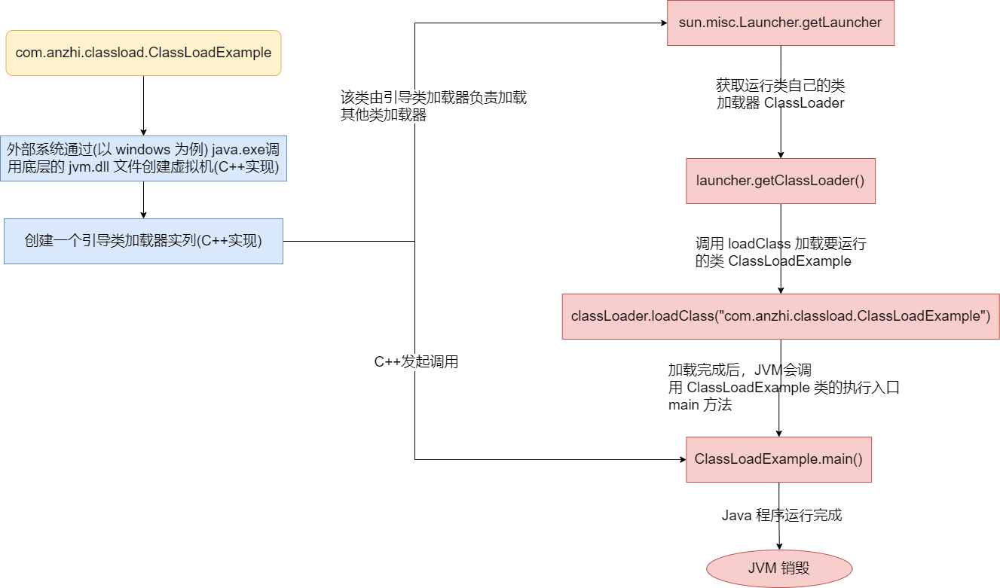
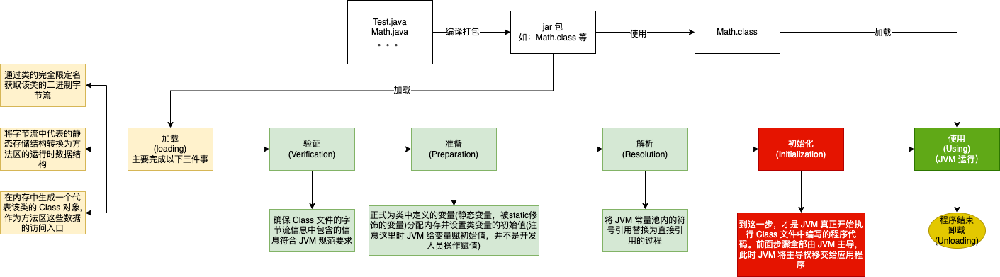
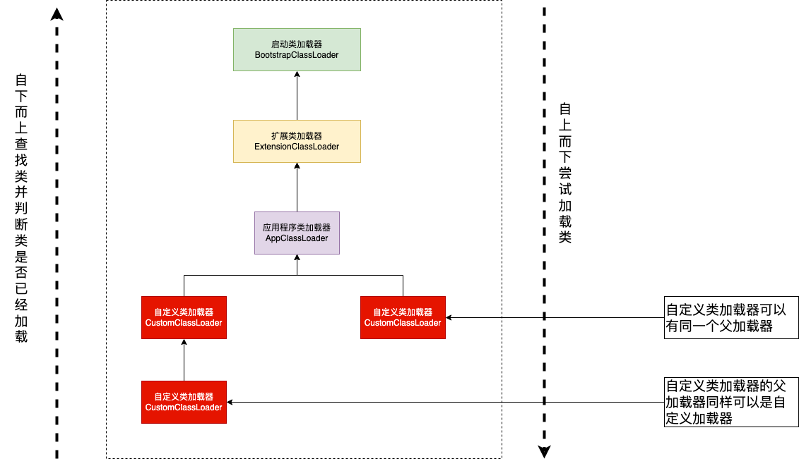

# Class 文件
Java 虚拟机并不是单单只能运行 Java 这一种语言。Java 虚拟机不与任何语言绑定，它只与 “Class” 文件这种特定的二进制文件格式关联。为此制定了很多强
制性的语法和结构约束化。只要按照 “Class” 文件要求格式，那么任何一种语言都可以通将 Java 虚拟机作为他们的语言运行基础，以 “Class” 文件作为他们产品
的交付媒介。以 Java 为例，先了解 Java 如和编译运行，然后在介绍 “Class” 文件的结构。
# 类加载过程
先来看一段代码：
```java
/**
 * 类加载演示
 */
public class ClassLoadExample {
    public static void myPrintf(){ // 一个方法对应一块栈帧内存区域
        System.out.println("类加载");
    }

    public static void main(String[] args) {
        myPrintf();
    }
}
```
Java 加载过程大致流程如下：

可以看到前面基本是由 C++ 完成的，对于 Java 来说是不可见的。所以主要了解一下 loadClass 这块。

## 类加载时机
一个类被加载到虚拟机开始，然后到被卸载，整个生命周期会经历 加载(loading)、验证(Verification)、准备(Preparation)、解析(Resolution)、
初始化(Initialization)、使用(Using)和卸载(Unloading)七个阶段。其中验证、准备、解析统称为连接(Lingking)。如下图所示：


## 类加载器
在了解了类加载器的过程之后，再来看一下类加载器是怎么工作的。

在 Java 中，对于每一个类都必须由它的类加载器和这个类本身一起共同确立其在 Java 虚拟机中的唯一性，每一个类都有一个独立的类名称空间。因此判断两个类
是否“相等”，只有在这两个类是由同一个类加载器加载的前提下比较才有意义。否则即使两个类来源于同一个 Class 文件，被同一个 Java 虚拟机加载，只要加载他
们的类加载器不同，那么两个类就必定不相等。
```java
/**
 * 类加载器与 instanceof 关键字演示
 */
public class ClassLoaderDemoCompare {
    public static void main(String[] args) throws Exception{
        // 重写 loadClass 方法加载 ClassLoaderDemoCompare 类
        ClassLoader myLoader = new ClassLoader() {
            @Override
            public Class<?> loadClass(String name) throws ClassNotFoundException {
                try{
                    String fileName = name.substring(name.lastIndexOf(".") + 1) + ".class";
                    InputStream is = getClass().getResourceAsStream(fileName);
                    if(Objects.isNull(is)){
                        return super.loadClass(name);
                    }

                    byte[] b = new byte[is.available()];
                    is.read(b);
                    return defineClass(name, b, 0, b.length);
                }catch (IOException e){
                    throw new ClassNotFoundException(name);
                }
            }
        };

        Object obj = myLoader.loadClass("com.anzhi.classload.ClassLoaderDemoCompare").newInstance();

        System.out.println(obj.getClass());
        System.out.println(obj instanceof com.anzhi.classload.ClassLoaderDemoCompare);
    }
}
```
上述代码中我们构造了一个简单的类加载器，从第一行输出的结果来看，类确实是 class com.anzhi.classload.ClassLoaderDemoCompare 实例化出来的，但是
通过我们自定义的类加载器实例化出来的类与 com.anzhi.classload.ClassLoaderDemoCompare 做属性检查的时候返回了 false。前者是自定义类加载器加载的，
后者是通过应用程序类加载器加载的。

从 JVM 层面来看，加载器被分为两种：一种是启动类加载器(Bootstrap ClassLoader), 这种类加载器使用 C++ 语言实现，是虚拟机自身的一部分；另外一种
就是其他所有的类加载器。这些加载器由 Java 语言实现，独立于虚拟机之外，并且全部继承自抽象类：java.lang.ClassLoader

站在开发人员的角度来看，类加载器可以进一步划分为：
1. 启动类加载器：主要负责加载存放在 <JAVA_HOME>\lib 目录下的文件，或者被 -Xbootclasspath 参数所指定的路径中存放的文件；这个加载器无法被 Java 程序
直接使用；
2. 扩展类加载器：这个类加载器是在 sun.misc.Launcher$ExtClassLoader 中以 Java 代码的形式实现的。它负责加载<JAVA_HOME>\lib\ext 下、或者
被 java.ext.dirs 系统变量所指定的路径中的所有类库。由于是 Java 实现的，所以我们可以使用它来加载 Class 文件。
3. 应用程序类加载器：这个类加载器由 sun.misc.Launcher$AppClassLoader 来实现。负责加载用户类路径(ClassPath)上所有的类库，开发者同样可以直接
在代码中使用这个类加载器。

以上是类加载器的介绍。代码验证一下类加载器：
```java
public class PrintfClassLoader {
    public static void main(String[] args) {
        System.out.println("C++ 实现的启动类加载器，Java 无法获取" + String.class.getClassLoader());
        System.out.println(com.sun.crypto.provider.DESKeyFactory.class.getClassLoader().getClass().getName());
        System.out.println(PrintfClassLoader.class.getClassLoader().getClass().getName());
        System.out.println();

        ClassLoader appClassLoader = ClassLoader.getSystemClassLoader();
        ClassLoader extClassloader = appClassLoader.getParent();
        ClassLoader bootstrapLoader = extClassloader.getParent();

        System.out.println("the bootstrapLoader : " + bootstrapLoader);
        System.out.println("the extClassloader : " + extClassloader);
        System.out.println("the appClassLoader : " + appClassLoader);

        System.out.println(); System.out.println("bootstrapLoader加载以下文件:");

        URL[] urls = Launcher.getBootstrapClassPath().getURLs(); for (int i = 0; i < urls.length; i++) {
            System.out.println(urls[i]);
        }

        System.out.println(); System.out.println("extClassloader加载以下文件:"); System.out.println(System.getProperty("java.ext.dirs"));
        System.out.println(); System.out.println("appClassLoader加载以下文件:"); System.out.println(System.getProperty("java.class.path"));

    }
}
```

## 双亲委派机制
如下图是双亲委派机制模型：

双亲委派模型的工作过程是：如果一个类加载器收到了类加载器的请求，它首先不会自己去尝试加载这个类，而是把这个请求委派给父类加载器完成。每一个层次的加载器
都是如此。所以，所有的类请求加载都会传送到最顶层的启动类加载器中。只有父类加载器无法完成这个加载请求(它的搜索范围中没有找到需要的类)时。子类加载器才会
去尝试自己加载。

使用双亲委派模型的好处：
1. Java 中的类随着它的类加载器一起具备了一种带有优先级的层级关系；
2. 保证类的唯一性，上面代码已经验证过了，不同的类加载器加载相同的类，这两个类的类型也是不一样的；
3. 沙箱安全机制：自己写的java.lang.String.class类不会被加载，这样便可以防止核心 
API库被随意篡改；

来看一下双亲委派模型的实现：
```java
public abstract class ClassLoader {
    protected Class<?> loadClass(String name, boolean resolve)
            throws ClassNotFoundException {
        synchronized (getClassLoadingLock(name)) {
            // 第一步检查类是否已经被加载过了
            Class<?> c = findLoadedClass(name);
            if (c == null) {
                long t0 = System.nanoTime();
                try {
                    if (parent != null) {
                        c = parent.loadClass(name, false);
                    } else {
                        c = findBootstrapClassOrNull(name);
                    }
                } catch (ClassNotFoundException e) {
                    // 如果父类加载器抛出 ClassNotFoundException
                    // 说明父类加载器无法完成对应类的加载
                }

                if (c == null) {
                    // 在父类无法完成加载时
                    // 再调用本身的 findClass 方法来进行类加载
                    long t1 = System.nanoTime();
                    c = findClass(name);

                    // this is the defining class loader; record the stats
                    PerfCounter.getParentDelegationTime().addTime(t1 - t0);
                    PerfCounter.getFindClassTime().addElapsedTimeFrom(t1);
                    PerfCounter.getFindClasses().increment();
                }
            }
            if (resolve) {
                resolveClass(c);
            }
            return c;
        }
    }
}
```

## 自定义实现一个类加载器
自定义类加载器只需要继承 java.lang.ClassLoader 类，该类有两个核心方法，一个是 loadClass(String, boolean)，实现了双亲委派机制，还有
一个方法是findClass，默认实现是空 方法，所以我们自定义类加载器主要是重写 findClass 方法。

为什么要自己实现自己定义类加载器：举个例子：比如在业务中，业务A和业务B都需要使用到消息中间件，但是 A与B 依赖的消息中间件并不相同。为了避免
冲突，就需要针对不同的模块，使用不同的类加载器加载对应版本的消息中间件。这种的就是类隔离技术。因为在 JVM 中类加载器的作用之一就是保证类的
唯一性。不同的消息中间版本只会加载一个。现然这种机制是不满足我们的要求的。
编写一个 demo 测试一下。参考[类隔离自定义类加载器实现，你学会了吗](https://www.51cto.com/article/715809.html)

要实现自定义的类加载器，有两种写法：
1. 重写 findClass
2. 重写 loadClass
```java

```


