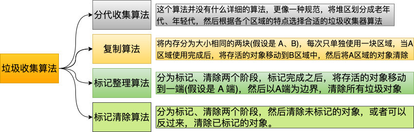
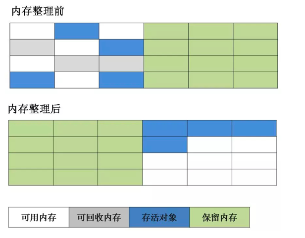
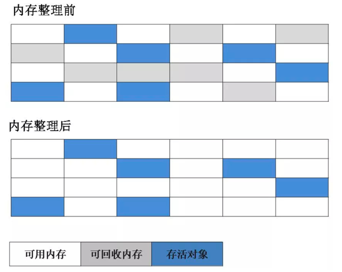
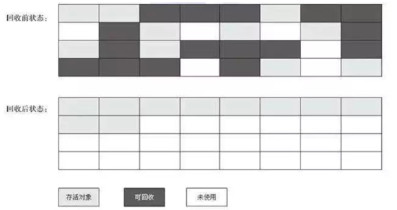
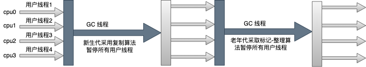

# 垃圾收集算法
如图是目前 JVM 用到的垃圾收集算法：

图中介绍了几种算法的思想，下面介绍一下这几种算法的演进。
## 复制算法
复制算法的弊端比较明显，总有一块儿内存是空着的啥事不干，就等着将存活的对象放入，显然这中算法是不可取的。而且影响程序运行效率。

## 标记清除算法
为了解决上面内存浪费，效率低下的问题，标记清除算法先**标记对象**，然后**清除对象**，这种算法虽然没有内存浪费的情况出现，但是会带来以下两个

问题：
1. 如果标记对象很多，效率是一个问题；
2. 会产生内存碎片：比如这次回收了 1K 的数据，此时需要放入 2K 数据，因为没有连续的空间，且如果以后再没有 1K 的数据，那么这块空间就永远用不上了，
这就产生了内存碎片；也会造成内存浪费；
## 标记整理算法
这个算法解决了标记清除算法中内存碎片的问题，与标记清除算法前面两个阶段一样，都需要标记清除。在清除之前，需要移动对象到另一端(可以理解为整理对象)，然后以这个端
为边界，清除所有垃圾对象。但是这种算法同样存在效率问题，大对象的来回移动会造成效率低下。

## 分代收集算法
分代垃圾收集算法是根据分代区域的不同，使用不同的垃圾算法进行垃圾回收。
# 垃圾收集器
前面垃圾收集算法只是一个大体的思路，并没有提供具体的实现。垃圾收集器才是内存收集的具体实现。下面来介绍一下这些垃圾收集器。

## Serial
Serial 收集器年轻代的收集器，采用复制算法。它是一个"单线程"工作的收集器，但是需要注意它"单线程"的意义不仅仅只是说明它只会用一个处理器或
一条收集垃圾的线程，更重要的是 它在进行垃圾收集时，必须暂停其他所有的线程，也就是 STW(Stop The World)。由于这是由底层 JVM 完成，对于用
户来说并不可控。如果 GC 时间老长的话，对于用户来说是不可接受的。工作图如下：

照这样描述，Serial 垃圾器似乎该被淘汰了，事实上，它依然是 HotSpot 虚拟机运行在客户端模式下的默认新生代垃圾收集器。对于内存环境受限的环境，它是
所有收集器中额外内存消耗最少的，并且对于单核处理器或者处理器核心数较少的环境来说，Serial 收集由于没有线程交互，专心做垃圾回收可以获得最高的单线程
收集效率。

所以对于一些微服务的应用来说，分配给虚拟机管理的内存并不大，垃圾收集停顿的时间完全可以控制在十几、几十毫秒，只要不是频繁地 GC，这点
停顿完全可以接受。

## Serial Old 收集器
Serial Old 是 Serial 收集器的老年代版本，同样是一个单线程收集器，采用标记整理算法。

## Parallel Scavenge收集器(-XX:+UseParallelGC(年轻代),-XX:+UseParallelOldGC(老年代))
Parallel Scavenge 是一款新生代的垃圾收集器，同样基于标记-复制算法实现。与 Serial 收集器不同的是 Parallel Scavenge 是多线程收集器。
默认的收集线程数跟cpu核数相同，当然也可以用参数(- XX:ParallelGCThreads)指定收集线程数，但是一般不推荐修改。

相比于其他收集器关注点不同，Parallel Scavenge 收集器的目标是达到一个可控制的吞吐量。吞吐量计算公示：

$吞吐量={用户运行代码时间 \over 用户运行代码时间+运行垃圾收集时间}$

Parallel Scavenge 收集器提供了两个参数用于精准控制吞吐量：
1. -XX:GCTimeRatio : 直接设置吞吐量；
2. -XX:MaxGCPauseMills : 控制垃圾收集器最大停顿时间(但是需要注意，不是把参数设置的小一点，垃圾收集速度就变得更快，垃圾停顿时间缩短是以牺牲
吞吐量和新生代空间为代价换取的，新生代调得小一些，就意味着 GC 会变得很频繁，从而导致吞吐量下降)；
3. -XX:+UseAdaptiveSizePolicy: 当设置了这个参数，JVM 会自适应的调整各个区的比例，不需要人工调节了；

Parallel Old/Parallel Scavenge 收集器运行示意图:

## Parallel Old 收集器
Parallel Old收集器是Parallel Scavenge收集器的老年代版本。使用多线程和“标记-整理”算法。在注重吞吐量以及 CPU资源的场合，都可以优先考虑
Parallel Scavenge收集器和Parallel Old收集器(JDK8默认的新生代和老年代收集 器)。

