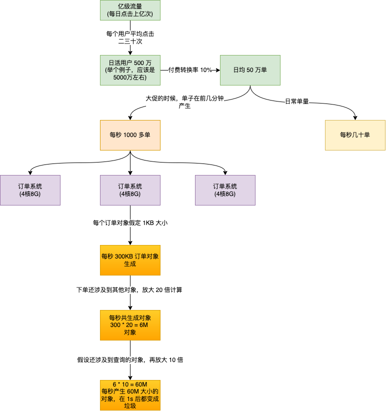

目录
=================

* [垃圾收集算法](#垃圾收集算法)
   * [复制算法](#复制算法)
   * [标记清除算法](#标记清除算法)
   * [标记整理算法](#标记整理算法)
   * [分代收集算法](#分代收集算法)
* [垃圾收集器](#垃圾收集器)
   * [Serial](#serial)
   * [Serial Old 收集器](#serial-old-收集器)
   * [Parallel Scavenge收集器(-XX:+UseParallelGC(年轻代),-XX:+UseParallelOldGC(老年代))](#parallel-scavenge收集器-xxuseparallelgc年轻代-xxuseparalleloldgc老年代)
   * [Parallel Old 收集器](#parallel-old-收集器)
   * [ParaNew 收集器](#paranew-收集器)
   * [CMS收集器(-XX:+UseConcMarkSweepGC(old))](#cms收集器-xxuseconcmarksweepgcold)
      * [CMS 相关核心参数：](#cms-相关核心参数)
      * [JVM 模型调优](#jvm-模型调优)
      * [CMS 的调优](#cms-的调优)
      * [补充(设置元空间大小的必要性)](#补充设置元空间大小的必要性)
      * [CMS 垃圾收集器底层算法](#cms-垃圾收集器底层算法)
         * [漏标是怎么产生的](#漏标是怎么产生的)
         * [漏标的解决办法](#漏标的解决办法)
   * [记忆集与卡表](#记忆集与卡表)
      * [卡表的维护](#卡表的维护)
   * [G1 垃圾收集器(-XX:+UseG1GC)](#g1-垃圾收集器-xxuseg1gc)
      * [G1 的运行过程](#g1-的运行过程)
      * [G1 特点](#g1-特点)
      * [G1 垃圾收集分类](#g1-垃圾收集分类)
      * [G1收集器参数设置](#g1收集器参数设置)
      * [G1 优化建议](#g1-优化建议)
      * [什么场景下建议使用 G1](#什么场景下建议使用-g1)
      * [每秒几十万并发的系统如何优化JVM](#每秒几十万并发的系统如何优化jvm)
      * [为什么 G1 用 SATB，CMS 用增量更新](#为什么-g1-用-satbcms-用增量更新)
   * [ZGC(作为了解)](#zgc作为了解)
      * [ZGC 目标](#zgc-目标)
      * [不分代](#不分代)
      * [ZGC内存布局](#zgc内存布局)
      * [颜色指针(了解，有个概念就行)](#颜色指针了解有个概念就行)
      * [读屏障(了解，有个概念就行)](#读屏障了解有个概念就行)
      * [ZGC 运作过程](#zgc-运作过程)
      * [ZGC 存在的问题](#zgc-存在的问题)
         * [解决方案](#解决方案)
      * [ZGC 触发时机](#zgc-触发时机)
* [垃圾收集器搭配](#垃圾收集器搭配)


# 垃圾收集算法
如图是目前 JVM 用到的垃圾收集算法：


图中介绍了几种算法的思想，下面介绍一下这几种算法的演进。
## 复制算法
复制算法的弊端比较明显，总有一块儿内存是空着的啥事不干，就等着将存活的对象放入，显然这中算法是不可取的。而且影响程序运行效率。

## 标记清除算法
为了解决上面内存浪费，效率低下的问题，标记清除算法先**标记对象**，然后**清除对象**。


这种算法虽然没有内存浪费的情况出现，但是会带来以下两个问题：
1. 如果标记对象很多，效率是一个问题；
2. 会产生内存碎片：比如这次回收了 1K 的数据，此时需要放入 2K 数据，因为没有连续的空间，且如果以后再没有 1K 的数据，那么这块空间就永远用不上了，
这就产生了内存碎片；也会造成内存浪费；
## 标记整理算法
这个算法解决了标记清除算法中内存碎片的问题，与标记清除算法前面两个阶段一样，都需要标记清除。在清除之前，需要移动对象到另一端(可以理解为整理对象)，然后以这个端
为边界，清除所有垃圾对象。但是这种算法同样存在效率问题，大对象的来回移动会造成效率低下。


## 分代收集算法
分代垃圾收集算法是根据分代区域的不同，使用不同的垃圾算法进行垃圾回收。
# 垃圾收集器
前面垃圾收集算法只是一个大体的思路，并没有提供具体的实现。垃圾收集器才是内存收集的具体实现。下面来介绍一下这些垃圾收集器。

## Serial
Serial 收集器年轻代的收集器，采用复制算法。它是一个"单线程"工作的收集器，但是需要注意它"单线程"的意义不仅仅只是说明它只会用一个处理器或
一条收集垃圾的线程，更重要的是 它在进行垃圾收集时，必须暂停其他所有的线程，也就是 STW(Stop The World)。由于这是由底层 JVM 完成，对于用
户来说并不可控。如果 GC 时间老长的话，对于用户来说是不可接受的。工作图如下：


照这样描述，Serial 垃圾器似乎该被淘汰了，事实上，它依然是 HotSpot 虚拟机运行在客户端模式下的默认新生代垃圾收集器。对于内存环境受限的环境，它是
所有收集器中额外内存消耗最少的，并且对于单核处理器或者处理器核心数较少的环境来说，Serial 收集由于没有线程交互，专心做垃圾回收可以获得最高的单线程
收集效率。

所以对于一些微服务的应用来说，分配给虚拟机管理的内存并不大，垃圾收集停顿的时间完全可以控制在十几、几十毫秒，只要不是频繁地 GC，这点
停顿完全可以接受。

## Serial Old 收集器
Serial Old 是 Serial 收集器的老年代版本，同样是一个单线程收集器，采用标记整理算法。

## Parallel Scavenge收集器(-XX:+UseParallelGC(年轻代),-XX:+UseParallelOldGC(老年代))
Parallel Scavenge 是一款新生代的垃圾收集器，同样基于标记-复制算法实现。与 Serial 收集器不同的是 Parallel Scavenge 是多线程收集器。
默认的收集线程数跟cpu核数相同，当然也可以用参数(- XX:ParallelGCThreads)指定收集线程数，但是一般不推荐修改。

相比于其他收集器关注点不同，Parallel Scavenge 收集器的目标是达到一个可控制的吞吐量。吞吐量计算公示：

$吞吐量={用户运行代码时间 \over 用户运行代码时间+运行垃圾收集时间}$

Parallel Scavenge 收集器提供了两个参数用于精准控制吞吐量：
1. -XX:GCTimeRatio : 直接设置吞吐量；
2. -XX:MaxGCPauseMills : 控制垃圾收集器最大停顿时间(但是需要注意，不是把参数设置的小一点，垃圾收集速度就变得更快，垃圾停顿时间缩短是以牺牲
吞吐量和新生代空间为代价换取的，新生代调得小一些，就意味着 GC 会变得很频繁，从而导致吞吐量下降)；
3. -XX:+UseAdaptiveSizePolicy: 当设置了这个参数，JVM 会自适应的调整各个区的比例，不需要人工调节了；

Parallel Old/Parallel Scavenge 收集器运行示意图:


## Parallel Old 收集器
Parallel Old收集器是Parallel Scavenge收集器的老年代版本。使用多线程和“标记-整理”算法。在注重吞吐量以及 CPU资源的场合，都可以优先考虑
Parallel Scavenge收集器和Parallel Old收集器(JDK8默认的新生代和老年代收集 器)。

## ParaNew 收集器
ParNew收集器其实跟Parallel收集器很类似，区别主要在于它可以和CMS收集器配合使用。 新生代采用复制算法，老年代采用标记-整理算法。

## CMS收集器(-XX:+UseConcMarkSweepGC(old))
CMS(Concurrent Mark Sweep)收集器是一种以获取最短回收停顿时间为目标的收集器。它非常符合在注重用户体 验的应用上使用，它是HotSpot虚拟机
第一款真正意义上的并发收集器，它第一次实现了让垃圾收集线程与用户线程 (基本上)同时工作。
CMS收集器是一种 “标记-清除”算法实现的，它的运作过程相比于前面 几种垃圾收集器来说更加复杂一些。整个过程分为四个步骤:
1. **初始标记**: 暂停所有的其他线程(STW)，并记录下gc roots直接能引用的对象，速度很快。
2. **并发标记**: 并发标记阶段就是从GC Roots的直接关联对象开始遍历整个对象图的过程， 这个过程耗时较长但 是不需要停顿用户线程， 可以与垃圾收
集线程一起并发运行。因为用户程序继续运行，可能会有导致已经标记过的对象状态发生改变。
3. 重新标记: 重新标记阶段就是为了修正并发标记期间因为用户程序继续运行而导致标记产生变动的那一部分对象的标记记录，这个阶段的停顿时间一般会
比初始标记阶段的时间稍长，远远比并发标记阶段时间短。主要用到三 色标记里的增量更新算法(见下面详解)做重新标记。
4. 并发清理: 开启用户线程，同时GC线程开始对未标记的区域做清扫。这个阶段如果有新增对象会被标记为黑 色不做任何处理(见下面三色标记算法详解)。
5. 并发重置:重置本次GC过程中的标记数据。

如下是 CMS 垃圾收集器运行示意图


从运行图可以看出来 CMS 是一款优秀的垃圾收集器。它具有并发收集、低停顿的优点。但是 CMS 并也并不完美。也有以下几个缺点：
1. 对CPU资源敏感(会和服务抢资源): 就是在并发标记、并发清除的时候，CMS 会和用户争夺 CPU 资源，会影响程序的运行；
2. 无法处理浮动垃圾(在并发标记和并发清理阶段又产生垃圾，这种浮动垃圾只能等到下一次gc再清理了)：浮动垃圾产生的原因是因为在并发阶段，用户线程
还在不断的运行，自然就会产生新的垃圾，这种垃圾是在标记之后产生的。这种垃圾是没有办法在这次清理的，只能在下一次垃圾收集时再清理掉。
3. 执行的不确定性：前面也提到过，CMS 会产生浮动垃圾，所以 CMS 不能等到老年代被填满了再进行 Full GC，需要预留一些空间。否则在 CMS 运行期
间预留的内存无法满足程序分配新对象的需要，就会出现"并发失败(Concurrent Mode Failure)"，这时候虚拟机不得不启动后备预案：冻结用户线程执行，
临时启动 Serial Old 收集器进行老年代的垃圾收集，但是这样 STW 时间就非常长了；
4. 会残留空间碎片：因为采用的是标记清除算法，会产生空间碎片，这会导致即使老年代有空间，但是无法存放对象。因此 CMS 提供了一个 -XX:+UseCMSCompactAtFullCollection
开关参数(默认是开启的，此参数从JDK9开始废弃)。但是这又会导致停顿时间变长，于是 CMS 又提供了另一个参数：-XX:CMSFullGCsBeforeCompaction， CMS
执行若干次之后，再整理空间(同样从 JDK9 开始废弃)。

### CMS 相关核心参数：
1. -XX:+UseConcMarkSweepGC:启用cms
2. -XX:ConcGCThreads:并发的GC线程数
3. -XX:+UseCMSCompactAtFullCollection:FullGC之后做压缩整理(减少碎片)
4. -XX:CMSFullGCsBeforeCompaction:多少次FullGC之后压缩一次，默认是0，代表每次FullGC后都会压缩一 次
5. -XX:CMSInitiatingOccupancyFraction: 当老年代使用达到该比例时会触发FullGC(默认是92，这是百分比) 6. -XX:+UseCMSInitiatingOccupancyOnly:只使用设定的回收阈值(-XX:CMSInitiatingOccupancyFraction设 定的值)，如果不指定，JVM仅在第一次使用设定值，后续则会自动调整
6. -XX:+CMSScavengeBeforeRemark:在CMS GC前启动一次minor gc，目的在于减少老年代对年轻代的引 用，降低CMS GC的标记阶段时的开销，一般CMS的GC耗时 80%都在标记阶段
7. -XX:+CMSParallellnitialMarkEnabled:表示在初始标记的时候多线程执行，缩短STW
8. -XX:+CMSParallelRemarkEnabled:在重新标记的时候多线程执行，缩短STW;

### JVM 模型调优
大型电商系统后端现在一般都是拆分为多个子系统部署的，比如，商品系统，库存系统，订单系统，促销系统，会员系 统等等。
这里以比较核心的订单系统为例。如图：

对于 8G 的内存，一般会分配 4G 的内存给 JVM。那么按照正常的配置，大致参数如下：
```text
‐Xms3072M ‐Xmx3072M ‐Xss1M ‐XX:MetaspaceSize=512M ‐XX:MaxMetaspaceSize=512M ‐XX:SurvivorRatio=8
```
那么对应的内存模型如下：


不以模型计算的话，直接按照上述分配：堆分配 3G，元空间分配 512M，Eden 区与 Survivor 区空间比例 8:1:1。这种参数配置在模拟的场景下会有问题的。
分析一下：

线程每秒产生 60M 对象，Eden 区有 800M 大小，在第 14 秒的时候，就要发生一次 Minor GC。此时前面 13s 的对象基本上已经被回收了，因为 Minor GC
要 STW，所以第 14s 的订单对象可能无法被回收，那么这 60M 对象就会被放入 Survivor 区。虽然 Survivor 有 100M 的空间，完全可以放入这 60M 对象，
但是不要忘记 JVM 针对 Survivor 的优化：对象动态年龄判断。60M 已占用了 Survivor 区空间的 60%，所以这个对象并不会被放入 Survivor，而是会
被直接放入老年代。按照这种情况推算，老年代有 2G 的空间，大概 400s 就会发生一次 Full GC，也就大概 7 分钟一次 Full GC，这么频繁地 GC，对于系统
来说显然是不允许的。

通过分析可以知道，根本原因是因为年轻代的 Survivor 太小，导致 Minor GC 的时候，由于动态年龄的判断导致对象直接放入老年代，从而频繁的 Full GC。
那么我们可以尝试将年轻代的空间放大，老年代空间调小。

```text
‐Xms3072M ‐Xmx3072M ‐Xmn2048M ‐Xss1M ‐XX:MetaspaceSize=256M ‐XX:MaxMetaspaceSize=256M ‐XX:SurvivorRatio=8
```
将年轻代大小调整为 2G，那么 Eden 区为 1.6G, Survivor 区为 200M。那么 Eden 区放满大概需要 25s，第 26 秒的时候进行 Minor GC，然后将 60M
对象放入 Survivor 区。当下个第 26s 的时刻，才会有新的对象放入 Survivor 区，而到了这个时候，Survivor 区之前存放的对象，在 Minor GC 的时候
已经回收掉了。这样不仅减少了 Minor GC 的频率，Full GC 几乎不进行(理论上是这样)。

针对上面的模型，还可以进一步进行优化-对象的年龄。因为订单相关对象消亡很快，所以在年轻代中的年龄不会很大，而那些年龄很大一般就是 JVM 自己创建
的对象，或者是 Spring 框架自己的对象。针对这些系统对象，应该及早的让它们进入老年代，而不是占用着年轻代的空间。所以可以将 JVM 默认的age=12 可以
调整成 5，也就经历 5 次 Minor GC 的对象还不消亡，那么很可能就是系统对象，那么就让早早地进入老年代。关于年龄的参数只能在实际的过程中调整，并不是固定
的。

进一步分析之后，JVM 运行参数调整如下：
```text
‐Xms3072M ‐Xmx3072M ‐Xmn2048M ‐Xss1M ‐XX:MetaspaceSize=256M ‐XX:MaxMetaspaceSize=256M ‐XX:SurvivorRatio=8 
‐XX:MaxTenuringThreshold=5 ‐XX:PretenureSizeThreshold=1M
```
指定了 JVM 中对象的年龄，以及对大对象大小的认定值。

### CMS 的调优
基于上面的模型，来分析一下 CMS 如何调优。

对于JDK8默认的垃圾回收器是-XX:+UseParallelGC(年轻代)和-XX:+UseParallelOldGC(老年代)，如果内存较大(超过4个G，只是经验 值)，系统对
停顿时间比较敏感，我们可以使用ParNew+CMS(-XX:+UseParNewGC -XX:+UseConcMarkSweepGC)。基于上面的分析，可以从一下几个方面入手：
1. 经历几次的对象认为是系统对象，而不会被 GC 回收；
2. 在秒杀的时候，系统压力激增，此时每秒数据可能激增到上百兆，一个订单可能用好几秒才能处理完，那么就有可能 26s、27s、28s 这些数据都会直接到
老年代，大概 100M左右。乐观一点，这种情况大概 5、6 分钟出现一次，那么一次 Full GC 触发的频率基本上就是半小时或者一小时左右一次。这种基本已经
扛过了抢购了；Full GC的触发条件还有我们之前说过的老年代空间分配担保机制，历次的minor gc挪动到老年代的对象大小 肯定是非常小的，所以几乎
不会在minor gc触发之前由于老年代空间分配担保失败而产生full gc
3. 标记清除算法会产生内存碎片，需要在 JVM 的运行参数设定碎片整理的参数；

基于上述分析，只要年轻代分配合理，其余参数可以默认，至于整理碎片的频率可以是每次 Full GC 回收或者隔个两三次进行回收。
```text
‐Xms3072M ‐Xmx3072M ‐Xmn2048M ‐Xss1M ‐XX:MetaspaceSize=256M ‐XX:MaxMetaspaceSize=256M ‐XX:SurvivorRatio=8
‐XX:MaxTenuringThreshold=5 ‐XX:PretenureSizeThreshold=1M ‐XX:+UseParNewGC ‐XX:+UseConcMarkSweepGC
‐XX:CMSInitiatingOccupancyFraction=92 ‐XX:+UseCMSCompactAtFullCollection ‐XX:CMSFullGCsBeforeCompaction=2
```
堆分分配大小没变，使用 ParNew 配合 CMS 垃圾收集器，指定老年代使用阈值，开启整理内存碎片以及每隔多少次开始内存碎片的整理。

### 补充(设置元空间大小的必要性)


### CMS 垃圾收集器底层算法
在并发标记的过程中，因为标记期间应用线程还在继续跑，对象间的引用可能发生变化，多标和漏标的情况就有可能发生。
这里我们引入“三色标记”来给大家解释下，把Gcroots可达性分析遍历对象过程中遇到的对象， 按照“是否访问过”这个条件标记成以 下三种颜色。

1. 黑色: 表示对象已经被垃圾收集器访问过， 且这个对象的所有引用都已经扫描过。 黑色的对象代表已经扫描 过， 它是安全存活的， 如果有其他对象
引用指向了黑色对象， 无须重新扫描一遍。 黑色对象不可能直接(不经过 灰色对象) 指向某个白色对象。
2. 灰色: 表示对象已经被垃圾收集器访问过， 但这个对象上至少存在一个引用还没有被扫描过。
3. 白色: 表示对象尚未被垃圾收集器访问过。 显然在可达性分析刚刚开始的阶段， 所有的对象都是白色的， 若在分析结束的阶段， 仍然是白色的对象，
即代表不可达。


对应的 demo 如下：
```java
/**
 * 三色标记模型
 */
public class ThreeColorModelDemo {
    public static void main(String[] args) {
        MarkA markA = new MarkA();
        // 开始做并发标记，标记根结点的引用
        
    }

    static class MarkA {
        MarkB markB = new MarkB();
        MarkD markD = null;
    }

    static class MarkB{
        MarkC markC = new MarkC();
        MarkD markD = new MarkD();

    }

    static class MarkC{

    }

    static class MarkD{

    }
}
```
在 GC 的那一刻，先从 gc roots 从 A 开始扫描，扫描到 B，此时 A 就可以被标记为黑色，因为 A 对象的引用被扫描过了。
还是接着上一步，扫描到 B 之后，再接着从 B 开始扫描，扫描到 C，但是 D 没有被扫描到，所以**此刻** B 对象被标记为灰色；接着从 C
开始扫描，此时 C 没有其他引用，所以，C 对象被标记为黑色；D 因为没有被扫描到，所以**此刻**被标记为白色。

以上就是三色标记的大致过程。

#### 漏标是怎么产生的
在并发标记的过程中，在完成 A 的扫描后，即 A 被标记为黑色；因为是并发收集，在 扫描 B 的时候，刚刚扫描完它的一个引用 C，还没来得及扫描 D，正
准备扫描 D 的时候。此时有用户线程将 B 指向 D 应用断开了，然后将 A 的引用指向了 D。当再次扫描的时候，因为 A 被标记为黑色，是不会在扫描 D 了，
而 B 中断开了 D 的引用，最终导致 D 没有被标记为黑色，在 GC 的时候被当作垃圾对象回收掉了。这就是漏标。

#### 漏标的解决办法
漏标会导致被引用的对象被当成垃圾误删除，这是严重bug，必须解决，有两种解决方案: 

增量更新(Incremental Update) 和原始快照(Snapshot At The Beginning，SATB) 。 
1. 增量更新就是当黑色对象插入新的指向白色对象的引用关系时，就将这个新插入的引用记录下来，等并发扫描结束之后，再将这些记录过的引用关系
中的黑色对象为根，重新扫描一次。这可以简化理解为，黑色对象一旦新插入了指向白色对象的引用之后，它就变回灰色对象了。
2. 原始快照就是当灰色对象要删除指向白色对象的引用关系时，就将这个要删除的引用记录下来，在并发扫描结束之后，再将这些记录过的引用关系中的灰
色对象为根，重新扫描一次，这样就能扫描到白色的对象，将白色对象直接标记为黑色(目的就是让这种对象在本轮gc清理中能存活下来，待下一轮gc的时
候重新扫描，这个对象也有可能是浮动垃圾) 以上无论是对引用关系记录的插入还是删除，虚拟机的记录操作都是通过"写屏障"实现的。

要特别注意的是这里的"写屏障"与JVM内存模型中的"写屏障"两个是不同意思，两者没有任何关联。虚拟机中的"写屏障"指的是在赋值操作前后加入一些处理(异步处理提高效率)，
类似与 Spring 中的 AOP。后者是目的是保证线程并发安全的。

现代追踪式(可达性分析)的垃圾回收器几乎都借鉴了三色标记的算法思想，尽管实现的方式不尽相同:比如白色/黑色 集合一般都不会出现(但是有其他体现颜色的地方)、
灰色集合可以通过栈/队列/缓存日志等方式进行实现、遍历方式可 以是广度/深度遍历等等。


对于读写屏障，以Java HotSpot VM为例，其并发标记时对漏标的处理方案如下:
1. CMS:写屏障 + 增量更新 G1，Shenandoah:写屏障 + SATB ZGC:读屏障
2. 工程实现中，读写屏障还有其他功能，比如写屏障可以用于记录跨代/区引用的变化，读屏障可以用于支持移动对象的并 发执行等。功能之外，
还有性能的考虑，所以对于选择哪种，每款垃圾回收器都有自己的想法。

## 记忆集与卡表
在新生代做  GCRoots 可达性扫描过程中可能会碰到跨代引用的对象，这种如果又去对老年代再去扫描效率太低了。 为此，在新生代可以引入记录集
(Remember Set)的数据结构(记录从非收集区到收集区的指针集合)，避免把整个老年代加入GCRoots扫描范围。事实上并不只是新生代、 老年代之间才有
跨代引用的问题，所有涉及部分区域收集 (Partial GC) 行为的垃圾收集器，典型的如G1、ZGC和Shenandoah收集器，都会面临相同的问题。垃圾收集场
景中，收集器只需通过记忆集判断出某一块非收集区域是否存在指向收集区域的指针即可，无需了解跨代引用指针的全部细节。

hotspot使用一种叫做“卡表”(cardtable)的方式实现记忆集，也是目前最常用的一种方式。关于卡表与记忆集的关系， 可以类比为Java语言中HashMap与Map的关系。
卡表是使用一个字节数组实现:CARD_TABLE[ ]，每个元素对应着其标识的内存区域一块特定大小的内存块，称为“卡 页”。
hotSpot使用的卡页是2^9大小，即512字节

一个卡页中可包含多个对象，只要有一个对象的字段存在跨代指针，其对应的卡表的元素标识就变成1，表示该元素变 脏，否则为0.
GC时，只要筛选本收集区的卡表中变脏的元素加入GCRoots里。

### 卡表的维护 
卡表变脏上面已经说了，但是需要知道如何让卡表变脏，即发生引用字段赋值时，如何更新卡表对应的标识为1。 
Hotspot使用写屏障维护卡表状态。

## G1 垃圾收集器(-XX:+UseG1GC)
G1 (Garbage-First)是一款面向服务器的垃圾收集器,主要针对配备多颗处理器及大容量内存的机器。以极高概率满足 GC 停顿时间要求的同时,还具备高
吞吐量性能特征。

G1 的核心算法依然是分代收集算法。只不过相对于其他垃圾器的算法实现，G1 将堆空间划分为多个大小相等的独立区域(Region), JVM 最多可以有 2048 个
Region。

1. Region 大小: 一般 Region 大小等于堆的大小除以2048，比如堆大小为4096M，则Region大小为2M，当然也可以用参数"- XX:G1HeapRegionSize"手动指定Region
大小，但是推荐默认的计算方式；
2. G1保留了年轻代和老年代的概念，但不再是物理隔阂了，它们都是(可以不连续)Region的集合。即每个 Region 的角色(区域功能)都是可以相互转换的。
3. 年轻代占比：默认年轻代对堆内存的占比是5%，可以通过“-XX:G1NewSizePercent”设置新生代初始占比。但是最多新生代的占比不会超过60%，可以通过
“-XX:G1MaxNewSizePercent”调整。年轻代中的Eden和 Survivor对应的region也跟之前一样，默认8:1:1。
4. Humongous 区：Humongous 区是 G1 专门用来存储短期巨型对象的，这种对象不进入老年代，节约了老年代空间，避免老年代空间不够的 GC 开销。
   1. 对于大对象的定义：在G1中，大对象的判定规则就是一 个大对象超过了一个Region大小的50%，如果一个对象太大，可能会横跨多个Region来存放。

以上是 G1 要说明的特点，其他的和之前的垃圾收集器没有什么不同。

### G1 的运行过程
1. 初始标记(initial mark，STW):暂停所有的其他线程，并记录下gc roots直接能引用的对象，速度很快;
2. 并发标记(Concurrent Marking):同CMS的并发标记;
3. 最终标记(Remark，STW):同CMS的重新标记;
4. 筛选回收(Cleanup，STW): 
   1. 筛选回收阶段首先对各个Region的回收价值和成本进行排序，根据用户所期望的GC停顿时间(可以用JVM参数 -XX:MaxGCPauseMillis指定)来制定回收计划;
   2. 回收算法采用的是复制算法：将一个region中的存活对象复制到另一个region中，这种不会像CMS那样 回收完因为有很多内存碎片还需要整理一次，
   G1采用复制算法回收几乎不会有太多内存碎片。


### G1 特点
1. 并行与并发:G1能充分利用CPU、多核环境下的硬件优势，使用多个CPU(CPU或者CPU核心)来缩短 Stop-The-World 停顿时间。部分其他收集器原本
需要停顿Java线程来执行GC动作，G1收集器仍然可以通过并发的方式 让java程序继续执行;
2. 分代收集:虽然G1可以不需要其他收集器配合就能独立管理整个GC堆，但是还是保留了分代的概念;
3. 空间整合:与CMS的“标记--清理”算法不同，G1从整体来看是基于“标记整理”算法实现的收集器;从局部 上来看是基于“复制”算法实现的;
4. 可预测的停顿:这是G1相对于CMS的另一个大优势，降低停顿时间是G1 和 CMS 共同的关注点，但G1 除了 追求低停顿外，还能建立可预测的停顿时间
模型，能让使用者明确指定在一个长度为M毫秒的时间片段(通过参数"- XX:MaxGCPauseMillis"指定)内完成垃圾收集。

需要注意的是设置停顿时间要选一个恰当的值，而不是为了减少停顿时间直接将停顿时间设置成最小。结果导致每次回收的垃圾只有一小部分，最终导致垃圾
慢慢堆积，从而触发 Full GC，反而导致 G1 性能降低。一般把期望停顿时间设置为一两百毫秒或者两三百毫秒会是比较合理的。

### G1 垃圾收集分类
1. YoungGC: G1 年轻代触发 GC 并不会等到 Eden 区占满，它会计算当前 Eden 区回收时间是否远远小于参数 -XX:MaxGCPauseMills 设定的值；如果小于
就增加年轻代的 region，继续存放对象，直到下一次 Eden 区放满，计算出的回收时间接近参数 -XX:MaxGCPauseMills 设定的值，那么就会触发 Minor GC。
2. MixedGC：不是FullGC，老年代的堆占有率达到参数(-XX:InitiatingHeapOccupancyPercent)设定的值则触发，回收所有的 Young 和部分Old
(根据期望的GC停顿时间确定old区垃圾收集的优先顺序)以及大对象区，正常情况G1的垃圾收集是先做 MixedGC，主要使用复制算法，需要把各个region
中存活的对象拷贝到别的region里去，拷贝过程中如果发现没有足够的空region能够承载拷贝对象就会触发一次Full GC；
3. Full GC：停止系统程序，然后采用单线程进行标记、清理和压缩整理，好空闲出来一批Region来供下一次MixedGC使用，这
个过程是非常耗时的。(Shenandoah优化成多线程收集了)

### G1收集器参数设置
1. -XX:+UseG1GC:使用G1收集器
2. -XX:ParallelGCThreads:指定GC工作的线程数量;
3. -XX:G1HeapRegionSize:指定分区大小(1MB~32MB，且必须是2的N次幂)，默认将整堆划分为2048个分区；
4. -XX:MaxGCPauseMillis:目标暂停时间(默认200ms)；
5. -XX:G1NewSizePercent:新生代内存初始空间(默认整堆5%)；
6. -XX:G1MaxNewSizePercent:新生代内存最大空间；
7. -XX:TargetSurvivorRatio:Survivor区的填充容量(默认50%)，Survivor区域里的一批对象(年龄1+年龄2+年龄n的多个
   年龄对象)总和超过了Survivor区域的50%，此时就会把年龄n(含)以上的对象都放入老年代；
8. -XX:MaxTenuringThreshold:最大年龄阈值(默认15)；
9. -XX:InitiatingHeapOccupancyPercent:老年代占用空间达到整堆内存阈值(默认45%)，则执行新生代和老年代的混合
   收集(MixedGC)，比如我们之前说的堆默认有2048个region，如果有接近1000个region都是老年代的region，则可能 就要触发MixedGC了
10. -XX:G1MixedGCLiveThresholdPercent(默认85%) region中的存活对象低于这个值时才会回收该region，如果超过这 个值，存活对象过多，回收的的意义不大。
11. -XX:G1MixedGCCountTarget:在一次回收过程中指定做几次筛选回收(默认8次)，在最后一个筛选回收阶段可以回收一 会，然后暂停回收，恢复系统运行，
一会再开始回收，这样可以让系统不至于单次停顿时间过长。
12. -XX:G1HeapWastePercent(默认5%): gc过程中空出来的region是否充足阈值，在混合回收的时候，对Region回收都 是基于复制算法进行的，都
是把要回收的Region里的存活对象放入其他Region，然后这个Region中的垃圾对象全部清 理掉，这样的话在回收过程就会不断空出来新的Region，一旦
空闲出来的Region数量达到了堆内存的5%，此时就会立 即停止混合回收，意味着本次混合回收就结束了。

### G1 优化建议
调节 -XX:MaxGCPauseMills 这个参数的值，在保证他的年轻代gc别太频繁的同时，还得考虑每次gc过后的存活对象有多少,避免存活对象太多快速进入老年代，
频繁触发mixed gc。至于原因前面在介绍 G1 的特点时有说明。

### 什么场景下建议使用 G1
1. 50%以上的堆被存活对象占用
2. 对象分配和晋升的速度变化非常大 3. 垃圾回收时间特别长，超过1秒
3. 8GB以上的堆内存(建议值)
4. 停顿时间是500ms以内

### 每秒几十万并发的系统如何优化JVM
前面基于订单模型分析了一下 JVM 的内存调优。服务器是 4核8G。如果每秒几十万的并发，单台机器是根本扛不住遮样的流量的。想象一下，每秒几十万的
订单，那就是秒产生几个 G 的订单数据，对于之前的数据模型，之间就进入老年代了，而且触发 Full GC，Full GC 放不下的话，导致 OOM。

G1天生就适合这种大内存机器的JVM运行，可以比较完美的解决大内存垃圾回收时间过长的问题。

### 为什么 G1 用 SATB，CMS 用增量更新
通过上面分析 G1 将堆区分为了多个 region，如果使用增量更新，每个 region 都有对应卡集，这种遍历还是很消耗时间的；所以 G1 没有选择增量更新
这种方式实现，而是选择了 STAB。

## ZGC(作为了解)
ZGC是一款JDK 11中新加入的具有实验性质的低延迟垃圾收集器，ZGC可以说源自于是Azul System公司开发的 C4(Concurrent Continuously Compacting Collector) 收集器。

### ZGC 目标
1. 支持TB量级的堆: 我们生产环境的硬盘还没有上TB呢，这应该可以满足未来十年内，所有JAVA应用的需求了吧。
2. 最大GC停顿时间不超10ms。目前一般线上环境运行良好的JAVA应用Minor GC停顿时间在10ms左右，Major GC一般都需要100ms以上(G1可以调节停
顿时间，但是如果调的过低的话，反而会适得其反)，之所以能 做到这一点是因为它的停顿时间主要跟Root扫描有关，而Root数量和堆大小是没有任何关系的。
3. 奠定未来GC特性的基础;
4. 最糟糕的情况下吞吐量会降低15%。这都不是事，停顿时间足够优秀。至于吞吐量，通过扩容分分钟解决。另外，Oracle官方提到了它最大的优点是:
它的停顿时间不会随着堆的增大而增长!也就是说，几十G堆的停顿时间是 10ms以下，几百G甚至上T堆的停顿时间也是10ms以下。

### 不分代
单代，即ZGC「没有分代」。我们知道以前的垃圾回收器之所以分代，是因为源于“「大部分对象朝生夕死」”的假 设，事实上大部分系统的对象分配行为也
确实符合这个假设。那么为什么ZGC就不分代呢?因为分代实现起来麻烦，作者就先实现出一个比较简单可用的单代版本，后续会优化。

### ZGC内存布局
ZGC收集器是一款基于Region内存布局的，暂时不设分代的，使用了读屏障、颜色指针等技术来实现可并发的标记-整理算法的，以低延迟为首要目标的一
款垃圾收集器。如图所示:


ZGC 的 Region 按容量区分如下：
1. 小型Region(Small Region) : 容量固定为2MB， 用于放置小于256KB的小对象。 
2. 中型Region(Medium Region) : 容量固定为32MB， 用于放置大于等于256KB但小于4MB的对象。 
3. 大型Region(Large Region) : 容量不固定， 可以动态变化， 但必须为2MB的整数倍， 用于放置4MB或以上的大对象。 每个大型Region中只会存
放一个大对象，这也预示着虽然名字叫作“大型Region”，但它的实际容量完全有可能小于中型 Region，最小容量可低至4MB。大型Region在ZGC的实现中
是不会被重分配(重分配是ZGC的一种处理动作， 用于复制对象的收集器阶段，稍后会介绍到)的，因为复制一个大对象的代价非常高昂。

### 颜色指针(了解，有个概念就行)
Colored Pointers，即颜色指针，如下图所示，ZGC的核心设计之一。以前的垃圾回收器的GC信息都保存在对象头中，而ZGC的GC信息保存在指针中。


### 读屏障(了解，有个概念就行)
之前的GC都是采用Write Barrier，这次ZGC采用了完全不同的方案读屏障，这个是ZGC一个非常重要的特性。 在标记和移动对象的阶段，每次「从堆里对
象的引用类型中读取一个指针」的时候，都需要加上一个Load Barriers。

### ZGC 运作过程

1. 并发标记(Concurrent Mark):与G1一样，并发标记是遍历对象图做可达性分析的阶段，它的初始标记(Mark Start)和最终标记(Mark End)也会出现
短暂的停顿，与G1不同的是，ZGC的标记是在指针上而不是在对象上进行的，标记阶段会更新染色指针中的Marked 0、Marked 1标志位。
2. 并发预备重分配(Concurrent Prepare for Relocate):这个阶段需要根据特定的查询条件统计得出本次收 集过程要清理哪些Region，将这些
Region组成重分配集(Relocation Set)。ZGC每次回收都会扫描所有的Region，用范围更大的扫描成本换取省去G1中记忆集的维护成本。
3. 并发重分配(Concurrent Relocate):重分配是ZGC执行过程中的核心阶段，这个过程要把重分配集中的存活对象复制到新的Region上，并为重分配
集中的每个Region维护一个转发表(Forward Table)，记录从旧对象到新对象的转向关系。ZGC收集器能仅从引用上就明确得知一个对象是否处于重分配
集之中，如果用户线程此时并 发访问了位于重分配集中的对象，这次访问将会被预置的内存屏障(读屏障)所截获，然后立即根据Region上的转发 表记录
将访问转发到新复制的对象上，并同时修正更新该引用的值，使其直接指向新对象，ZGC将这种行为称为指 针的“自愈”(Self-Healing)能力。
4. 并发重映射(Concurrent Remap):重映射所做的就是修正整个堆中指向重分配集中旧对象的所有引用，但是ZGC中对象引用存在“自愈”功能，所以这个
重映射操作并不是很迫切。ZGC很巧妙地把并发重映射阶段要做的工作，合并到了下一次垃圾收集循环中的并发标记阶段里去完成，反正它们都是要遍历所有
对象的，这样合并就节省了一次遍历对象图的开销。一旦所有指针都被修正之后，原来记录新旧对象关系的转发表就可以释放掉了。

### ZGC 存在的问题
ZGC最大的问题是浮动垃圾。ZGC的停顿时间是在10ms以下，但是ZGC的执行时间还是远远大于这个时间的。假如ZGC
全过程需要执行10分钟，在这个期间由于对象分配速率很高，将创建大量的新对象，这些对象很难进入当次GC，所以只
能在下次GC的时候进行回收，这些只能等到下次GC才能回收的对象就是浮动垃圾。而且由于 ZGC 目前没有分代的概念，
每次都需要进行全堆扫描，导致一些“朝生夕死”的对象没能及时的被回收。

#### 解决方案
目前唯一的办法是增大堆的容量，使得程序得到更多的喘息时间，但是这个也是一个治标不治本的方案。如果需要从根 本上解决这个问题，还是需要引入分
代收集，让新生对象都在一个专门的区域中创建，然后专门针对这个区域进行更频 繁、更快的收集。

### ZGC 触发时机
ZGC目前有4中机制触发GC:
1. 定时触发，默认为不使用，可通过ZCollectionInterval参数配置。 
2. 预热触发，最多三次，在堆内存达到10%、20%、30%时触发，主要时统计GC时间，为其他GC机制使用。 
3. 分配速率，基于正态分布统计，计算内存99.9%可能的最大分配速率，以及此速率下内存将要耗尽的时间点，在耗尽之前触发GC(耗尽时间 - 一次GC最大持续时间 - 一次GC检测周期时间)。 
4. 主动触发，(默认开启，可通过ZProactive参数配置) 距上次GC堆内存增长10%，或超过5分钟时，对比距上次GC的间隔时间跟(49 * 一次GC的最大持续时间)，超过则触发。

# 垃圾收集器搭配


