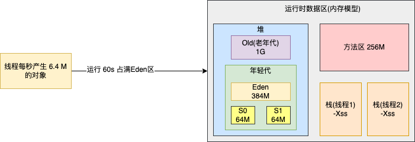

目录
=================

* [前置程序](#前置程序)
* [堆信息打印](#堆信息打印)
* [堆内存 dump-jmap 命令](#堆内存-dump-jmap-命令)
   * [OOM dump文件测试](#oom-dump文件测试)
* [Jstack 命令](#jstack-命令)
   * [jstack找出占用cpu最高的线程堆栈信息](#jstack找出占用cpu最高的线程堆栈信息)
* [Jinfo 命令](#jinfo-命令)
   * [JVM 参数查看](#jvm-参数查看)
   * [系统参数查看](#系统参数查看)
* [Jstat](#jstat)
   * [GC 次数](#gc-次数)
   * [堆内存统计](#堆内存统计)
   * [新生代垃圾回收统计](#新生代垃圾回收统计)
   * [新生代内存统计](#新生代内存统计)
   * [老年代垃圾回收统计](#老年代垃圾回收统计)
   * [老年代内存统计](#老年代内存统计)
   * [元数据空间统计](#元数据空间统计)
* [JVM 运行情况预估](#jvm-运行情况预估)
   * [年轻代增长速率](#年轻代增长速率)
   * [Young GC的触发频率和每次耗时](#young-gc的触发频率和每次耗时)
   * [每次Young GC后有多少对象存活和进入老年代](#每次young-gc后有多少对象存活和进入老年代)
   * [Full GC的触发频率和每次耗时](#full-gc的触发频率和每次耗时)
* [调优实战-系统频繁 Full FC 是什么原因](#调优实战-系统频繁-full-fc-是什么原因)
   * [模拟实例](#模拟实例)
   * [内存泄漏](#内存泄漏)
* [阿里巴巴 Arthas 详解](#阿里巴巴-arthas-详解)
   * [1. 下载 Arthas 并启动](#1-下载-arthas-并启动)
* [GC 日志详解](#gc-日志详解)
* [Class 常量池与运行时常量池](#class-常量池与运行时常量池)
   * [字面量](#字面量)
   * [符号引用](#符号引用)
   * [字符串常量池](#字符串常量池)
      * [字符串常量池的设计思想](#字符串常量池的设计思想)
      * [三种字符串操作(Jdk1.7 及以上版本)](#三种字符串操作jdk17-及以上版本)
         * [直接赋值字符串：](#直接赋值字符串)
         * [new String();](#new-string)
         * [intern()方法](#intern方法)

# 前置程序
首先我们在电脑上启动一个 web 程序，然后通过命令查看对应的进程。这里我自己启动了一个名叫 FirstSpringBootPrjApplication 的 web 程序
然后在终端输入 jps 查看当前运行进程(打了一个 jar 包，放在了 CentOS 上)：
```shell
jps

输出结果：
6000 first-spring-boot-prj-1.0.0-SNAPSHOT.jar
6802 Jps
```
前面是进程号，后面是进程名称。需要查看 FirstSpringBootPrjApplication 的内存信息，以及实例个数。

```shell
jmap -histo 6000

 num     #instances         #bytes  class name (module)
-------------------------------------------------------
   1:          6284        8725192  [I (java.base@11.0.16.1)
   2:         71312        7797048  [B (java.base@11.0.16.1)
   3:         50572        1213728  java.lang.String (java.base@11.0.16.1)
   4:         11766        1035408  java.lang.reflect.Method (java.base@11.0.16.1)
   5:          7073         838472  java.lang.Class (java.base@11.0.16.1)
   6:         10649         596344  java.util.concurrent.ConcurrentHashMap$KeyIterator (java.base@11.0.16.1)
   7:         18284         585088  java.util.concurrent.ConcurrentHashMap$Node (java.base@11.0.16.1)
   8:         12028         583832  [Ljava.lang.Object; (java.base@11.0.16.1)
   9:         22894         504984  [Ljava.lang.Class; (java.base@11.0.16.1)
  10:         13959         446688  java.util.concurrent.locks.AbstractQueuedSynchronizer$Node (java.base@11.0.16.1)
  11:          4263         372288  [Ljava.util.HashMap$Node; (java.base@11.0.16.1)
  12:         11181         357792  java.util.HashMap$Node (java.base@11.0.16.1)
  13:          8597         343880  java.util.LinkedHashMap$Entry (java.base@11.0.16.1)
  14:           987         219104  [C (java.base@11.0.16.1)
  15:           285         219024  [Ljava.util.concurrent.ConcurrentHashMap$Node; (java.base@11.0.16.1)
  16:          3812         213472  java.util.LinkedHashMap (java.base@11.0.16.1)
  17:          9017         144272  java.lang.Object (java.base@11.0.16.1)
……

num:序号
instances:实例数量
bytes:占用空间大小
class name:类名称，[C is a char[]，[S is a short[]，[I is a int[]，[B is a byte[]，[[I is a int[][]
```
# 堆信息打印
输入命令
```shell
jmap -heap 6000
```

可以看到新生代的大小，以及和老年代的比例等这些信息。
```text
using thread-local object allocation.
Parallel GC with 4 thread(s)

Heap Configuration:
   MinHeapFreeRatio         = 0
   MaxHeapFreeRatio         = 100
   MaxHeapSize              = 994050048 (948.0MB)
   NewSize                  = 20971520 (20.0MB)
   MaxNewSize               = 331350016 (316.0MB)
   OldSize                  = 41943040 (40.0MB)
   NewRatio                 = 2
   SurvivorRatio            = 8
   MetaspaceSize            = 21807104 (20.796875MB)
   CompressedClassSpaceSize = 1073741824 (1024.0MB)
   MaxMetaspaceSize         = 17592186044415 MB
   G1HeapRegionSize         = 0 (0.0MB)

Heap Usage:
PS Young Generation
Eden Space:
   capacity = 190840832 (182.0MB)
   used     = 10285584 (9.809097290039062MB)
   free     = 180555248 (172.19090270996094MB)
   5.389613895625859% used
From Space:
   capacity = 7864320 (7.5MB)
   used     = 0 (0.0MB)
   free     = 7864320 (7.5MB)
   0.0% used
To Space:
   capacity = 7864320 (7.5MB)
   used     = 0 (0.0MB)
   free     = 7864320 (7.5MB)
   0.0% used
PS Old Generation
   capacity = 36175872 (34.5MB)
   used     = 11148056 (10.631614685058594MB)
   free     = 25027816 (23.868385314941406MB)
   30.8162744494452% used

12207 interned Strings occupying 1048976 bytes.
```
# 堆内存 dump-jmap 命令
```shell
jmap -dump:format=b,file=test.hprof 6000 
```
执行完成后会输出一个 test.hprof 的二进制文件。
```text
Dumping heap to /home/azh/Dev_Azh/test.hprof ...
Heap dump file created
```

## OOM dump文件测试
可以在运行参数中设置 OOM 自动导出 dump 文件(文件很大的时候，不要设置，不然服务器容易炸)
测试demo
```java
/**
 * 测试 OOM
 * 设置 JVM 运行参数：-Xms10M -Xmx10M -XX:+PrintGCDetails -XX:+HeapDumpOnOutOfMemoryError -XX:HeapDumpPath=/Users/azh/Dev_AZH/Java_St/JUC/jvm/src/main/java/com/anzhi/jvmoptimization/oom.dump
 */
public class OomDemo {
    public static List<Object> objectList = new ArrayList<>();

    public static void main(String[] args) {
        int i=0;
        int j=0;
        while(true){
            objectList.add(new Object());
        }
    }
}
```
程序出现 OutOfMemoryError 异常，利用 jvisualvm 导入 dump 文件，可以看到是因为创建了大量的 Object 对象导致内存溢出。如图：


# Jstack 命令
用jstack加进程id查找死锁，见如下示例
```java
public class DeadLock {
    private static CountDownLatch lock1 = new CountDownLatch(1);
    private static CountDownLatch lock2 = new CountDownLatch(1);

    public static void main(String[] args) {
        new Thread(()->{
            try {
                System.out.println("T1 线程开始执行");
                lock1.await();
                Thread.sleep(5000);
            } catch (InterruptedException e) {
                // doNothing
            }
            lock2.countDown();
            System.out.println("T1 线程结束");
        }, "T1").start();

        new Thread(()->{
            try {
                System.out.println("T2 线程开始执行");
                lock1.await();
                Thread.sleep(5000);
            } catch (InterruptedException e) {
                // doNothing
            }
            lock2.countDown();
            System.out.println("T2 线程结束");
        }, "T2").start();
    }
}
```
输出结果：
```text
T1 线程开始执行
T2 线程开始执行
```
程序最终阻塞到这里。使用 jstack 命令查看线程信息：
```shell
jsp 查看当前运行线程
输出结果
78642 Jps
78599 Main
71384 
78619 DeadLock
78618 Launcher

DeadLock 线程 id 为： 78619

执行 jstack -l 78619 查看当前线程信息

"T2" #20 prio=5 os_prio=31 tid=0x00007fb3d10d3800 nid=0x9703 waiting on condition [0x00007000097a1000]
   java.lang.Thread.State: WAITING (parking)
	at sun.misc.Unsafe.park(Native Method)
	- parking to wait for  <0x000000066ac1eae0> (a java.util.concurrent.CountDownLatch$Sync)
	at java.util.concurrent.locks.LockSupport.park(LockSupport.java:175)
	at java.util.concurrent.locks.AbstractQueuedSynchronizer.parkAndCheckInterrupt(AbstractQueuedSynchronizer.java:836)
	at java.util.concurrent.locks.AbstractQueuedSynchronizer.doAcquireSharedInterruptibly(AbstractQueuedSynchronizer.java:997)
	at java.util.concurrent.locks.AbstractQueuedSynchronizer.acquireSharedInterruptibly(AbstractQueuedSynchronizer.java:1304)
	at java.util.concurrent.CountDownLatch.await(CountDownLatch.java:231)
	at com.anzhi.jvmoptimization.DeadLock.lambda$main$1(DeadLock.java:25)
	at com.anzhi.jvmoptimization.DeadLock$$Lambda$2/1989780873.run(Unknown Source)
	at java.lang.Thread.run(Thread.java:748)

   Locked ownable synchronizers:
	- None

"T1" #19 prio=5 os_prio=31 tid=0x00007fb3d70f8000 nid=0x6003 waiting on condition [0x000070000969e000]
   java.lang.Thread.State: WAITING (parking)
	at sun.misc.Unsafe.park(Native Method)
	- parking to wait for  <0x000000066ac1eab0> (a java.util.concurrent.CountDownLatch$Sync)
	at java.util.concurrent.locks.LockSupport.park(LockSupport.java:175)
	at java.util.concurrent.locks.AbstractQueuedSynchronizer.parkAndCheckInterrupt(AbstractQueuedSynchronizer.java:836)
	at java.util.concurrent.locks.AbstractQueuedSynchronizer.doAcquireSharedInterruptibly(AbstractQueuedSynchronizer.java:997)
	at java.util.concurrent.locks.AbstractQueuedSynchronizer.acquireSharedInterruptibly(AbstractQueuedSynchronizer.java:1304)
	at java.util.concurrent.CountDownLatch.await(CountDownLatch.java:231)
	at com.anzhi.jvmoptimization.DeadLock.lambda$main$0(DeadLock.java:13)
	at com.anzhi.jvmoptimization.DeadLock$$Lambda$1/2093631819.run(Unknown Source)
	at java.lang.Thread.run(Thread.java:748)

   Locked ownable synchronizers:
	- None
	
可以看到是阻塞在 CountDownLatch 这个对象
```
也可以通过 jvisualvm 查看当前线程的运行信息。

远程连接服务器这一块儿就不操作了，一般来说，生产的东西我们基本是无法连接的。

## jstack找出占用cpu最高的线程堆栈信息
使用 top 命令查询当前占用 CPU 最高的线程
```shell
top -c 查看当前占用 CPU 最高的进程程是那个

  PID USER      PR  NI    VIRT    RES    SHR S  %CPU %MEM     TIME+ COMMAND                                                                                                        
13354 azh       20   0 3420896  46576  12360 S  79.3  1.2   0:08.51 java CpuHighDemo       

top -H -p 13354  查看当前进程中占用 CPU 最高的线程是那个
  PID USER      PR  NI    VIRT    RES    SHR S %CPU %MEM     TIME+ COMMAND                                                                                                         
13355 azh       20   0 3420896  46576  12360 R 77.7  1.2   0:56.96 java     

jstack 13354 ｜ grep -A 30 0x342b 注意这里的 00x342b 是线程 13354 的十六进制表示

"main" #1 prio=5 os_prio=0 tid=0x00007fc77004b800 nid=0x342b runnable [0x00007fc777067000]
   java.lang.Thread.State: RUNNABLE
	at java.io.FileOutputStream.writeBytes(Native Method)
	at java.io.FileOutputStream.write(FileOutputStream.java:326)
	at java.io.BufferedOutputStream.flushBuffer(BufferedOutputStream.java:82)
	at java.io.BufferedOutputStream.flush(BufferedOutputStream.java:140)
	- locked <0x00000000c4c1dbd8> (a java.io.BufferedOutputStream)
	at java.io.PrintStream.write(PrintStream.java:482)
	- locked <0x00000000c4c07150> (a java.io.PrintStream)
	at sun.nio.cs.StreamEncoder.writeBytes(StreamEncoder.java:221)
	at sun.nio.cs.StreamEncoder.implFlushBuffer(StreamEncoder.java:291)
	at sun.nio.cs.StreamEncoder.flushBuffer(StreamEncoder.java:104)
	- locked <0x00000000c4c070e0> (a java.io.OutputStreamWriter)
	at java.io.OutputStreamWriter.flushBuffer(OutputStreamWriter.java:185)
	at java.io.PrintStream.write(PrintStream.java:527)
	- eliminated <0x00000000c4c07150> (a java.io.PrintStream)
	at java.io.PrintStream.print(PrintStream.java:669)
	at java.io.PrintStream.println(PrintStream.java:806)
	- locked <0x00000000c4c07150> (a java.io.PrintStream)
	at CpuHighDemo.compute(CpuHighDemo.java:7)
	at CpuHighDemo.main(CpuHighDemo.java:13)
```
可以看到最先面是因为调用了 compute 方法，导致CPU 飙升，大概率是这里存在问题。

# Jinfo 命令

## JVM 参数查看
查看正在运行的Java应用程序的扩展参数，查看jvm的参数。
```shell
jinfo -flags 13713 查看当前线程 JVM 启动参数

Attaching to process ID 13713, please wait...
Debugger attached successfully.
Server compiler detected.
JVM version is 25.362-b08
Non-default VM flags: -XX:CICompilerCount=3 -XX:InitialHeapSize=62914560 -XX:MaxHeapSize=994050048 
-XX:MaxNewSize=331350016 -XX:MinHeapDeltaBytes=524288 -XX:NewSize=20971520 -XX:OldSize=41943040 
-XX:+UseCompressedClassPointers -XX:+UseCompressedOops -XX:+UseParallelGC 
```
可以看到使用了什么垃圾收集器 CMS + Parallel，老年代、年轻代大小等信息。

## 系统参数查看
```shell
jinfo -flags 13713

Attaching to process ID 13713, please wait...
Debugger attached successfully.
Server compiler detected.
JVM version is 25.362-b08
Non-default VM flags: -XX:CICompilerCount=3 -XX:InitialHeapSize=62914560 -XX:MaxHeapSize=994050048 -XX:MaxNewSize=331350016 -XX:MinHeapDeltaBytes=524288 -XX:NewSize=20971520 -XX:OldSize=41943040 -XX:+UseCompressedClassPointers -XX:+UseCompressedOops -XX:+UseParallelGC 
Command line:  
[azh@CentOS_Dev]~% jinfo -sysprops 13713
Attaching to process ID 13713, please wait...
Debugger attached successfully.
Server compiler detected.
JVM version is 25.362-b08
java.runtime.name = OpenJDK Runtime Environment
```
# Jstat

jstat命令可以查看堆内存各部分的使用量，以及加载类的数量。命令的格式如下: 

jstat [-命令选项] [vmid] [间隔时间(毫秒)] [查询次数] 

注意:使用的jdk版本是jdk8

## GC 次数
```shell
jstat -gc pid 最常用，可以评估程序内存使用及GC压力整体情况

  S0C    S1C    S0U    S1U      EC       EU        OC         OU       MC     MU    CCSC   CCSU      YGC     YGCT FGC      FGCT     GCT   
7168.0 7168.0  0.0    0.0   189440.0 14316.1   35328.0    11401.6   35456.0 33447.0 4480.0 4028.7     10    0.063   2      0.067    0.129
```

说明一下上面参数的意义
```text
S0C:第一个幸存区的大小，单位KB 
S1C:第二个幸存区的大小 
S0U:第一个幸存区的使用大小
S1U:第二个幸存区的使用大小 
EC:伊甸园区的大小 
EU:伊甸园区的使用大小 
OC:老年代大小
OU:老年代使用大小 
MC:方法区大小(元空间) 
MU:方法区使用大小 
CCSC:压缩类空间大小 
CCSU:压缩类空间使用大小 
YGC:年轻代垃圾回收次数 
YGCT:年轻代垃圾回收消耗时间，单位s 
FGC:老年代垃圾回收次数 
FGCT:老年代垃圾回收消耗时间，单位s 
GCT:垃圾回收消耗总时间，单位s
```
## 堆内存统计
```shell
jstat -gccapacity 13713

NGCMN    NGCMX     NGC     S0C   S1C       EC      OGCMN      OGCMX       OGC         OC       MCMN     MCMX      MC     CCSMN    CCSMX     CCSC    YGC    FGC 
 20480.0 323584.0 203776.0 7168.0 7168.0 189440.0    40960.0   647168.0    35328.0    35328.0      0.0 1081344.0  35456.0      0.0 1048576.0   4480.0     10     2
```
说明一下参数意义
```text
NGCMN:新生代最小容量 
NGCMX:新生代最大容量 
NGC:当前新生代容量 
S0C:第一个幸存区大小 
S1C:第二个幸存区的大小 
EC:伊甸园区的大小 
OGCMN:老年代最小容量 
OGCMX:老年代最大容量 
OGC:当前老年代大小 
OC:当前老年代大小 
MCMN:最小元数据容量 
MCMX:最大元数据容量 
MC:当前元数据空间大小 
CCSMN:最小压缩类空间大小 
CCSMX:最大压缩类空间大小 
CCSC:当前压缩类空间大小 
YGC:年轻代gc次数 
FGC:老年代GC次数
```

## 新生代垃圾回收统计
```text
jstat -gcnew 13713  

 S0C    S1C    S0U    S1U   TT MTT  DSS      EC       EU     YGC     YGCT  
7168.0 7168.0    0.0    0.0  1  15 7168.0 189440.0  14316.1     10    0.063
```
说明一下参数意义
```text
S0C:第一个幸存区的大小 
S1C:第二个幸存区的大小 
S0U:第一个幸存区的使用大小 
S1U:第二个幸存区的使用大小 
TT:对象在新生代存活的次数 
MTT:对象在新生代存活的最大次数 
DSS:期望的幸存区大小 
EC:伊甸园区的大小 
EU:伊甸园区的使用大小 
YGC:年轻代垃圾回收次数 
YGCT:年轻代垃圾回收消耗时间
```
## 新生代内存统计
```shell
  NGCMN      NGCMX       NGC      S0CMX     S0C     S1CMX     S1C       ECMX        EC      YGC   FGC 
   20480.0   323584.0   203776.0 107520.0   7168.0 107520.0   7168.0   322560.0   189440.0    10     2
```

说明一下参数意义
```text
NGCMN:新生代最小容量 
NGCMX:新生代最大容量 
NGC:当前新生代容量 
S0CMX:最大幸存1区大小 
S0C:当前幸存1区大小 
S1CMX:最大幸存2区大小 
S1C:当前幸存2区大小 
ECMX:最大伊甸园区大小 
EC:当前伊甸园区大小 
YGC:年轻代垃圾回收次数 
FGC:老年代回收次数
```
## 老年代垃圾回收统计
```shell
   MC       MU      CCSC     CCSU       OC          OU       YGC    FGC    FGCT     GCT   
 35456.0  33447.0   4480.0   4028.7     35328.0     11401.6     10     2    0.067    0.129
```
参数说明
```text
MC:方法区大小 
MU:方法区使用大小 
CCSC:压缩类空间大小 
CCSU:压缩类空间使用大小 
OC:老年代大小 
OU:老年代使用大小 
YGC:年轻代垃圾回收次数 
FGC:老年代垃圾回收次数 
FGCT:老年代垃圾回收消耗时间 
GCT:垃圾回收消耗总时间
```

## 老年代内存统计
```shell
jstat -gcold 13713

   MC       MU      CCSC     CCSU       OC          OU       YGC    FGC    FGCT     GCT   
 35456.0  33447.0   4480.0   4028.7     35328.0     11401.6     10     2    0.067    0.129
```
参数说明
```text
OGCMN:老年代最小容量 
OGCMX:老年代最大容量 
OGC:当前老年代大小 
OC:老年代大小 
YGC:年轻代垃圾回收次数 
FGC:老年代垃圾回收次数 
FGCT:老年代垃圾回收消耗时间 
GCT:垃圾回收消耗总时间
```

## 元数据空间统计
```shell
jstat -gcmetacapacity 13713

MCMN       MCMX        MC       CCSMN      CCSMX       CCSC     YGC   FGC    FGCT     GCT   
   0.0  1081344.0    35456.0        0.0  1048576.0     4480.0    10     2    0.067    0.129
```
参数说明
```text
MCMN:最小元数据容量 
MCMX:最大元数据容量 
MC:当前元数据空间大小 
CCSMN:最小压缩类空间大小 
CCSMX:最大压缩类空间大小 
CCSC:当前压缩类空间大小 
YGC:年轻代垃圾回收次数 
FGC:老年代垃圾回收次数 
FGCT:老年代垃圾回收消耗时间 
GCT:垃圾回收消耗总时间
```
# JVM 运行情况预估
用 jstat gc -pid 命令可以计算出如下一些关键数据，有了这些数据就可以采用之前介绍过的优化思路，先给自己的系统设置一些初始性的 JVM参数，
比如堆内存大小，年轻代大小，Eden和Survivor的比例，老年代的大小，大对象的阈值，大龄对象进入老年代的阈值等。
## 年轻代增长速率
年轻代对象增长的速率
可以执行命令 jstat -gc pid 1000 10 (每隔1秒执行1次命令，共执行10次)，通过观察EU(eden区的使用)来估算每秒eden大概新增多少对象，如果系统负载不高，
可以把频率1秒换成1分钟，甚至10分钟来观察整体情况。注意，一般系统可能有高峰期和日常期，所以需要在不同的时间分别估算不同情况下对象增长速率。
## Young GC的触发频率和每次耗时
知道年轻代对象增长速率我们就能推根据eden区的大小推算出Young GC大概多久触发一次，Young GC的平均耗时可以通过 YGCT/YGC 公式算出，根据结
果我们大概就能知道系统大概多久会因为Young GC的执行而卡顿多久。
## 每次Young GC后有多少对象存活和进入老年代
这个因为之前已经大概知道Young GC的频率，假设是每5分钟一次，那么可以执行命令 jstat -gc pid 300000 10 ，观察每次结果eden， survivor和
老年代使用的变化情况，在每次gc后eden区使用一般会大幅减少，survivor和老年代都有可能增长，这些增长的对象就是每次 Young GC后存活的对象，
同时还可以看出每次Young GC后进去老年代大概多少对象，从而可以推算出老年代对象增长速率。
## Full GC的触发频率和每次耗时
知道了老年代对象的增长速率就可以推算出Full GC的触发频率了，Full GC的每次耗时可以用公式 FGCT/FGC 计算得出。
**优化思路**其实简单来说就是尽量让每次Young GC后的存活对象小于Survivor区域的50%，都留存在年轻代里。尽量别让对象进入老年 代。尽量减少
Full GC的频率，避免频繁Full GC对JVM性能的影响。

# 调优实战-系统频繁 Full FC 是什么原因
运行环境如下：
1. 机器配置:2核4G
2. JVM内存大小:2G 
3. 系统运行时间:7天 
4. 期间发生的Full GC次数和耗时:500多次，200多秒 期间发生的Young GC次数和耗时:1万多次，500多秒


大致算下来每天会发生70多次Full GC，平均每小时3次，每次Full GC在400毫秒左右; 每天会发生1000多次Young GC，每分钟会发生1次，每次
Young GC在50毫秒左右。

JVM 参数设置如下：
````shell
-Xms1536M -Xmx1536M -Xmn512M -Xss256K -XX:SurvivorRatio=6 -XX:MetaspaceSize=256M -XX:MaxMetaspaceSize=256M -XX:+UseParNewGC -XX:+UseConcMarkSweepGC -XX:CMSInitiatingOccupancyFraction=75 -XX:+UseCMSInitiatingOccupancyOnly
````

根据 JVM 参数配置，我们可以画出如下的堆内存模型：


根据上面描述，暂时推测是因为对象动态年龄判断机制导致 Full GC 频繁。下面我们用代码模拟一下这种场景(GC次数，以及对象大小可能不一致，但是
优化大体差不多)

## 模拟实例
模拟一个用户查询的场景，代码如下：
Controller 层
```java
@RestController
public class IndexController {

    @RequestMapping("/user/process")
    public String processUserData() throws InterruptedException {
        ArrayList<User> users = queryUsers();

        for (User user: users) {
            //TODO 业务处理
            System.out.println("user:" + user.toString());
        }
        return "end";
    }

    /**
     * 模拟批量查询用户场景
     * @return
     */
    private ArrayList<User> queryUsers() {
        ArrayList<User> users = new ArrayList<>();
        for (int i = 0; i < 5000; i++) {
            users.add(new User(i,"zhuge"));
        }
        return users;
    }
}
```
创建 User 对象
```java
public class User {
	
	private int id;
	private String name;

	byte[] a = new byte[1024*100];

	public User(){}

	public User(int id, String name) {
		super();
		this.id = id;
		this.name = name;
	}

	public int getId() {
		return id;
	}
	public void setId(int id) {
		this.id = id;
	}
	public String getName() {
		return name;
	}
	public void setName(String name) {
		this.name = name;
	}

}
```
创建启动类
```java
@SpringBootApplication
public class Application {

	public static void main(String[] args) {
		SpringApplication.run(Application.class, args);
	}

	@Bean
	public RestTemplate restTemplate() {
		return new RestTemplate();
	}

}
```

创建 yaml 配置文件
```yaml
server:
  port: 8080
```

创建测试类：
```java
@RunWith(SpringRunner.class)
@SpringBootTest(classes={Application.class})// 指定启动类
public class JvmOptimizationExampleTest {
    @Bean
    public RestTemplate restTemplate() {
        return new RestTemplate();
    }

    @Autowired
    private RestTemplate restTemplate;

    @Test
    public void test() throws Exception {
        for (int i = 0; i < 10000; i++) {
            String result = restTemplate.getForObject("http://localhost:8080/user/process", String.class);
            Thread.sleep(1000);
        }
    }
}
```

启动业务类代码，查看对应运行线程的 id：
```shell
jsp

71384 
95752 Jps
95725 JvmOptimizationApplication
95724 Launcher

使用 jstat -gc 2000 10000 查看 GC 信息：每2s查询一次，查询 1w 次
 S0C    S1C    S0U    S1U      EC       EU        OC         OU       MC     MU    CCSC   CCSU   YGC     YGCT    FGC    FGCT     GCT   
65536.0 65536.0  0.0   23503.8 393216.0 55052.8  1048576.0     0.0     29184.0 27179.4 4096.0 3656.6      1    0.017   0      0.000    0.017
65536.0 65536.0  0.0   23503.8 393216.0 55052.8  1048576.0     0.0     29184.0 27179.4 4096.0 3656.6      1    0.017   0      0.000    0.017
65536.0 65536.0  0.0   23503.8 393216.0 55052.8  1048576.0     0.0     29184.0 27179.4 4096.0 3656.6      1    0.017   0      0.000    0.017
65536.0 65536.0  0.0   23503.8 393216.0 55052.8  1048576.0     0.0     29184.0 27179.4 4096.0 3656.6      1    0.017   0      0.000    0.017
65536.0 65536.0  0.0   23503.8 393216.0 55052.8  1048576.0     0.0     29184.0 27179.4 4096.0 3656.6      1    0.017   0      0.000    0.017
65536.0 65536.0  0.0   23503.8 393216.0 55052.8  1048576.0     0.0     29184.0 27179.4 4096.0 3656.6      1    0.017   0      0.000    0.017
65536.0 65536.0  0.0   23503.8 393216.0 55052.8  1048576.0     0.0     29184.0 27179.4 4096.0 3656.6      1    0.017   0      0.000    0.017
65536.0 65536.0  0.0   23503.8 393216.0 55052.8  1048576.0     0.0     29184.0 27179.4 4096.0 3656.6      1    0.017   0      0.000    0.017
65536.0 65536.0  0.0   23503.8 393216.0 55052.8  1048576.0     0.0     29184.0 27179.4 4096.0 3656.6      1    0.017   0      0.000    0.017
65536.0 65536.0  0.0   23503.8 393216.0 55052.8  1048576.0     0.0     29184.0 27179.4 4096.0 3656.6      1    0.017   0      0.000    0.017

此时系统运行正常
```
启动测试类，掉用查询接口，每隔 1s 查询一次用户信息，此时再看 GC 信息：
```textS0C    S1C    S0U    S1U      EC       EU        OC         OU       MC     MU    CCSC   CCSU   YGC     YGCT    FGC    FGCT     GCT   
65536.0 65536.0 65536.0  0.0   393216.0 200547.1 1048576.0   266018.3  30336.0 28338.0 4224.0 3793.2      2    0.150   0      0.000    0.150
65536.0 65536.0  0.0   65536.0 393216.0 59606.6  1048576.0   789134.1  30592.0 28626.8 4224.0 3835.3      5    0.388   1      0.003    0.391
65536.0 65536.0 65441.8  0.0   393216.0 300067.4 1048576.0   651038.6  30592.0 28626.8 4224.0 3835.3      7    0.421   2      0.096    0.518
65536.0 65536.0  0.0   65442.4 393216.0 33493.6  1048576.0   424145.1  30592.0 28626.8 4224.0 3835.3      9    0.454   3      0.151    0.605
65536.0 65536.0  0.0    0.0   393216.0 270417.9 1048576.0   247341.5  30592.0 28626.8 4224.0 3835.3     11    0.497   5      0.223    0.720
65536.0 65536.0  0.0   65510.7 393216.0 120932.6 1048576.0   333528.2  30592.0 28626.8 4224.0 3835.3     14    0.622   7      0.229    0.851
65536.0 65536.0  0.0   65534.5 393216.0 357663.3 1048576.0   625579.6  30592.0 28626.8 4224.0 3835.3     16    0.700   7      0.229    0.929
65536.0 65536.0  0.0   65486.3 393216.0 88472.9  1048576.0   366250.9  30592.0 28626.8 4224.0 3835.3     18    0.739   9      0.237    0.976
65536.0 65536.0  0.0    0.0   393216.0 329675.3 1048576.0   190726.1  30592.0 28626.8 4224.0 3835.3     20    0.780  10      0.299    1.079
65536.0 65536.0  0.0    0.0   393216.0 182762.1 1048576.0   337193.4  30592.0 28628.6 4224.0 3835.9     23    0.852  12      0.385    1.237
65536.0 65536.0 65535.1  0.0   393216.0 23152.3  1048576.0   426069.6  30592.0 28628.6 4224.0 3835.9     26    0.921  13      0.433    1.354
65536.0 65536.0  0.0   65536.0 393216.0 264619.4 1048576.0   810269.2  30592.0 28628.6 4224.0 3835.9     28    0.963  15      0.434    1.397
65536.0 65536.0 65536.0  0.0   393216.0 384545.2 1048576.0   575236.7  30592.0 28628.6 4224.0 3835.9     29    0.999  15      0.508    1.506
65536.0 65536.0  0.0   65511.1 393216.0 235862.9 1048576.0   548164.7  30592.0 28628.6 4224.0 3835.9     32    1.060  17      0.516    1.576
```
发现 YGC 和 Full GC 的次数增加了。

根据我们之前的推测，是因为对象动态年龄判断导致那些朝生夕死的对象进入了老年代，从而频繁地触发 Full GC。那么将年轻代适当的调大。其他参数不变
```shell
-Xms1536M -Xmx1536M -Xmn1024M -Xss256K -XX:SurvivorRatio=6 -XX:MetaspaceSize=256M -XX:MaxMetaspaceSize=256M -XX:+UseParNewGC -XX:+UseConcMarkSweepGC -XX:CMSInitiatingOccupancyFraction=92 -XX:+UseCMSInitiatingOccupancyOnly
```
主机访问虚机的web服务需要配置转接接口: 
[配置转接接口](https://download.parallels.com/desktop/v10/docs/zh_CN/Parallels%20Desktop%20User's%20Guide/33341.htm)

再次启动线程，查询用户数据：
```text
     S0C    S1C    S0U    S1U      EC       EU        OC         OU       MC     MU    CCSC   CCSU   YGC     YGCT    FGC    FGCT     GCT   
131072.0 131072.0  0.0    0.0   786432.0 338984.0  524288.0   188327.2  30592.0 28630.4 4224.0 3838.2      3    0.266   3      0.080    0.346
131072.0 131072.0  0.0    0.0   786432.0 117353.0  524288.0   456253.6  30592.0 28630.4 4224.0 3838.2      4    0.358   4      0.187    0.545
131072.0 131072.0  0.0    0.0   786432.0 318901.6  524288.0   198649.0  30592.0 28630.4 4224.0 3838.2      5    0.358   7      0.274    0.631
131072.0 131072.0  0.0    0.0   786432.0 571001.8  524288.0   472974.4  30592.0 28630.4 4224.0 3838.2      6    0.358   8      0.373    0.731
131072.0 131072.0  0.0    0.0   786432.0 36968.5   524288.0   479586.9  30592.0 28630.4 4224.0 3838.2      8    0.398  12      0.572    0.970
131072.0 131072.0  0.0    0.0   786432.0 301510.4  524288.0   224173.7  30592.0 28630.4 4224.0 3838.2      9    0.398  15      0.652    1.050
131072.0 131072.0  0.0    0.0   786432.0 36455.7   524288.0   485089.3  30592.0 28630.4 4224.0 3838.2     10    0.398  17      0.748    1.146
131072.0 131072.0  0.0    0.0   786432.0 274276.6  524288.0   244983.1  30592.0 28632.2 4224.0 3838.8     11    0.398  19      0.829    1.227
131072.0 131072.0  0.0    0.0   786432.0 527111.3  524288.0    9589.9   30592.0 28632.2 4224.0 3838.8     12    0.398  20      0.862    1.260
131072.0 131072.0  0.0   130997.6 786432.0 766485.4  524288.0   136436.3  30592.0 28632.2 4224.0 3838.8     13    0.419  20      0.862    1.281
131072.0 131072.0  0.0   131072.0 786432.0 232779.1  524288.0   284664.2  30592.0 28635.1 4224.0 3839.7     15    0.445  20      0.862    1.307
131072.0 131072.0 36532.2  0.0   786432.0 482332.5  524288.0   157829.5  30592.0 28635.1 4224.0 3839.7     16    0.448  22      0.876    1.324
131072.0 131072.0  0.0   131015.3 786432.0 210737.6  524288.0   330356.4  30592.0 28635.5 4224.0 3839.7     17    0.474  22      0.876    1.350
```
根据监测的信息来看，Full GC 的次数反而更多了。这是为什么呢？

首先来看下什么请况下会触发 Full GC
1. 元空间不够导致的多余full gc;
2. 显示调用System.gc()造成多余的full gc，这种一般线上尽量通过-XX:+DisableExplicitGC参数禁用，如果加上了这个JVM启动参数，那 么代码中调用System.gc()没有任何效果;
3. 老年代空间分配担保机制

我们分配的元空间大小是 256M，从监控情况来看，方法区占用了 27M，显然不是这个问题；而在程序中也没有显示地调用 System.gc()；仔细观察老年代的
使用情况来看，显然没有触发老年代空间分配担保机制。那么是不是程序哪里有问题，那么目前看来参数调整是没有问题的。那就只有可能是程序有问题了。

1. 那怎么排查呢？首先查看一下是否有占用 CPU 高的进程：
```shell
top -c
 PID USER      PR  NI    VIRT    RES    SHR S  %CPU %MEM     TIME+ COMMAND                                                                                                                                                                                
 4126 azh       20   0 5186292 1.659g  11648 S   8.6 44.9   0:12.33 java -Xms1536M -Xmx1536M -Xmn1024M -Xss256K -XX:SurvivorRatio=6 -XX:MetaspaceSize=256M ...

查看当前进程中占用 CPU 较高的线程信息
top -H -p 4126
  PID USER      PR  NI    VIRT    RES    SHR S %CPU %MEM     TIME+ COMMAND                                                                                                         
 4133 azh       20   0 5186292 1.660g  11648 S  5.3 44.9   0:12.78 VM Thread    

发现基本是 JVM 的GC 线程在工作，那么我们在查看一下该进程的对象信息：
jmap -histo 4126 > text.txt

大概内容如下：
 num     #instances         #bytes  class name
----------------------------------------------
   1:          6857      512448208  [B
   2:         66460        6137400  [C
   3:          2748        2089568  [I
   4:         36385         873240  java.lang.String
   5:          6257         691712  java.lang.Class
   6:         18483         591456  java.util.concurrent.ConcurrentHashMap$Node
……
```

可以看到创建了大量的 byte 对象，导致内存不够使用。而这个 byte 正是在创建 User 对象的时候被创建的，所以需要我们优化查询对象的代码：
```text
    /**
     * 模拟批量查询用户场景
     * @return
     */
    private ArrayList<User> queryUsers() {
        ArrayList<User> users = new ArrayList<>();
        for (int i = 0; i < 1000; i++) {
            users.add(new User(i,"zhuge"));
        }
        return users;
    }
```
将每次可以查询5000的数据改为查询1000条，再来看一下效果：
```text
131072.0 131072.0  0.0   38734.4 786432.0 779808.9  524288.0   10763.4   31104.0 29001.8 4224.0 3837.9    137    0.848   0      0.000    0.848
131072.0 131072.0 6527.5  0.0   786432.0 198163.3  524288.0   10763.4   31104.0 29001.8 4224.0 3837.9    138    0.852   0      0.000    0.852
131072.0 131072.0 6527.5  0.0   786432.0 401925.0  524288.0   10763.4   31104.0 29001.8 4224.0 3837.9    138    0.852   0      0.000    0.852
131072.0 131072.0 6527.5  0.0   786432.0 605848.9  524288.0   10763.4   31104.0 29001.8 4224.0 3837.9    138    0.852   0      0.000    0.852
131072.0 131072.0  0.0   76947.5 786432.0 24901.7   524288.0   10763.4   31104.0 29001.8 4224.0 3837.9    139    0.859   0      0.000    0.859
131072.0 131072.0  0.0   76947.5 786432.0 229210.6  524288.0   10763.4   31104.0 29001.8 4224.0 3837.9    139    0.859   0      0.000    0.859
131072.0 131072.0  0.0   76947.5 786432.0 434721.8  524288.0   10763.4   31104.0 29001.8 4224.0 3837.9    139    0.859   0      0.000    0.859
131072.0 131072.0  0.0   76947.5 786432.0 640539.8  524288.0   10763.4   31104.0 29001.8 4224.0 3837.9    139    0.859   0      0.000    0.859
131072.0 131072.0 43235.1  0.0   786432.0 58506.0   524288.0   10763.4   31104.0 29001.8 4224.0 3837.9    140    0.864   0      0.000    0.864
131072.0 131072.0 43235.1  0.0   786432.0 261973.5  524288.0   10763.4   31104.0 29001.8 4224.0 3837.9    140    0.864   0      0.000    0.864
131072.0 131072.0 43235.1  0.0   786432.0 467657.6  524288.0   10763.4   31104.0 29001.8 4224.0 3837.9    140    0.864   0      0.000    0.864
131072.0 131072.0 43235.1  0.0   786432.0 671945.1  524288.0   10763.4   31104.0 29001.8 4224.0 3837.9    140    0.864   0      0.000    0.864
```
可以看到基本没有触发 Full GC了。

所以有的时候在 JVM 参数调整符合理论基础的时候，仍然还有大量的 Full GC ，那么就需要考虑程序的优化了。

## 内存泄漏
再给大家讲一种情况，一般电商架构可能会使用多级缓存架构，就是redis加上JVM级缓存，大多数同学可能为了图方便对于JVM级缓存就 简单使用一个
hashmap，于是不断往里面放缓存数据，但是很少考虑这个map的容量问题，结果这个缓存map越来越大，一直占用着老 年代的很多空间，时间长了就会导
致full gc非常频繁，这就是一种内存泄漏，对于一些老旧数据没有及时清理导致一直占用着宝贵的内存 资源，时间长了除了导致full gc，还有可能导致
OOM。 这种情况完全可以考虑采用一些成熟的JVM级缓存框架来解决，比如ehcache等自带一些LRU数据淘汰算法的框架来作为JVM级的缓存。

上面这种情况与 ThreadLocal 使用不释放是一样的。

# 阿里巴巴 Arthas 详解
Arthas 是阿里在2018年9月开源的 Java 工具，支持 JDK6+，采用命令交互模式，可以方便的定位和诊断线上程序问题。详细文档参考：[Arthas](https://arthas.aliyun.com/doc/quick-start.html)

## 1. 下载 Arthas 并启动
```shell
curl -O https://arthas.aliyun.com/arthas-boot.jar
java -jar arthas-boot.jar
```
在启动 Arthas 之前首先把前面导致 OOM 的线程以及产生死锁的线程运行起来，然后再启动 Arthas。


# GC 日志详解


# Class 常量池与运行时常量池
Class 常量池可以理解为 Class 文件中的资源仓库。Class 文件中除了包含类的版本、字段、方法、接口等描述信息外，还有一项信息就是常量池(constant pool table)，
用于存放编译期生成的各种字面量(Literal)和符号引用(Symbolic References)。

Java 生成的 Class 文件是 16 进制的，一般我们不会人工分析。可以通过命令查看：
```shell
javap -v MinorGcEdenDemo(这个是 class 文件)
```
输出结果：
```text
Constant pool:
   #1 = Methodref          #5.#23         // java/lang/Object."<init>":()V
   #2 = Integer            247808000
   #3 = Integer            8192000
   #4 = Class              #24            // com/anzhi/jvmminorgc/MinorGcEdenDemo
   #5 = Class              #25            // java/lang/Object
   #6 = Utf8               <init>
   #7 = Utf8               ()V
   ……
```
Constant pool: 下面展示的就是 class 常量池信息。常量池中主要存放两大类常量：字面量和符号引用

## 字面量
字面量就是指由字母、数字等构成的字符串或者数值常量。

## 符号引用
符号引用是编译原理中的概念，是相对于直接引用来说的。主要包括了以下三类常量:

1. 类和接口的全限定名;
2. 字段的名称和描述符;
3. 方法的名称和描述符;

## 字符串常量池
### 字符串常量池的设计思想
1. 字符串的分配，和其他的对象分配一样，耗费高昂的时间与空间代价，作为最基础的数据类型，大量频繁的创建字符串，会极大程度地影响程序的性能；
2. JVM为了提高性能和减少内存开销，在实例化字符串常量的时候进行了一些优化；
   1. 为字符串开辟一个字符串常量池，类似于缓存区；
   2. 创建字符串常量时，首先查询字符串常量池是否存在该字符串；
   3. 存在该字符串，返回引用实例，不存在，实例化该字符串并放入池中；

### 三种字符串操作(Jdk1.7 及以上版本)
#### 直接赋值字符串：
```text
String str = "zhangsan"
```
这种方式创建的字符串对象，只会在常量池中。 因为有"zhuge"这个字面量，创建对象s的时候，JVM会先去常量池中通过 equals(key) 方法，判断是否
有相同的对象，如果有，则直接返回该对象在常量池中的引用; 如果没有，则会在常量池中创建一个新对象，再返回引用。

#### new String();
```text
String s1 = new String("zhangsan");//s1指向内存中的对象引用
```
步骤大致如下: 因为有"zhangsan"这个字面量，所以会先检查字符串常量池中是否存在字符串"zhangsan" 不存在，先在字符串常量池里创建一个字符串;
再去内存中创建一个字符串对象 new String(); 存在的话，就直接去堆内存中创建一个字符串对象 new String(); 最后，将内存中的引用返回。

#### intern()方法
```text
String s1 = new String("zhangsan");
String s2 = s1.intern();

System.out.println(s1==s2);//JDK 1.6版本输出false，JDK1.7及以上输出 true。
```
为什么输出会有这些变化呢?主要还是字符串池从永久代中脱离、移入堆区的原因， intern() 方法也相应发生了变化:
String中的intern方法是一个 native 的方法，当调用 intern 方法时，如果池已经包含一个等于此 String 对象的字符串 (用equals(oject)方法确定)，
则返回池中的字符串。否则，将intern返回的引用指向当前字符串 s1(jdk1.6版本需要将 s1 复制到字符串常量池里)。


