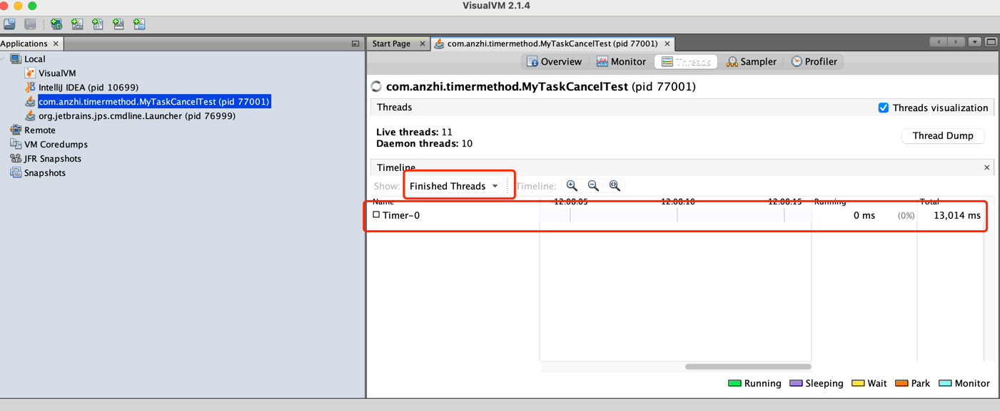

目录
=================

* [定时器 Timer 的使用](#定时器-timer-的使用)
    * [方法 schedule(TimerTask task, Date time) 的使用](#方法-scheduletimertask-task-date-time-的使用)
    * [使用 public void cancel() 方法实现线程 TimerThread 销毁](#使用-public-void-cancel-方法实现线程-timerthread-销毁)
    * [TimerTask 类中的 cancel() 方法](#timertask-类中的-cancel-方法)
    * [间隔执行 Task 任务的算法](#间隔执行-task-任务的算法)
    * [Timer 类中的 cancel() 方法有时并不一定会停止计划任务](#timer-类中的-cancel-方法有时并不一定会停止计划任务)
    * [schedule(TimerTask task, long delay) 方法](#scheduletimertask-task-long-delay-方法)
    * [schedule(TimerTask task, long delay, long period) 方法](#scheduletimertask-task-long-delay-long-period-方法)
    * [scheduleAtFixedRate(TimerTask task, Date firstTime, long period) 方法](#scheduleatfixedratetimertask-task-date-firsttime-long-period-方法)

# 定时器 Timer 的使用

在 JDK 库中 Timer 类主要负责计划任务的功能。即指定任务在指定的时间运行。

## 方法 schedule(TimerTask task, Date time) 的使用

该方法的作用是在指定的日期执行一次某一任务。

创建任务类:

```java
public class MyTimer extends TimerTask {
    @Override
    public void run() {
        System.out.println("任务执行了, 时间为: " + System.currentTimeMillis());
    }
}
```

创建测试类：

```java
public class MyTaskTest {
    public static void main(String[] args) {
        long nowTime = System.currentTimeMillis();
        System.out.println("当前时间为：" + nowTime);

        long scheduleTime = (nowTime + 10000);
        System.out.println("计划时间为: " + scheduleTime);

        MyTimer task = new MyTimer();

        Timer timer = new Timer();
        try {
            Thread.sleep(1000);
        } catch (InterruptedException e) {
            // doNothing
        }
        timer.schedule(task, new Date(scheduleTime));

        try {
            Thread.sleep(Integer.MAX_VALUE);
        } catch (InterruptedException e) {
            // doNothing
        }
    }
}
```

程序运行结果：

```text
当前时间为：1659109487469
计划时间为: 1659109497469
任务执行了, 时间为: 1659109497472
```

通过 VisuaIVM 查看 JVM 可以看到 Timer-0 这个线程一直处于等待状态，如图：


10s 之后任务执行成功，但是进程还未销毁。这是因为在创建 Timer 对象时，启动了一个新的非守护线程。JDK 源码如下:

```java
public class Timer {
    public Timer(String name) {
        thread.setName(name);
        thread.start();
    }
}
```

这个 thread 变量是 TimerThread 线程类。该类继承了 Thread 类，thread.start() 启动时会执行 TimerThread 类中重写的 run() 方法：

```java
public class Timer {
    public void run() {
        try {
            mainLoop();
        } finally {
            // Someone killed this Thread, behave as if Timer cancelled
            synchronized (queue) {
                newTasksMayBeScheduled = false;
                queue.clear();  // Eliminate obsolete references
            }
        }
    }
}
```

而导致线程一直循环的是 mainLoop() 方法。 而这个方法的源码如下:

```java
public class Timer {
    /**
     * The main timer loop.  (See class comment.)
     */
    private void mainLoop() {
        // 死循环一直执行计划任务，并不退出 while(true) 死循环
        while (true) {
            try {
                TimerTask task;
                boolean taskFired;
                synchronized(queue) {
                    // Wait for queue to become non-empty
                    // 1.当 queue 和 newTasksMayBeScheduled 都为 true 时，才会使当前线程停止运行
                    // 等待被唤醒
                    while (queue.isEmpty() && newTasksMayBeScheduled)
                        queue.wait();
                    // 再次判断任务队列是否为 null，为 null 退出循环
                    if (queue.isEmpty())
                        break; // Queue is empty and will forever remain; die

                    // Queue nonempty; look at first evt and do the right thing
                    long currentTime, executionTime;
                    task = queue.getMin();
                    synchronized(task.lock) {
                        if (task.state == TimerTask.CANCELLED) {
                            queue.removeMin();
                            continue;  // No action required, poll queue again
                        }
                        currentTime = System.currentTimeMillis();
                        executionTime = task.nextExecutionTime;
                        if (taskFired = (executionTime<=currentTime)) {
                            if (task.period == 0) { // Non-repeating, remove
                                queue.removeMin();
                                task.state = TimerTask.EXECUTED;
                            } else { // Repeating task, reschedule
                                queue.rescheduleMin(
                                        task.period<0 ? currentTime   - task.period
                                                : executionTime + task.period);
                            }
                        }
                    }
                    if (!taskFired) // Task hasn't yet fired; wait
                        queue.wait(executionTime - currentTime);
                }
                if (taskFired)  // Task fired; run it, holding no locks
                    task.run();
            } catch(InterruptedException e) {
            }
        }
    }
}
```

其中代码中 newTasksMayBeScheduled 置为 false 是在 cancel 方法中。源码如下：

```java
public class Timer {
    public void cancel() {
        synchronized (queue) {
            thread.newTasksMayBeScheduled = false;
            queue.clear();
            queue.notify();  // In case queue was already empty.
        }
    }
}
```

以上就是进程不销毁的原因，以及退出死循环 while(true) 的逻辑。

## 使用 public void cancel() 方法实现线程 TimerThread 销毁

创建测试类：

````java
public class MyTimerCancelTest {
    public static void main(String[] args) {
        long nowTime = System.currentTimeMillis();
        System.out.println("当前时间为：" + nowTime);

        long scheduleTime = (nowTime + 15000);
        System.out.println("计划时间为: " + scheduleTime);

        MyTimer task = new MyTimer();

        Timer timer = new Timer();
        timer.schedule(task, new Date(scheduleTime));

        try {
            Thread.sleep(18000);
            timer.cancel();
        } catch (InterruptedException e) {
            // doNothing
        }
    }
}
````

运行结果查看监控可以发现 TimerThread 线程已经销毁，主程序也已经退出。

```text
当前时间为：1659154714267
计划时间为: 1659154729267
任务执行了, 时间为: 1659154729273

Process finished with exit code 0
```



schedule方法是支持执行多个任务,代码和上面类似, 区别就是多创建了几个 TimerTask 任务。

## TimerTask 类中的 cancel() 方法

创建任务类：

```java
public class MyTimerTaskA extends TimerTask {
    @Override
    public void run() {
        System.out.println("MyTimerTaskA run timer= " + System.currentTimeMillis());
        this.cancel();
        System.out.println("MyTimerTaskA 移除自己");
    }
}

public class MyTimerTaskB extends TimerTask {
    @Override
    public void run() {
        System.out.println("MyTimerTaskB run timer= " + System.currentTimeMillis());
    }
}
```

创建测试类：

```java
public class MyTimerTaskCancelTest {
    public static void main(String[] args) {
        long nowTime = System.currentTimeMillis();
        System.out.println("当前时间为: " + nowTime);

        System.out.println("计划时间为: " + nowTime);

        MyTimerTaskA task1 = new MyTimerTaskA();
        MyTimerTaskB task2 = new MyTimerTaskB();

        Timer timer = new Timer();

        timer.schedule(task1, new Date(nowTime), 4000);
        timer.schedule(task2, new Date(nowTime), 4000);

        try {
            Thread.sleep(10000);
        } catch (InterruptedException e) {
            // doNothing
        }

        timer.cancel();
    }
}
```

输出结果：

```text
当前时间为: 1659161489286
计划时间为: 1659161489286
MyTimerTaskA run timer= 1659161489287
MyTimerTaskA 移除自己
MyTimerTaskB run timer= 1659161489287
MyTimerTaskB run timer= 1659161493292
MyTimerTaskB run timer= 1659161497295
MyTimerTaskB run timer= 1659161501295
MyTimerTaskB run timer= 1659161505298
MyTimerTaskB run timer= 1659161509302
MyTimerTaskB run timer= 1659161513302
```

## 间隔执行 Task 任务的算法

任务执行顺序的算法是每次将最后一个任务放入队列头，再执行队列头中的 Task 任务的 run() 方法。


## Timer 类中的 cancel() 方法有时并不一定会停止计划任务

调用 Timer 类中的 cancel() 方法有时并不一定会停止计划任务，即计划任务正常执行。这是因为在执行 Timer 类中的 cancel() 方法时有可能并没有争抢
queue 锁，所以导致计划任务虽然调用了取消方法，但是程序仍然执行。

## schedule(TimerTask task, long delay) 方法

该方法的作用是以执行 schedule(TimerTask task, long delay) 方法当前的时间为参考时间,在此时间上延迟指定的毫秒数后执行下一次的 TimerTask 任务。


## schedule(TimerTask task, long delay, long period) 方法

与 schedule(TimerTask task, long delay) 区别是该方法在执行当前方法的时间上加上延迟时，然后周期性的执行。

## scheduleAtFixedRate(TimerTask task, Date firstTime, long period) 方法

该方法使用与 schedule 基本差不多，区别是 schedule 没有追赶特性。追赶性是指如果任务被延时，那么下一次执行任务的时间是参考上一次任务 "结束" 时的时间来计算。


