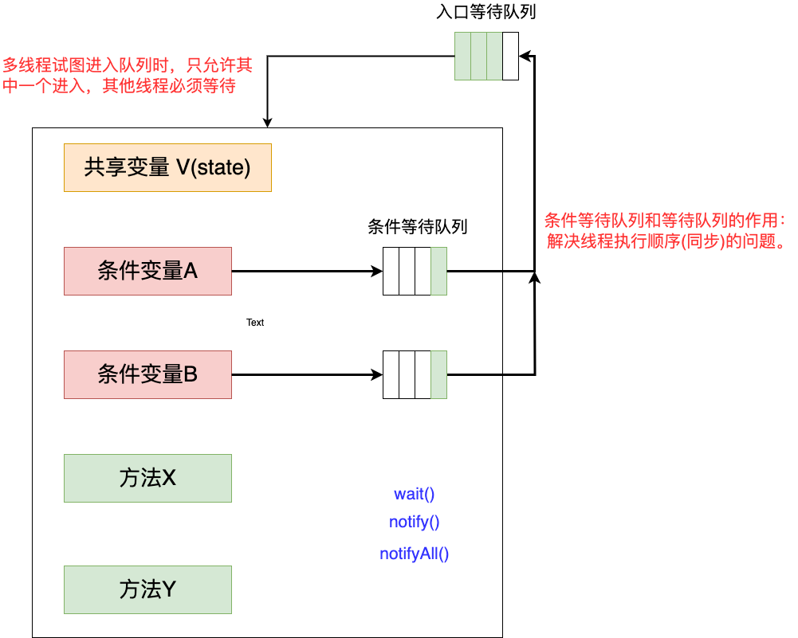

# 如何实现一把独占锁

>state：首先要有一个表示锁状态的字段，如 0 无锁，1 有锁。
>
>那么在多线程中如何操作 state 呢？ 我们前面提到过的 CAS。接下的问题是抢锁失败的线程怎么处理呢？

> 等待队列(queue)：存储抢锁失败的线程的数据；
>
> 那么如何让这队列中的线程继续执行呢？这就需要额外的唤醒机制。

> 等待唤醒：比如 JDK 中实现的 wait()/notify() 、LockSupport.park()/unpark() 等

> 其次是一些共性的操作：入口等待队列、条件等待队列、入队出队等操作。针对这些共性操作，可以定义一个抽象类，在抽象类中定义共性的方法，然后交由子类实现。(设计模式：模版方法)

在实现独占锁之前，先了解一下什么是管程模型。

## 什么是 MESA 管程模型：

在解决并发问题的时候，最早使用的是信号量。到后面才是管程模型的提出。那么这两个有什么区别？

### 信号量(semaphore)

信号量又称为信号标。**是一个同步对象，用于保持在0至指定最大值之间的一个计数值**。 当线程完成一次对该semaphore对象的等待（wait）时，该计数值减一；当线程完成一次对semaphore对象的释放（release）时，计数值加一。

> 信号量运作方式：
>
> 1. 初始化，给与它一个非负数的整数值。
> 2. 执行P(wait())：信号标S的值将被减少。企图进入临界区段的进程，需要先执行P（`wait()`）。当信号标S减为负值时，进程会被挡住，不能继续；当信号标S不为负值时，进程可以获准进入临界区段。
> 3. 执行V(signal())：信号标S的值会被增加。结束离[临界区段的进程，将会执行V（`signal()`）。当信号标S不为负值时，先前被挡住的其他进程，将可获准进入临界区段。
>
> 举个实际的例子：
>
> 我们举个现实中采用信号量控制线程的例子，例如我们信号量设置的是2，也就是同时只允许2个线程处理，当第三个线程 T3 来的时候 T1、T2 还没处理完的情况下，T3 会阻塞到 T1 或 T2 执行完成并且通过 V 操作(加1，释放一个位置给别人)，这个时候 T3 进行 P操作(减一，把这个位置占用)。
>
> 同样的如果s我们设置为1，则可以实现线程之间的互斥操作。

### 管程(Monitor)

管程也称为监视器，它是一种程序结构。结构内的多个子程序形成的多个工作线程互斥访问共享资源。管程实现了在一个时间点，最多只有一个线程在执行管程的某个子程序。

管程还提供了一种机制，线程可以临时放弃互斥访问，等待某些条件得到满足后，重新获得执行权恢复它的互斥访问。

管程与信号量是等价的。

> 一个管程包含的内容如下：
>
> 1. 多个彼此可以交互并共享资源的线程；
> 2. 多个与资源使用有关的变量；
> 3. 一个互斥锁；
> 4. 一个用来避免静态条件的不变量；
>
> 运作方式：
>
> 一个管程的程序在执行一个线程前会先获取互斥锁，直到完成线程或是线程等待某个条件被满足才会放弃互斥锁。若每个执行中的线程在放弃互斥锁之前都能保证不变量成立，则所有线程皆不会导致竞态条件成立。

管程MESA模型如下：



管程还有其他两种模型：Hasen模型、Hoare模型。

> 假设有 T1 和 T2 两个线程同时访问共享资源。这三种模型工作流程如下：
>
> 1. Hasen模型：Hasen模型要求notify放到最后，这样T2线程通知T1后，T2线程就结束了，然后T1执行完，这样就能保证同一时刻只有一个线程在执行。
> 2. Hoare模型： Hoare模型里面，T2线程通知完T1线程后，T2马上阻塞，T1马上执行；等T1执行完之后再唤醒T2线程，也能保证同一时刻只有一个线程在执行，但是T2多了一次阻塞唤醒操作。
> 3. MESA管程模型（Java使用MESA模型实现）： MESA模型中，T2唤醒T1之后，T2还是会接着执行，T1并不立即执行，仅仅是从条件变量队列到等待队列中。
>    1.   好处：notify（或notifyAll）、signal（或signalAll）不用放到代码的最后，T2也没有多余的阻塞唤醒操作。
>    2. T1执行的时候，可能曾经满足过条件，现在已经不能满足了，需要增加循环验证条件方式。


# 什么是 AQS

AQS 即 AbstractQueuedSynchronizer。**队列同步器，它是Java并发用来构建锁和其他同步组件的基础框架**。

可以看下在这个抽象类中实现了那些方法(部分)。

```java
private volatile int state;

protected final int getState() {
  return state;
}

public final void acquire(int arg) {
  if (!tryAcquire(arg) &&
      acquireQueued(addWaiter(Node.EXCLUSIVE), arg))
    selfInterrupt();
}

protected boolean tryAcquire(int arg) {
  throw new UnsupportedOperationException();
}
```

# AQS 具备的特性

> 1.  阻塞等待队列；
> 2. 共享/独占；
> 3. 公平/非公平；
> 4. 可重入；
> 5. 允许中断；

## 独占锁实现

```java
public class LockAQSSolutionDemo extends AbstractQueuedSynchronizer {
    @Override
    protected boolean tryAcquire(int arg) {
        // cas 加锁 state = 0;
        if (compareAndSetState(0, 1)) {
            setExclusiveOwnerThread(Thread.currentThread());
            return true;
        }
        return false;
    }

    @Override
    protected boolean tryRelease(int arg) {
        //释放锁
        setExclusiveOwnerThread(null);
        setState(0);
        return true;
    }
    
    public void lock () {
        acquire(1);
    }
    
    public void unlock () {
        release(1);
    }
    
    public boolean tryLock () {
        return tryAcquire(1);
    }
    
    public boolean isLocked () {
        return isHeldExclusively();
    }

    private final static LockAQSSolutionDemo lockAQSSolutionDemo = new LockAQSSolutionDemo();
    private static int count = 0;

    public static void addCount () {
        lockAQSSolutionDemo.lock();
        try {
            count++;
        } finally {
            lockAQSSolutionDemo.unlock();
        }
    }

    public static void main(String[] args) {
        Thread t1 = new Thread(() -> {
            for (int i=0; i<5000; i++) {
                addCount();
            }
        }, "t1");

        Thread t2 = new Thread(() -> {
            for (int i=0; i<5000; i++) {
                addCount();
            }
        }, "t2");

        t1.start();
        t2.start();
        try {
            t1.join();
            t2.join();
        } catch (Exception e) {
            // doSomething
        }
        System.out.println(count);
    }
}
```

# ReentrantLock 锁的实现

1. 公平锁和非公平锁、可重入所如何实现；
2. 设计核心：并发场景下入队和出队操作是如何设计的：
   1. 线程竞争锁失败入队阻塞逻辑实现；
   2. 释放锁的线程唤醒阻塞线程出队竞争锁的逻辑实现；

```java
/**
 * 通过这个买票 demo 来观察独占锁的实现
 */
public class ReentrantLockDemo {
    // 默认非公平锁
    private final ReentrantLock lock = new ReentrantLock(); 
    // 总票数
    private static int tickets = 8;
 
    public void buyTicket() {
        // 获取锁
        lock.lock();
        // 还有票继续卖
        if (tickets > 0) {
            try {
                Thread.sleep(10);
                System.out.println(Thread.currentThread().getName() + "购买了第" + tickets-- + "张票");
            } catch (InterruptedException e) {
                // doNothing
            } finally {
                lock.unlock();
            }
        }
    }

    public static void main(String[] args) {
        ReentrantLockDemo ticketSystem = new ReentrantLockDemo();
        // 创建多线程购票
        for (int i=1; i<=10;i++) {
            Thread thread = new Thread(()->{
                // 开始购票
                ticketSystem.buyTicket();
            }, "线程" + i);
            // 启动线程
            thread.start();
        }
    }
}
```

debug该程序，设置debug模式为线程模式。

在 lock.lock 中的实现为：

```java
static final class NonfairSync extends Sync {
  private static final long serialVersionUID = 7316153563782823691L;

  /**
         * Performs lock.  Try immediate barge, backing up to normal
         * acquire on failure.
         */
  final void lock() {
    // CAS 设置 state 的值
    if (compareAndSetState(0, 1))
      setExclusiveOwnerThread(Thread.currentThread());
    else
      acquire(1);
  }

  protected final boolean tryAcquire(int acquires) {
    return nonfairTryAcquire(acquires);
  }
}
```

1. 通过 CAS 设置 state 的值；
2. 设置可重入锁的标志；`private transient Thread exclusiveOwnerThread = 线程1的属性`：存储的是线程信息；

通过debug可以看到是线程1抢到锁了，在线程1 运行到`if (tickets > 0)`的时候，此时就不要继续执行了，我们换一个线程观察一下。比如线程10

在线程10 进行`compareAndSetState(0, 1)`的时候，更改失败，执行`acquire(1)`方法。

```java
// arg = 1
public final void acquire(int arg) {
  if (!tryAcquire(arg) &&
      // Node.EXCLUSIVE = null
      acquireQueued(addWaiter(Node.EXCLUSIVE), arg))
    selfInterrupt();
}

protected final boolean tryAcquire(int acquires) {
  return nonfairTryAcquire(acquires);
}

final boolean nonfairTryAcquire(int acquires) {
  final Thread current = Thread.currentThread();
  //getState = 1, 
  int c = getState();
  // 可以发现线程 10 仍然要获取锁，能获取到就继续执行
  // 这就是非公平的体现
  if (c == 0) {
    if (compareAndSetState(0, acquires)) {
      setExclusiveOwnerThread(current);
      return true;
    }
  }
  //getExclusiveOwnerThread() 获取的线程为线程 1，因此不等
  // 这里实现的逻辑主要是可重入锁的实现。当线程1 相等的时候，就会为 state 再次上 acquires 的值
  // 这里 acquires = 1， c=1，最终 state = 2
  else if (current == getExclusiveOwnerThread()) {
    int nextc = c + acquires;
    if (nextc < 0) // overflow
      throw new Error("Maximum lock count exceeded");
    setState(nextc);
    return true;
  }
  // 直接返回 false
  return false;
}
```

在获取锁失败之后，仍然尝试再次获取一次锁。`nonfairTryAcquire`这个方法表明此时使用非公平的方式获取锁。然后判断当前执行的线程是否再次加锁了，此时就会进入`else if (current == getExclusiveOwnerThread())`这个逻辑，锁重入的实现。

在开始代码中的体现就是在`System.out.println(Thread.currentThread().getName() + "购买了第" + tickets-- + "张票");`后面再次调用 `buyTicket()`方法。

## 1. 入队

线程10 获取尝试加锁失败后，则开始将线程加入等待队列`acquireQueued(addWaiter(Node.EXCLUSIVE), arg)`。

```java
private Node addWaiter(Node mode) {
  // 获取当前线程信息
  Node node = new Node(Thread.currentThread(), mode);
  // Try the fast path of enq; backup to full enq on failure
  // 放入一个双向列表中
  Node pred = tail;
  if (pred != null) {
    node.prev = pred;
    if (compareAndSetTail(pred, node)) {
      pred.next = node;
      return node;
    }
  }
  enq(node);
  return node;
}
```

第一次进入需要初始化双端列表，执行 end 方法：

```java
private Node enq(final Node node) {
  for (;;) {
    Node t = tail;
    if (t == null) { // Must initialize
      //如果尾节点为null，就要初始化节点。通过 CAS 创建一个头节点
      if (compareAndSetHead(new Node()))
        tail = head;
    } else {
      // 线程10的前驱节点指向tail节点
      node.prev = t;
      // 通过CAS将tail指向线程10的节点
      if (compareAndSetTail(t, node)) {
        // head 的后驱节点指向尾节点
        t.next = node;
        return t;
      }
    }
  }
}
```

这个双端队列的头节点就代表线程1，因为线程1已经存储到了exclusiveOwnerThread。所以head节点没有存储线程1的信息。个人觉得这个 head 相当于一个 flag，表示着前面的人正在买票，后面的人需要等待。

最终会形成这样一个双端队列：


## 2. 线程挂起

接着需要将线程10挂起。`acquireQueued`方法则完成了这个功能。

```java
final boolean acquireQueued(final Node node, int arg) {
  boolean failed = true;
  try {
    // 设置中断标识为为false
    boolean interrupted = false;
    for (;;) {
      // 获取前驱节点
      final Node p = node.predecessor();
      // 如果前驱节点是 head，再次尝试获取锁，后续的锁则不会在尝试获取了。
      // 此时是无法获取的，线程1还没有释放锁
      if (p == head && tryAcquire(arg)) {
        setHead(node);
        p.next = null; // help GC
        failed = false;
        return interrupted;
      }
      
      // 直接进入这个判断逻辑，将线程10 挂起
      if (shouldParkAfterFailedAcquire(p, node) &&
          parkAndCheckInterrupt())
        interrupted = true;
    }
  } finally {
    if (failed)
      cancelAcquire(node);
  }
}
```

在前驱节点为头节点时，当前线程会再次尝试获取一次锁，失败，则将当前线程挂起。执行`if (shouldParkAfterFailedAcquire(p, node) &&parkAndCheckInterrupt())`这条判断语句：

`shouldParkAfterFailedAcquire(p, node)`：p此时的值是头节点，node是当前线程10

```java
private static boolean shouldParkAfterFailedAcquire(Node pred, Node node) {
  // 头节点的 waitStatus = -1
  int ws = pred.waitStatus;
  // Node.SIGNAL = -1，表示后继节点的线程需要被挂起
  // 所以每个前驱节点的 waitStatus 是后驱节点挂起的标志
  if (ws == Node.SIGNAL)
    /*
             * This node has already set status asking a release
             * to signal it, so it can safely park.
             */
    // 直接返回 true
    return true;
  if (ws > 0) {
    /*
             * Predecessor was cancelled. Skip over predecessors and
             * indicate retry.
             */
    do {
      node.prev = pred = pred.prev;
    } while (pred.waitStatus > 0);
    pred.next = node;
  } else {
    /*
             * waitStatus must be 0 or PROPAGATE.  Indicate that we
             * need a signal, but don't park yet.  Caller will need to
             * retry to make sure it cannot acquire before parking.
             */
    compareAndSetWaitStatus(pred, ws, Node.SIGNAL);
  }
  return false;
}
```

接着执行`parkAndCheckInterrupt()`开始挂起线程。

```java
private final boolean parkAndCheckInterrupt() {
  LockSupport.park(this);
  return Thread.interrupted();
}
```

然后一直debug将剩余9个线程全部挂起。嫌多的话，开始的时候少创建几个线程😄。

## 3. 锁释放

其余线程挂起之后，接着再回到线程1，让它执行完成之后释放锁。

```java
public void unlock() {
  sync.release(1);
}
public final boolean release(int arg) {
  // 释放锁
  if (tryRelease(arg)) {
    Node h = head;
    // 唤醒下一个线程
    if (h != null && h.waitStatus != 0)
      unparkSuccessor(h);
    return true;
  }
  return false;
}
```

执行`tryRelease(1)`释放锁

```java
protected final boolean tryRelease(int releases) {
  //没有重入锁，c 的值为0
  int c = getState() - releases;
  if (Thread.currentThread() != getExclusiveOwnerThread())
    throw new IllegalMonitorStateException();
  boolean free = false;
  if (c == 0) {
    free = true;
    //将exclusiveOwnerThread
    setExclusiveOwnerThread(null);
  }
  //锁状态值更新
  setState(c);
  return free;
}
```

## 唤醒等待的线程

执行`unparkSuccessor(Node node)`方法

```
private void unparkSuccessor(Node node) {
    /*
     * If status is negative (i.e., possibly needing signal) try
     * to clear in anticipation of signalling.  It is OK if this
     * fails or if status is changed by waiting thread.
     */
     // 获取之前挂起标志的值
    int ws = node.waitStatus;
    if (ws < 0)
    // CAS 将 waitStatus 的值置为0，表示该节点的后继节点将要被唤醒。可以开始买票了
        compareAndSetWaitStatus(node, ws, 0);

    /*
     * Thread to unpark is held in successor, which is normally
     * just the next node.  But if cancelled or apparently null,
     * traverse backwards from tail to find the actual
     * non-cancelled successor.
     */
    // node.next 是线程10
    Node s = node.next;
    if (s == null || s.waitStatus > 0) {
        s = null;
        for (Node t = tail; t != null && t != node; t = t.prev)
            if (t.waitStatus <= 0)
                s = t;
    }
    if (s != null)
    		// 线程10 恢复运行，尝试获取锁，于是从parkAndCheckInterrupt()处开始继续运行
        LockSupport.unpark(s.thread);
}
```

线程10 恢复运行后，从`final boolean acquireQueued(final Node node, int arg)`方法中挂起线程10 的那处语句开始执行`if (shouldParkAfterFailedAcquire(p, node) &&parkAndCheckInterrupt())`，然后在循环中尝试获取锁

```java
for (;;) {
  // 获取前驱节点
  final Node p = node.predecessor();
  // 此时线程10的前驱节点是头节点，且线程1释放锁后，线程10可以成功获取锁
  if (p == head && tryAcquire(arg)) {
    // 于是头节点指向当前节点
    setHead(node);
    // 前驱节点的next指向null，断开第一个节点
    p.next = null; // help GC，
    failed = false;
    return interrupted;
  }

  // 直接进入这个判断逻辑，将线程10 挂起
  if (shouldParkAfterFailedAcquire(p, node) &&
      parkAndCheckInterrupt())
    interrupted = true;
}
```

后面剩余在队列中的线程被唤醒以及获取锁，出队的过程与此相同。不再一一说明。
