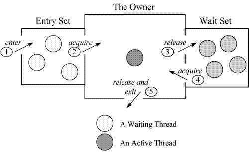
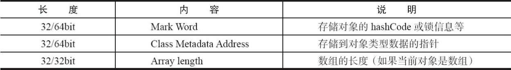
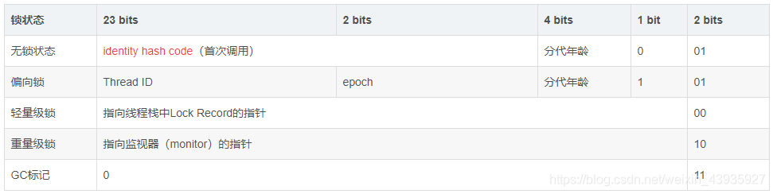
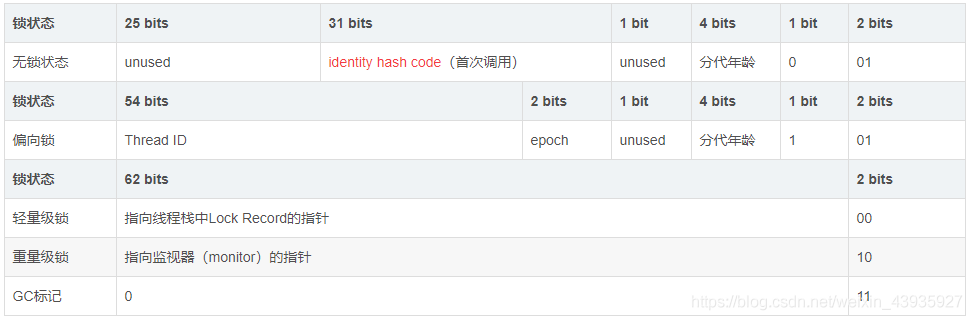
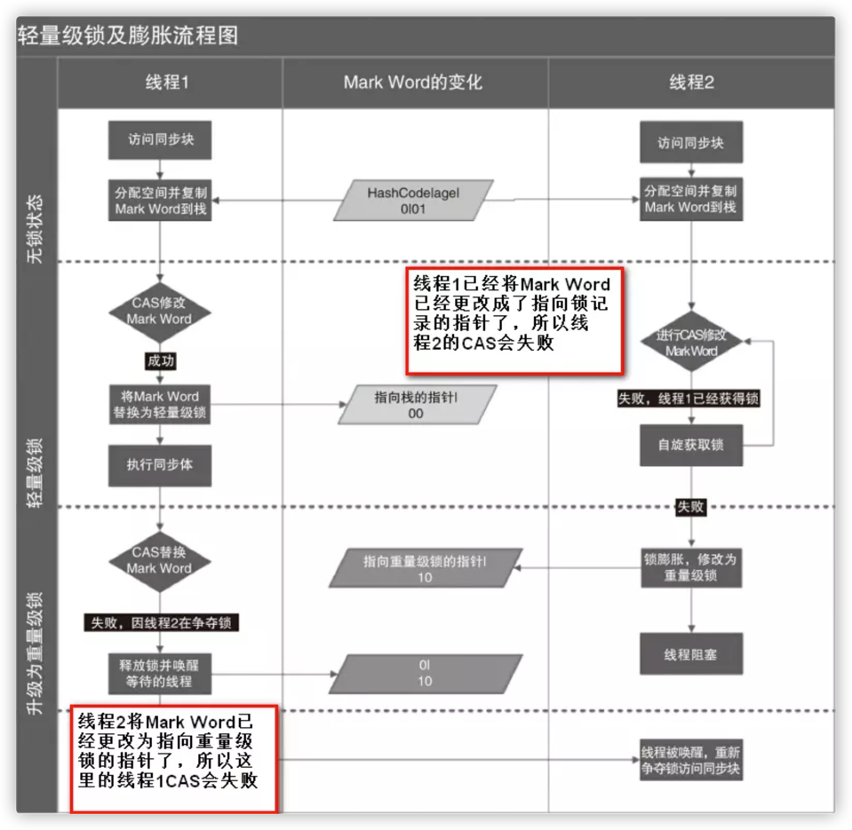

目录
=================

* [Synchronized 关键字](#synchronized-关键字)
    * [方法内部变量线程安全](#方法内部变量线程安全)
    * [实例变量非线程安全问题与解决方案](#实例变量非线程安全问题与解决方案)
* [synchronized 使用方式](#synchronized-使用方式)
    * [修饰普通方法，锁是当前实例对象](#修饰普通方法锁是当前实例对象)
    * [修饰静态同步方法，锁是当前类的 Class 对象](#修饰静态同步方法锁是当前类的-class-对象)
    * [同步代码块](#同步代码块)
    * [synchronized 锁重入](#synchronized-锁重入)
    * [锁重入支持继承](#锁重入支持继承)
    * [程序异常, 锁自动释放](#程序异常-锁自动释放)
    * [重写方法不使用 synchronized](#重写方法不使用-synchronized)
    * [String 常量池特性与同步相关的问题](#string-常量池特性与同步相关的问题)
* [synchronized 底层实现原理](#synchronized-底层实现原理)
    * [Monitor 概念](#monitor-概念)
    * [Monitor 基本元素](#monitor-基本元素)
    * [Java 对 monitor 的支持](#java-对-monitor-的支持)
    * [Monitor 在 Java 中的存储位置](#monitor-在-java-中的存储位置)
    * [Mark Word](#mark-word)
* [Synchronized 作用](#synchronized-作用)
    * [原子性](#原子性)
    * [可见性](#可见性)
    * [有序性](#有序性)
* [Synchronized 锁的膨胀](#synchronized-锁的膨胀)
    * [锁的升级与对比](#锁的升级与对比)
        * [偏向锁](#偏向锁)
            * [偏向锁加锁](#偏向锁加锁)
            * [偏向锁的获得和撤销流程](#偏向锁的获得和撤销流程)
            * [偏向锁关闭](#偏向锁关闭)
            * [偏向锁的验证](#偏向锁的验证)
                * [无锁状态](#无锁状态)
                * [偏向锁](#偏向锁-1)
        * [轻量级锁](#轻量级锁)
            * [轻量级锁膨胀](#轻量级锁膨胀)
            * [整个锁升级的验证](#整个锁升级的验证)
                * [偏向锁计算HashCode后直接升级为重量级锁](#偏向锁计算hashcode后直接升级为重量级锁)


# Synchronized 关键字

在多线程的并发中 synchronized 一直是元老级角色，这是一款重量级锁。但是随着 JDK 1.6 之后 对 synchronized 进行了优化之后，有些情况下，它
并不是那么重了。

下面从使用到实现原理两个方面对 synchronized 进行分析。

## 方法内部变量线程安全

多线程并发的使用场景中，常常会有 "非线程安全问题" 的发生。即多个线程对同一个对象中实例变量进行访问，这种产生的后果就是 "脏读"，也就是读取的数据是
被已经更改过的数据。

非线程安全问题存在于实例变量中，对于方法内部的私有变量，则不存在线程安全问题。下面验证一下方法内部变量，是不存在非线程安全问题的。

测试类：

```java
public class InternalVariable {

    //int num = 0; // 实例变量

    public void addI(String username){
        int num = 0;  //局部内变量
        if(username.equals("a")){
            num = 100;
            System.out.println("Thread.currentThread().getName()= " + Thread.currentThread().getName());
            try {
                Thread.sleep(1000);
            } catch (InterruptedException e) {
                e.printStackTrace();
            }
            System.out.println("a set over");
        }else{
            num = 200;
            System.out.println("Thread.currentThread().getName()= " + Thread.currentThread().getName());
        }
        System.out.println(username + " num = " + num);
    }
}
```

线程类实例：

```java
public class InternalVariableThreadA extends Thread{

    private InternalVariable internalVariable;

    public InternalVariableThreadA(InternalVariable internalVariable){
        this.internalVariable = internalVariable;
    }

    @Override
    public void run() {
        internalVariable.addI("a");
    }
}

// InternalVariableThreadB 代码与 InternalVariableThreadA 一样
```

测试类实例：

```java
public class InternalVariableThreadTest {

    public static void main(String[] args) {

        StackTraceElement[] stackTrace = Thread.currentThread().getStackTrace();

        InternalVariable internalVariable = new InternalVariable();

        InternalVariableThreadA threadA = new InternalVariableThreadA(internalVariable);
        threadA.setName("threadA");
        threadA.start();

        InternalVariableThreadB threadB = new InternalVariableThreadB(internalVariable);
        threadB.setName("threadB");
        threadB.start();

        try {
            Thread.sleep(1000);
        } catch (InterruptedException e) {
            e.printStackTrace();
        }
        System.out.println("end");
    }
}
```

输出结果：

```text
Thread.currentThread().getName()= threadA
Thread.currentThread().getName()= threadB
b num = 200
a set over
a num = 100
end
```

局部变量的存放位置在栈中，和方法"同生共死"，而每个线程都会独立的栈，所以，局部内变量才不会有非线程安全的问题。一个变量如果想要跨越方法的边界，
就必须创建在堆里。参考链接 https://leeshengis.com/archives/86695

## 实例变量非线程安全问题与解决方案

如果多个线程共同访问一个对象中的实例变量，则有可能出现非线程安全问题。

将第一个实例中 InternalVariable 类中的变量位置放到方法外部，如下：

```java
public class InternalVariable {
    int num = 0;
    public void addI(String username){
        if(username.equals("a")){
            
        }else{
            num = 200;
        }
    }
}
```

输出结果：

```text
Thread.currentThread().getName()= threadA
Thread.currentThread().getName()= threadB
b num = 200
a set over
a num = 200
end
```
解决这种非线程安全的问题需要对共享资源加锁。使用 synchronized 修饰 addI 方法即可保证线程安全。修改 InternalVariable 类用例如下：

```java
public class InternalVariable {

    int num = 0; // 实例变量
    
    public synchronized void addI(String username){
        // ... 代码省略
    }

}
```

# synchronized 使用方式

Java 中的每个对象都可以作为锁，具体表现为以下三种形式：

1. 修饰普通方法，锁是当前实例对象；
2. 修饰静态同步方法，锁是当前类的 Class 对象
3. 修饰代码块，锁是 synchronized 括号里配置的对象；

下面通过举例看一下这几种加锁方式

## 修饰普通方法，锁是当前实例对象

创建 HasSelfPrivateNum 实现同步方法:

```java
public class HasSelfPrivateNum {

    private int num = 0;

    synchronized public void synchronizedAddMethod(String userName) {
        System.out.println("Thread" + userName + "获得锁");
        try {
            Thread.sleep(5000);
            System.out.println("Thread" + userName + "释放锁");
        } catch (InterruptedException e) {
            // doNothing
        }
    }

    public void addMethod(String userName){
        synchronized (this){
            System.out.println("Thread" + userName + "获得锁");
        }
    }
}
```

创建测试类 ThreadTest:

```java
public class ThreadTest {
    public static void main(String[] args) {
        HasSelfPrivateNum hasSelfPrivateNum = new HasSelfPrivateNum();

        // 验证同步方法上锁的是对象
        new Thread(()->hasSelfPrivateNum.synchronizedAddMethod("TA")).start();
        new Thread(()->hasSelfPrivateNum.addMethod("TB")).start();
    }
}
```

输出结果: 

```text
ThreadTA获得锁
ThreadTA释放锁
ThreadTB获得锁
```
根据结果可以看到 synchronized 修饰方法上锁的是当前实例对象

## 修饰静态同步方法，锁是当前类的 Class 对象

类 Class 的单例性：每个 *.java 文件对应的 Class 实例都是一个。

在 HasSelfPrivateNum 类中添加静态类方法

```java
public class HasSelfPrivateNum {
    
    // 。。。
    synchronized static public void synchronizedStaticAddMethod() {
        System.out.println("Thread" + Thread.currentThread().getName() + "获得锁");
        try {
            Thread.sleep(5000);
            System.out.println("Thread" + Thread.currentThread().getName() + "释放锁");
        } catch (InterruptedException e) {
            // doNothing
        }
    }

    public static void staticAddMethod(){
        synchronized (HasSelfPrivateNum.class){
            System.out.println("Thread" + Thread.currentThread().getName() + "获得锁");
        }
    }
}
```

在 ThreadTest 添加测试方法

```java
public class ThreadTest {
    public static void main(String[] args) {
        // 。。。
        // 验证修饰静态同步方法，锁是当前类的 Class 对象
        new Thread(()->HasSelfPrivateNum.synchronizedStaticAddMethod(), "TA").start();
        new Thread(()->hasSelfPrivateNum2.staticAddMethod(), "TB").start();
    }
}
```

打印结果
```text
ThreadTA获得锁
ThreadTA释放锁
ThreadTB获得锁
```

根据结果可以看到 synchronized 修饰的静态类方法上锁的是该类的class对象

## 同步代码块

根据前面两个方法可以知道, synchronized() 括号中添加什么对象, 该对象就作为加锁对象, 并不是代码。

## synchronized 锁重入

关键字 synchronized 拥有重入锁的功能。当一个线程得到一个对象锁后, 再次请求次对象锁是可以得到对象锁的.在之前 HasSelfPrivateNum 类中再
添加一个同步方法

```java
public class HasSelfPrivateNum {

    private int num = 0;

    // synchronized 锁重入
    synchronized public void synchronizedAddMethodLockReentrancy(String userName) {
        System.out.println("Thread" + userName + "获得锁");
        try {
            addMethodLockReentrancy("ThreadT" + Thread.currentThread().getName() + "start run");
            Thread.sleep(5000);
            System.out.println("Thread" + userName + "释放锁");
        } catch (InterruptedException e) {
            // doNothing
        }
    }
    synchronized public void addMethodLockReentrancy(String userName){
        System.out.println("Thread" + userName + "获得锁执行方法 addMethodLockReentrancy");
    }
}

```

测试demo

```java
public class ThreadTest {
    public static void main(String[] args) {

        // 锁重入
        new Thread(() -> hasSelfPrivateNum.synchronizedAddMethodLockReentrancy("TA")).start();
    }
}
```

输出结果:

```text
ThreadTA获得锁
ThreadThreadTTAstart run获得锁执行方法 addMethodLockReentrancy
ThreadTA释放锁
```

## 锁重入支持继承

创建 LockReentrancySupportsExtendsDemo 类

```java
public class LockReentrancySupportsExtendsDemo extends HasSelfPrivateNum{
    synchronized public void lockReentrancySupportsExtends(String userName){
        System.out.println("Thread" + userName + "获得锁 start run");
        synchronizedAddMethodLockReentrancy(userName);
    }
}
```

在 ThreadTest 测试类中添加

```java
public class ThreadTest {
    public static void main(String[] args) {
        // 锁重入支持继承
        LockReentrancySupportsExtendsDemo lockReentrancySupportsExtends = new LockReentrancySupportsExtendsDemo();
        new Thread(() -> lockReentrancySupportsExtends.lockReentrancySupportsExtends("lockReentrancySupportsExtends")).start();
    }
}
```

输出结果:

```text
ThreadlockReentrancySupportsExtends获得锁 start run
ThreadlockReentrancySupportsExtends获得锁
ThreadThreadTlockReentrancySupportsExtendsstart run获得锁执行方法 addMethodLockReentrancy
ThreadlockReentrancySupportsExtends释放锁
```

## 程序异常, 锁自动释放

创建类 LockReentrancySupportsExtendsDemo

```java
public class LockReentrancySupportsExtendsDemo extends HasSelfPrivateNum{
    // 异常，锁释放
    synchronized public void synchronizedExceptionMethod(String userName) {
        System.out.println("Thread" + userName + "获得锁");
        try {
            if(Objects.equals(userName, "TA")) {
                int i = 1 / 0;
                Thread.sleep(5000);
            }
            System.out.println("Thread" + userName + "释放锁");
        } catch (Exception e) {
            System.out.println("异常释放锁");
        }
    }
}
```

测试类添加代码如下:

```java
public class ThreadTest {
    public static void main(String[] args) {
        // 异常释放锁
        HasSelfPrivateNum selfPrivateNum = new HasSelfPrivateNum();
        new Thread(() -> selfPrivateNum.synchronizedExceptionMethod("TA"), "TA").start();
        new Thread(() -> selfPrivateNum.synchronizedExceptionMethod("TB"), "TB").start(); 
    }
}
```

输出结果

```text
ThreadTA获得锁
异常释放锁
ThreadTB获得锁
ThreadTB释放锁
```

## 重写方法不使用 synchronized 

重写方法如果不使用 synchronized 修饰, 非 synchronized 方法会变成同步方法

在 LockReentrancySupportsExtendsDemo 重写方法

```java
public class LockReentrancySupportsExtendsDemo extends HasSelfPrivateNum{
    // 。。。
    @Override
    public void synchronizedAddMethod(String userName) {
        System.out.println("LockReentrancySupportsExtendsDemo 重写方法执行");
        super.synchronizedAddMethod(userName);
    }
}
```

测试类添加代码如下:

```java
public class ThreadTest {
    public static void main(String[] args) {
        // 异常释放锁
        HasSelfPrivateNum selfPrivateNum = new HasSelfPrivateNum();
        new Thread(() -> selfPrivateNum.synchronizedExceptionMethod("TA"), "TA").start();
        new Thread(() -> selfPrivateNum.synchronizedExceptionMethod("TB"), "TB").start(); 
    }
}
```

输出结果:

```text
ThreadTA获得锁 start run
ThreadTA获得锁
ThreadThreadTTAstart run获得锁执行方法 addMethodLockReentrancy
ThreadTA释放锁
ThreadTB获得锁 start run
ThreadTB获得锁
ThreadThreadTTBstart run获得锁执行方法 addMethodLockReentrancy
ThreadTB释放锁
```

## String 常量池特性与同步相关的问题

JVM 底层实现字符串有一个字符串常量池的功能, 当字符串相同的时候, 对个字符串对应的却是一个对象。这就导致在使用 String 作为锁对象的时候, 可能导致
多线程持有相同的锁, 从而带来逻辑处理的问题。验证如下:

在 HasSelfPrivateNum 类中添加如下方法:

```java
public class HasSelfPrivateNum {

    // 将 String 对象作为锁带来的问题
    public void synchronizedString(String str){
        synchronized (str){
            System.out.println("Thread" + Thread.currentThread().getName() + "获得锁开始执行");
            try {
                Thread.sleep(5000);
            } catch (InterruptedException e) {
                // doNothing
            }
            System.out.println("Thread" + Thread.currentThread().getName() + "执行完成, 释放锁");
        }
    }

    public void synchronizedString2(String str){
        synchronized (str){
            System.out.println("Thread" + Thread.currentThread().getName() + "获得锁开始执行");
            System.out.println("Thread" + Thread.currentThread().getName() + "执行完成, 释放锁");
        }
    }
}

```

测试demo

```java
public class ThreadTest {
    public static void main(String[] args) {

       // String 作为锁对象的问题
       HasSelfPrivateNum selfPrivateNum = new HasSelfPrivateNum();
       new Thread(() -> selfPrivateNum.synchronizedString("AA"), "TA").start();
       new Thread(() -> selfPrivateNum.synchronizedString2("AA"), "TB").start();
    }
}
```

输出结果

```text
ThreadTA获得锁开始执行
ThreadTA执行完成, 释放锁
ThreadTB获得锁开始执行
ThreadTB执行完成, 释放锁
```


# synchronized 底层实现原理

synchronized 底层实现依赖于 JVM，在 JVM 中同步的实现是通过监视器锁 monitorenter 和 monitorexit 指令实现，或者隐式地通过方法调用
(检测到同步标志位)和返回指令实现。这两种，前者对应同步代码块，后者对应同步方法、静态同步方法。

所以同步方法最终还是通过监视器锁来完成线程同步，并没有违背 JVM 中同步是通过 monitor 的进入和退出实现的。

## Monitor 概念

Monitor 监视器，在使用基本的 mutex 进行并发控制时，RD 需要很小心的控制 mutex 的加锁和释放操作，否则极易引起死锁的问题。为了更容易地编写
出正确的并发程序，所以在 mutex 和 semaphore 的基础上， 提出了更高层次的同步原语 monitor，不过需要注意的是，操作系统本身并不支持 monitor
机制，实际上，monitor 是属于编程语言的范畴。比如 C 不支持 monitor，Java 支持。

## Monitor 基本元素

monitor 机制需要几个元素来配合，分别是：

1. 临界区；
2. monitor 对象及锁；
3. 条件变量以及定义在 monitor 对象上的 wait，signal 操作；

monitor 的重要特点是同一时刻，只有一个 进程/线程 能进入 monitor 中定义的临界区，为了能够阻塞临界区的 进程/线程，还需要一个 monitor object
来协助；同时为了在适当的时候唤醒 进程/线程，还需要引入一个条件变量来决定什么时候是 "适当的时候"，这个条件可以来自程 RD 的代码逻辑，也可以是在 
monitor object 的内部。但是由于 monitor object 内部采用了数据结构来保存被阻塞的队列，因此它也必须对外提供两个 API 来让线程进入阻塞状态以及
之后的被唤醒，这两个 API 分别是 wait/notify

## Java 对 monitor 的支持

根据上面 synchronized 的使用，会发现 synchronized 的使用往往最终都需要指定一个对象，不管是方法还是代码块，以此作为 monitor 机制的临界区。

monitor 机制中，monitor Object 充当维护着 mutex (互斥变量) 以及定义 wait/signal API 来管理线程的阻塞和唤醒的角色。而在Java中的
java.lang.Object 类，是所有类的父类，并且 Object 类定义了 wait()、notify()、notifyAll()，这些方法的实现依赖于一个叫 ObjectMonitor 的
模式的实现，这是 JVM 基于 C++ 实现的一套机制，基本原理如下：



当一个线程需要获取 Object 的锁时，会被放入 EntrySet 中进行等待，如果该线程获取到了锁，成为当前锁的 owner。如果根据程序逻辑，一个已经获得了锁
的线程缺少某些外部条件，而无法继续进行下去（例如生产者发现队列已满或者消费者发现队列为空），那么该线程可以通过调用 wait 方法将锁释放，
进入 wait set 中阻塞进行等待，其它线程在这个时候有机会获得锁，去干其它的事情，从而使得之前不成立的外部条件成立，这样先前被阻塞的线程就可以重新进入
EntrySet 去竞争锁。这个外部条件在 monitor 机制中称为条件变量

Monitor 详细的介绍参考链接：

http://www.ytbean.com/posts/monitor-in-java/

https://zicair.github.io/2020/07/13/synchronized%E5%BA%95%E5%B1%82monitor%E5%8E%9F%E7%90%86/


## Monitor 在 Java 中的存储位置

想要了解 Monitor 在Java的存储位置，首先需要了解一下 Java 对象在内存存储的布局。
HotSpot 虚拟机中，对象在内存中存储的布局可以分为三块区域：对象头(Header)、实例数据(Instance Data)和对齐填充(Padding)。如图：



* 对象头
    * Mark Word(标记字段)：关于锁的信息。对象的Mark Word部分占4个字节/8个字节，表示对象的锁状态（比如轻量级锁的标记位，偏向锁标记位），
      另外还可以用来配合GC分代年龄、存放该对象的hashCode等；
    * Klass Pointer（Class对象指针）：Class对象指针的大小也是4个字节/8个字节，其指向的位置是对象对应的Class对象（其对应的元数据对象）
      的内存地址；
    * 数组长度：如果对象是数组类型，占用4个字节/8个字节，因为JVM虚拟机可以通过Java对象的元数据信息确定Java对象的大小，但是无法从数组的元
      数据来确认数组的大小，所以用一块来记录数组长度；
* Instance Data（对象实际数据）：这里面包括了对象的所有成员变量，其大小由各个成员变量的大小决定，比如：byte和boolean是1个字节，short和char是
  2个字节，int和float是4个字节，long和double是8个字节，reference是4个字节
* padding data（对齐）：如果上面的数据所占用的空间不能被8整除，padding则占用空间凑齐使之能被8整除。被8整除在读取数据的时候会比较快

## Mark Word

Mdrk Word 里默认存储对象的HashCode、分带年龄和锁标记位。在 32 位 JVM 的 Mark Word 的默认存储结构是这样的：


在运行期间，Mark Word里存储的数据会随着锁标志位的变化而变化。Mark Word 可能变化为存储以下 4 种数据：

在 32 位 JVM 中 Mark Word 是这样的： 


在 64 位 JVM 中 Mark Word 是这样的：



分析完 Mark Word 结构，可以知道 重量级锁也就是通常说synchronized的对象锁，锁标识位为10，其中指针指向的是monitor对象（也称为管程或监视器锁）
的起始地址。

# Synchronized 作用

Synchronized 可用来保障原子性、可见性和有序性。

## 原子性

前面分析了 monitor 机制，线程执行 monitorenter 指令会对 monitor Object 加锁，加锁后其他线程无法获得锁，除非持锁线程释放锁。即使在执行过程
中，由于某种原因，比如 CPU 时间片用完，持锁线程放弃了 CPU，但是锁仍然被该线程持有，直到该线程执行完所有逻辑，将锁释放。这就保证了原子性。

## 可见性

在 JMM 中关于 synchronized 有如下规定：

* 线程加锁时，必须清空工作内存中共享变量的值，因此在线程使用共享变量时，需要从主内存中重新获取；
* 线程解锁时，必须把工作内存中最新的共享变量的值写入到主存，以此来保证共享变量的可见性；

具体底层实现细节：

* monitorenter 指令之后会有一个 Load 屏障，执行 refresh 处理器缓存操作，把别的处理器修改过的最新的值加载到自己的高速缓存中；
* monitorexit 指令之后会有一个 store 屏障，强制让线程把自己修改过的共享变量执行 flush 处理器缓存操作，刷到主内存中 

## 有序性

被 synchronized 修饰的代码/方法 同一时刻只能有一个线程持有锁，可以认为是单线程执行的，所以保证其有序性。底层具体实现：

* 在 monitorenter 指令和 Load 屏障之后，会加一个 Acquire 屏障(Acquire 之后的指令不会被排到 Acquire 之前执行，即禁止 Acquire 后
  的指令和同步代码块之前的指令进行指令重排)
  
* 在 monitorexit 指令和 Release 屏障(Release 之前的指令不会被排到 Release 之后执行，即禁止 Release 之前的指令和同步代码块之后的指令进行
  指令重排)

这里需要注意：在 Acquire 和 Release 屏障之间的指令无法禁止指令重排即 synchronized 临界区内的代码无法保证指令重排。因此才需要 volatile 关键字。

所以需要注意这里 synchronized "有序" 的概念。

# Synchronized 锁的膨胀

前面分析 Java 对象透头的时候，我们看到 Mark Word 里面有几种锁的状态下面介绍一下锁的升级过程。

## 锁的升级与对比

Java SE 1.6 中为了减少获得锁和释放锁带来的性能消耗，引入了 "偏向锁" 和 "轻量级锁"。锁的状态变为四种；无锁、偏向锁、轻量级锁、重量级锁，这几种锁
会随着竞争情况逐渐升级。但是需要注意的是，锁可以升级但是不能降级，即轻量级锁不能降级为偏向锁。这种只能升级不能降级的策略，目的是为了提高获得锁和释放锁的效率。

### 偏向锁

经过专业人士的研究，大多数情况，锁不仅不存在多线程竞争，而且总是由一个线程获得，因此为了让线程获得锁的代价更低，才引入了偏向锁。

#### 偏向锁加锁

当一个线程访问同步块代码并获取锁时，会在对象头的 Mark Word 中记录线程 Thread ID 和偏向锁。当该线程再次进入同步代码块的时候，只需要简单的测试一
下 Mark Word 里是否存储着指向当前线程的偏向锁，而不需要进行 CAS(CAS 后续章节学习，本章只讨论 Synchronized) 加锁和解锁。如果测试成功，表示当
前线程已经获得了锁；如果失败，还需要验证 Mark Word 中偏向锁的标识位是否已经设置为 1 (表示当前是偏向锁)；如果没有，则使用 CAS 竞争锁；
如果已经设置，则尝试使用 CAS 将对象头的偏向锁指向当前线程

#### 偏向锁的获得和撤销流程


偏向锁只有等到其他线程竞争出现才会释放，持有锁的线程不会主动释放锁。偏向锁的撤销需要等待全局安全点(在这个时间点上没有正在执行的字节码)，然后检查
持有偏向锁的线程是否存活，如果不处于活动状则将对象头锁标志位设置为无锁状态，反之拥有偏向锁的栈会被执行，遍历偏向对象的锁记录栈中的锁记录和对象头的
Mark Word 要么重新偏向于其他线程，要么恢复到无锁或者标记对象不适合作为偏向锁进而升级到轻量级锁的状态，最后唤醒暂停的线程。

#### 偏向锁关闭

偏向锁在 Java6 和 Java7 里是默认启动的, 但是它在应用程序启动几秒后才激活，如果有必要可以使用 JVM 参数来关闭延迟: 
`-XX:BiasedLockingStartupDelay=0`。如果确定应用程序里所有的锁通常情况下处于竞争状态，可以通过 JVM 参数来关闭偏向锁: 
`UseBiasedLocking=false`, 那么程序默认会进入轻量级锁状态。

#### 偏向锁的验证

在 JVM 底层实现中, 偏向锁的开启是有延时的, 为什么有延时, 网上 子牙大佬的说法是: 偏向锁的撤销与重偏向判断，也是需要启用安全点的，因为需要扫描所有
线程的虚拟机栈，需要内存静止才能保证结果准确。而JVM在启动期间用到的锁，包括初始化很多类的过程中用的锁，都会经过偏向锁逻辑，如果没有偏向延迟，就会
带来更多的STW，导致JVM启动时间过长。无锁

##### 无锁状态

创建 SynchronizedExampleNoLock 类

```java
public class SynchronizedExampleNoLock {
    public static void main(String[] args) {
        // 输出虚拟机的情况
        System.out.println(VM.current().details());

        // 创建一个对象
        HasSelfPrivateNum hasSelfPrivateNum = new HasSelfPrivateNum();
        System.out.println(ClassLayout.parseInstance(hasSelfPrivateNum).toPrintable());
    }
}
```

输出结果:

```text
# Objects are 8 bytes aligned.
# Field sizes by type: 4, 1, 1, 2, 2, 4, 4, 8, 8 [bytes]
# Array element sizes: 4, 1, 1, 2, 2, 4, 4, 8, 8 [bytes]

com.anzhi.synchronizedlocktype.HasSelfPrivateNum object internals:
 OFFSET  SIZE   TYPE DESCRIPTION                               VALUE
      0     4        (object header)                           01 00 00 00 (00000001 00000000 00000000 00000000) (1)
      4     4        (object header)                           00 00 00 00 (00000000 00000000 00000000 00000000) (0)
      8     4        (object header)                           16 f0 00 f8 (00010110 11110000 00000000 11111000) (-134156266)
     12     4    int HasSelfPrivateNum.num                     0
Instance size: 16 bytes
Space losses: 0 bytes internal + 0 bytes external = 0 bytes total
```
`00000001` 表示无锁状态, 对象不被任何线程持有

##### 偏向锁

分为两种情况, 是否延时开启

不开启延时: 编辑启动参数: -XX:BiasedLockingStartupDelay=0

创建测试类 SynchronizedExampleBiasLockDoNotTurnNnDelay

```java
public class SynchronizedExampleBiasLockDoNotTurnNnDelay {
    public static void main(String[] args) {
        // jvm 中默认延迟开启偏向锁, 默认 4s 后开启。一旦开启, 不论对象是否被线程持有, 对象都处于偏向锁状态
        // 创建一个对象  偏向锁
        HasSelfPrivateNum hasSelfPrivateNum = new HasSelfPrivateNum();
        synchronized (hasSelfPrivateNum){
            System.out.println("对象正在被加锁-----------");
            System.out.println(ClassLayout.parseInstance(hasSelfPrivateNum).toPrintable());
        }
        System.out.println("线程释放锁-----------------");
        System.out.println(ClassLayout.parseInstance(hasSelfPrivateNum).toPrintable());
    }
}
```

输出结果

```text
对象正在被加锁-----------
# WARNING: Unable to attach Serviceability Agent. You can try again with escalated privileges. Two options: a) use -Djol.tryWithSudo=true to try with sudo; b) echo 0 | sudo tee /proc/sys/kernel/yama/ptrace_scope
com.anzhi.synchronizedlocktype.HasSelfPrivateNum object internals:
 OFFSET  SIZE   TYPE DESCRIPTION                               VALUE
      0     4        (object header)                           05 a8 80 82 (00000101 10101000 10000000 10000010) (-2105497595)
      4     4        (object header)                           e3 7f 00 00 (11100011 01111111 00000000 00000000) (32739)
      8     4        (object header)                           43 c1 00 f8 (01000011 11000001 00000000 11111000) (-134168253)
     12     4    int HasSelfPrivateNum.num                     0
Instance size: 16 bytes
Space losses: 0 bytes internal + 0 bytes external = 0 bytes total

线程释放锁-----------------
com.anzhi.synchronizedlocktype.HasSelfPrivateNum object internals:
 OFFSET  SIZE   TYPE DESCRIPTION                               VALUE
      0     4        (object header)                           05 a8 80 82 (00000101 10101000 10000000 10000010) (-2105497595)
      4     4        (object header)                           e3 7f 00 00 (11100011 01111111 00000000 00000000) (32739)
      8     4        (object header)                           43 c1 00 f8 (01000011 11000001 00000000 11111000) (-134168253)
     12     4    int HasSelfPrivateNum.num                     0
Instance size: 16 bytes
Space losses: 0 bytes internal + 0 bytes external = 0 bytes total
```

根据结果可以看到, 即使对象锁被释放, 该对象仍然处于偏向锁状态

延时开启, jvm 默认 4s

创建类 SynchronizedExampleBiasLockTurnNnDelay

```java
public class SynchronizedExampleBiasLockTurnNnDelay {
    public static void main(String[] args) {
        // jvm 中默认延迟开启偏向锁, 默认 4s 后开启。一旦开启, 不论对象是否被线程持有, 对象都处于偏向锁状态
        try {
            Thread.sleep(3000);
        } catch (InterruptedException e) {
            e.printStackTrace();
        }
        // 创建一个对象  偏向锁
        HasSelfPrivateNum hasSelfPrivateNum = new HasSelfPrivateNum();
        synchronized (hasSelfPrivateNum){
            System.out.println("对象正在被加锁-----------");
            System.out.println(ClassLayout.parseInstance(hasSelfPrivateNum).toPrintable());
        }
        System.out.println("线程释放锁-----------------");
        System.out.println(ClassLayout.parseInstance(hasSelfPrivateNum).toPrintable());

    }
}
```

输出结果:

```text
对象正在被加锁-----------
# WARNING: Unable to attach Serviceability Agent. You can try again with escalated privileges. Two options: a) use -Djol.tryWithSudo=true to try with sudo; b) echo 0 | sudo tee /proc/sys/kernel/yama/ptrace_scope
com.anzhi.synchronizedlocktype.HasSelfPrivateNum object internals:
 OFFSET  SIZE   TYPE DESCRIPTION                               VALUE
      0     4        (object header)                           90 09 39 0f (10010000 00001001 00111001 00001111) (255396240)
      4     4        (object header)                           00 70 00 00 (00000000 01110000 00000000 00000000) (28672)
      8     4        (object header)                           43 c1 00 f8 (01000011 11000001 00000000 11111000) (-134168253)
     12     4    int HasSelfPrivateNum.num                     0
Instance size: 16 bytes
Space losses: 0 bytes internal + 0 bytes external = 0 bytes total

线程释放锁-----------------
com.anzhi.synchronizedlocktype.HasSelfPrivateNum object internals:
 OFFSET  SIZE   TYPE DESCRIPTION                               VALUE
      0     4        (object header)                           01 00 00 00 (00000001 00000000 00000000 00000000) (1)
      4     4        (object header)                           00 00 00 00 (00000000 00000000 00000000 00000000) (0)
      8     4        (object header)                           43 c1 00 f8 (01000011 11000001 00000000 11111000) (-134168253)
     12     4    int HasSelfPrivateNum.num                     0
Instance size: 16 bytes
Space losses: 0 bytes internal + 0 bytes external = 0 bytes total
```

未开启偏向锁之前, 线程持有对象, 此时对象头中的锁是轻量级锁。释放之后, 处于无锁状态, 无锁不可偏向

当线程休眠 5s 启动后, 此时对象头中的锁都是偏向锁, 将 SynchronizedExampleBiasLockTurnNnDelay 休眠时间延长为 5s,运行代码
输出结果如下:

```text
对象正在被加锁-----------
# WARNING: Unable to attach Serviceability Agent. You can try again with escalated privileges. Two options: a) use -Djol.tryWithSudo=true to try with sudo; b) echo 0 | sudo tee /proc/sys/kernel/yama/ptrace_scope
com.anzhi.synchronizedlocktype.HasSelfPrivateNum object internals:
 OFFSET  SIZE   TYPE DESCRIPTION                               VALUE
      0     4        (object header)                           05 b0 80 4d (00000101 10110000 10000000 01001101) (1300279301)
      4     4        (object header)                           c0 7f 00 00 (11000000 01111111 00000000 00000000) (32704)
      8     4        (object header)                           43 c1 00 f8 (01000011 11000001 00000000 11111000) (-134168253)
     12     4    int HasSelfPrivateNum.num                     0
Instance size: 16 bytes
Space losses: 0 bytes internal + 0 bytes external = 0 bytes total

线程释放锁-----------------
com.anzhi.synchronizedlocktype.HasSelfPrivateNum object internals:
 OFFSET  SIZE   TYPE DESCRIPTION                               VALUE
      0     4        (object header)                           05 b0 80 4d (00000101 10110000 10000000 01001101) (1300279301)
      4     4        (object header)                           c0 7f 00 00 (11000000 01111111 00000000 00000000) (32704)
      8     4        (object header)                           43 c1 00 f8 (01000011 11000001 00000000 11111000) (-134168253)
     12     4    int HasSelfPrivateNum.num                     0
Instance size: 16 bytes
Space losses: 0 bytes internal + 0 bytes external = 0 bytes total
```

可以看到对象头的锁处于偏向锁状态

### 轻量级锁

线程在执行同步块之前，JVM 会在当前线程的栈桢中创建用于存储记录的空间, 并将对象头中的 Mark Word 复制到锁记录中，官方称为 Displaced Mark Word。
接着 CAS 尝试将对象头中 Mark Word 替换为指向锁记录的指针。如果成功, 表示获得当前锁, 如果失败，采用自旋的方式来继续获取锁。

#### 轻量级锁膨胀

轻量级解锁, 会使用原子的 CAS 操作将 Displaced Mark Word 替换回到对象头, 如果成功, 则表示没有竞争发生。如果失败, 则表示当前锁存在竞争, 锁就会
膨胀成重量级锁。

锁膨胀流程图



因为自旋会消耗 CPU, 为了避免无用的自旋(比如获得锁的线程被阻塞住了), 一旦锁升级成重量级锁的时候, 就不会再恢复到轻量级锁状态，当处于重量级锁的时候，
其他线程获取锁的时候，都会被阻塞。当持有锁的线程释放锁之后, 会唤醒这些线程, 被唤醒的线程就会进行新一轮的抢锁过程。

自旋锁本身是有缺陷的, 它不能代替阻塞。自旋锁虽然避免了线程切换的开销, 但它自旋要占用处理器的时间, 如果占用时间很短, 那么自旋等待的意义是有价值的。
反之, 如果自旋的时间很长, 只会白白的浪费处理器资源。所以自旋等待的时间必须要有一定的限度, 如果自旋超过了限定次数(默认是 10 次, 可以使用
`-XX:PreBlockSpin` 来更改), 没有成功获取锁, 就应当挂起线程。

自旋锁在 JDK 1.4.2 中引入, 使用 `-XX: +UseSpinning` 来开启。JDK 6 中变为默认开启, 并且引入了自适应的自旋锁(适应性自旋锁)。自适应意味着自旋
的次数不再固定, 而是由前一次在同一个锁上的自旋时间及锁的拥有者的状态来决定。如果在同一个锁对象上，自旋等待刚刚成功获得过锁，并且持有锁的线程正在运行中，
那么虚拟机就会认为这次自旋也是很有可能再次成功，进而它将允许自旋等待持续相对更长的时间。如果对于某个锁，自旋很少成功获得过，那在以后尝试获取这个锁时
将可能省略掉自旋过程，直接阻塞线程，避免浪费处理器资源

#### 整个锁升级的验证

创建 SynchronizedlockUpgrade 类

```java
/**
 * 锁升级的验证
 */
public class SynchronizedlockUpgrade {
    public static void main(String[] args) {
        // 放在延时前，JVM未开启偏向锁，创建的c1对象，会出现一个问题，它会直接从无锁升级为轻量级锁
        HasSelfPrivateNum selfPrivateNum = new HasSelfPrivateNum();
        System.out.println("未关闭偏向锁的延时: selfPrivateNum 对象无锁: " + ClassLayout.parseInstance(selfPrivateNum).toPrintable());
        synchronized (selfPrivateNum){
            System.out.println("selfPrivateNum 对象第一次加锁, selfPrivateNum 对象为轻量级锁" + ClassLayout.parseInstance(selfPrivateNum).toPrintable());
        }
        // 延时 4s 等待偏向锁的开启
        try {
            Thread.sleep(4001);
        } catch (InterruptedException e) {
            // doNothing
        }
        // 此时对象默认偏向锁, 即使对象无线程竞争
        HasSelfPrivateNum hasSelfPrivateNum = new HasSelfPrivateNum();
        System.out.println("主程序延时 4s 偏向锁开启 即使对象无线程竞争 hasSelfPrivateNum 对象为偏向锁: " + ClassLayout.parseInstance(hasSelfPrivateNum).toPrintable());
        synchronized (hasSelfPrivateNum){
            System.out.println("hasSelfPrivateNum 对象第一次加锁, hasSelfPrivateNum 对象为偏向锁" + ClassLayout.parseInstance(hasSelfPrivateNum).toPrintable());
        }

        // 计算对象的 HashCode, 偏向锁撤销
        hasSelfPrivateNum.hashCode();
        System.out.println("hasSelfPrivateNum 对象计算HashCode, hasSelfPrivateNum 对象为无锁状态" + ClassLayout.parseInstance(hasSelfPrivateNum).toPrintable());
        new Thread(()->{
            synchronized (hasSelfPrivateNum){
                System.out.println("hasSelfPrivateNum 对象不存在线程竞争, hasSelfPrivateNum 对象为轻量级锁" + ClassLayout.parseInstance(hasSelfPrivateNum).toPrintable());
            }
        }, "TA").start();

        new Thread(()->{
            synchronized (hasSelfPrivateNum){
                System.out.println("hasSelfPrivateNum 对象存在线程竞争, hasSelfPrivateNum 对象为轻量级锁" + ClassLayout.parseInstance(hasSelfPrivateNum).toPrintable());
            }
        }, "TB").start();
    }
}
```

运行程序输出结果如下:

```text

未关闭偏向锁的延时: selfPrivateNum 对象无锁: com.anzhi.synchronizedlocktype.HasSelfPrivateNum object internals:
 OFFSET  SIZE   TYPE DESCRIPTION                               VALUE
      0     4        (object header)                           01 00 00 00 (00000001 00000000 00000000 00000000) (1)
      4     4        (object header)                           00 00 00 00 (00000000 00000000 00000000 00000000) (0)
      8     4        (object header)                           43 c1 00 f8 (01000011 11000001 00000000 11111000) (-134168253)
     12     4    int HasSelfPrivateNum.num                     0
Instance size: 16 bytes
Space losses: 0 bytes internal + 0 bytes external = 0 bytes total

selfPrivateNum 对象第一次加锁, selfPrivateNum 对象为轻量级锁com.anzhi.synchronizedlocktype.HasSelfPrivateNum object internals:
 OFFSET  SIZE   TYPE DESCRIPTION                               VALUE
      0     4        (object header)                           88 79 a9 0b (10001000 01111001 10101001 00001011) (195656072)
      4     4        (object header)                           00 70 00 00 (00000000 01110000 00000000 00000000) (28672)
      8     4        (object header)                           43 c1 00 f8 (01000011 11000001 00000000 11111000) (-134168253)
     12     4    int HasSelfPrivateNum.num                     0
Instance size: 16 bytes
Space losses: 0 bytes internal + 0 bytes external = 0 bytes total

主程序延时 4s 偏向锁开启 即使对象无线程竞争 hasSelfPrivateNum 对象为偏向锁: com.anzhi.synchronizedlocktype.HasSelfPrivateNum object internals:
 OFFSET  SIZE   TYPE DESCRIPTION                               VALUE
      0     4        (object header)                           05 00 00 00 (00000101 00000000 00000000 00000000) (5)
      4     4        (object header)                           00 00 00 00 (00000000 00000000 00000000 00000000) (0)
      8     4        (object header)                           43 c1 00 f8 (01000011 11000001 00000000 11111000) (-134168253)
     12     4    int HasSelfPrivateNum.num                     0
Instance size: 16 bytes
Space losses: 0 bytes internal + 0 bytes external = 0 bytes total

hasSelfPrivateNum 对象第一次加锁, hasSelfPrivateNum 对象为偏向锁com.anzhi.synchronizedlocktype.HasSelfPrivateNum object internals:
 OFFSET  SIZE   TYPE DESCRIPTION                               VALUE
      0     4        (object header)                           05 f0 80 51 (00000101 11110000 10000000 01010001) (1367404549)
      4     4        (object header)                           84 7f 00 00 (10000100 01111111 00000000 00000000) (32644)
      8     4        (object header)                           43 c1 00 f8 (01000011 11000001 00000000 11111000) (-134168253)
     12     4    int HasSelfPrivateNum.num                     0
Instance size: 16 bytes
Space losses: 0 bytes internal + 0 bytes external = 0 bytes total

hasSelfPrivateNum 对象计算HashCode, hasSelfPrivateNum 对象为无锁状态com.anzhi.synchronizedlocktype.HasSelfPrivateNum object internals:
 OFFSET  SIZE   TYPE DESCRIPTION                               VALUE
      0     4        (object header)                           01 db 32 64 (00000001 11011011 00110010 01100100) (1681054465)
      4     4        (object header)                           13 00 00 00 (00010011 00000000 00000000 00000000) (19)
      8     4        (object header)                           43 c1 00 f8 (01000011 11000001 00000000 11111000) (-134168253)
     12     4    int HasSelfPrivateNum.num                     0
Instance size: 16 bytes
Space losses: 0 bytes internal + 0 bytes external = 0 bytes total

hasSelfPrivateNum 对象不存在线程竞争, hasSelfPrivateNum 对象为轻量级锁com.anzhi.synchronizedlocktype.HasSelfPrivateNum object internals:
 OFFSET  SIZE   TYPE DESCRIPTION                               VALUE
      0     4        (object header)                           08 e9 e2 0d (00001000 11101001 11100010 00001101) (232974600)
      4     4        (object header)                           00 70 00 00 (00000000 01110000 00000000 00000000) (28672)
      8     4        (object header)                           43 c1 00 f8 (01000011 11000001 00000000 11111000) (-134168253)
     12     4    int HasSelfPrivateNum.num                     0
Instance size: 16 bytes
Space losses: 0 bytes internal + 0 bytes external = 0 bytes total

hasSelfPrivateNum 对象存在线程竞争, hasSelfPrivateNum 对象为轻量级锁com.anzhi.synchronizedlocktype.HasSelfPrivateNum object internals:
 OFFSET  SIZE   TYPE DESCRIPTION                               VALUE
      0     4        (object header)                           0a c0 00 52 (00001010 11000000 00000000 01010010) (1375780874)
      4     4        (object header)                           84 7f 00 00 (10000100 01111111 00000000 00000000) (32644)
      8     4        (object header)                           43 c1 00 f8 (01000011 11000001 00000000 11111000) (-134168253)
     12     4    int HasSelfPrivateNum.num                     0
Instance size: 16 bytes
Space losses: 0 bytes internal + 0 bytes external = 0 bytes total
```

根据结果我们验证了 synchronized 膨胀的过程。这里有一个点儿需要注意的是，为什么 对象在计算了 hashCode 之后偏向锁就撤销了。
这是因为 轻量级锁和重量级锁都会在线程的栈里面创建一块专门的空间Displaced Mark Word，用于在获得锁的时候，复制“锁”的对象头里面的Mark Word内容，
把当前的线程ID写进Mark Word;而在释放锁的时候，再从Displaced Mark Word复制回锁的Mark Word里面，当一个对象已经计算过identity hash code，
它就无法进入偏向锁状态;当一个对象当前正处于偏向锁状态，并且需要计算其identity hash code的话，则它的偏向锁会被撤销，并且锁会膨胀为重量级锁;

##### 偏向锁计算HashCode后直接升级为重量级锁

创建类 SynchronizedHashCodeLock 

```java
public class SynchronizedHashCodeLock {
    public static void main(String[] args) {
        // 延时 4s 等待偏向锁的开启
        try {
            Thread.sleep(4002);
        } catch (InterruptedException e) {
            // doNothing
        }
        // 此时对象默认偏向锁, 即使对象无线程竞争
        HasSelfPrivateNum selfPrivateNum = new HasSelfPrivateNum();
        System.out.println("主程序延时 4s 等待偏向锁开启 即使对象无线程竞争 hasSelfPrivateNum 对象为偏向锁: " + ClassLayout.parseInstance(selfPrivateNum).toPrintable());
        synchronized (selfPrivateNum){
            System.out.println("selfPrivateNum 对象第一次加锁, hasSelfPrivateNum 对象为偏向锁" + ClassLayout.parseInstance(selfPrivateNum).toPrintable());
        }
        new Thread(()->{
            synchronized (selfPrivateNum){
                selfPrivateNum.hashCode();
                System.out.println("selfPrivateNum 计算 hashCode 后, 第二次加锁, hasSelfPrivateNum 对象为重量级锁" + ClassLayout.parseInstance(selfPrivateNum).toPrintable());
            }
        }, "ThreadB").start();
    }
}
```

运行程序输出结果为:

```text
主程序延时 4s 等待偏向锁开启 即使对象无线程竞争 hasSelfPrivateNum 对象为偏向锁: com.anzhi.synchronizedlocktype.HasSelfPrivateNum object internals:
 OFFSET  SIZE   TYPE DESCRIPTION                               VALUE
      0     4        (object header)                           01 00 00 00 (00000001 00000000 00000000 00000000) (1)
      4     4        (object header)                           00 00 00 00 (00000000 00000000 00000000 00000000) (0)
      8     4        (object header)                           43 c1 00 f8 (01000011 11000001 00000000 11111000) (-134168253)
     12     4    int HasSelfPrivateNum.num                     0
Instance size: 16 bytes
Space losses: 0 bytes internal + 0 bytes external = 0 bytes total

selfPrivateNum 对象第一次加锁, hasSelfPrivateNum 对象为偏向锁com.anzhi.synchronizedlocktype.HasSelfPrivateNum object internals:
 OFFSET  SIZE   TYPE DESCRIPTION                               VALUE
      0     4        (object header)                           90 e9 5b 07 (10010000 11101001 01011011 00000111) (123464080)
      4     4        (object header)                           00 70 00 00 (00000000 01110000 00000000 00000000) (28672)
      8     4        (object header)                           43 c1 00 f8 (01000011 11000001 00000000 11111000) (-134168253)
     12     4    int HasSelfPrivateNum.num                     0
Instance size: 16 bytes
Space losses: 0 bytes internal + 0 bytes external = 0 bytes total

selfPrivateNum 计算 hashCode 后, 第二次加锁, hasSelfPrivateNum 对象为重量级锁com.anzhi.synchronizedlocktype.HasSelfPrivateNum object internals:
 OFFSET  SIZE   TYPE DESCRIPTION                               VALUE
      0     4        (object header)                           0a 2e 81 af (00001010 00101110 10000001 10101111) (-1350488566)
      4     4        (object header)                           f1 7f 00 00 (11110001 01111111 00000000 00000000) (32753)
      8     4        (object header)                           43 c1 00 f8 (01000011 11000001 00000000 11111000) (-134168253)
     12     4    int HasSelfPrivateNum.num                     0
Instance size: 16 bytes
Space losses: 0 bytes internal + 0 bytes external = 0 bytes total
```

synchronized 分析到这儿就暂告一段落，后面底层分析待补充


