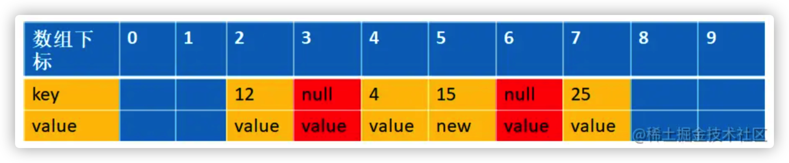

 # wait/notify 机制

线程与线程之间不是独立的个体，彼此是可以互相通信协作的。先来介绍一下 wait/notify 机制。

## wait/notify 机制的原理

拥有相同锁的线程才可以实现 wait/notify 机制

### wait() 方法的基本使用

使用条件: 在使用 wait() 方法之前, 线程必须获得该对象的对象级别锁。这也就意味着只能在同步方法中或者同步代码块中使用此方法。notify 同样如此。

作用：wait() 方法的作用是使当前线程暂停运行, 并释放对象锁。

测试demo

```java
public class WaitThreadDemo_1 {
    public static void main(String[] args) {
        String newString = new String("");

        try {
            newString.wait();
        } catch (InterruptedException e) {
            // doNothing
        }
    }
}
```

运行这段代码，结果抛出异常

```text
Exception in thread "main" java.lang.IllegalMonitorStateException
	at java.lang.Object.wait(Native Method)
	at java.lang.Object.wait(Object.java:502)
	at waitandnotifythread.WaitThreadDemo_1.main(WaitThreadDemo_1.java:8)
```

这是因为在 Object 类中，wait 底层实现是一个 native 方法

```java
public class Object {
    /**
    * IllegalMonitorStateException  if the current thread is not the owner of the object's monitor.
    * @param timeout
    * @throws InterruptedException
    */
    public final native void wait(long timeout) throws InterruptedException;
}
```

异常注释翻译一下就是抛出 IllegalMonitorStateException 是因为 wait 在 JVM 通过 monitor 对象完成，main 方法执行的时候并没有获取到 String 对象的
monitor。

修改代码如下: 

```java
public class WaitThreadDemo_2 {
    public static void main(String[] args) {
        String lock = new String("");
        System.out.println("未获取 String 对象的 monitor 对象");
        synchronized(lock){
        try {
            System.out.println("获取到 String monitor 对象, 执行 wait 方法");
            lock.wait();
            System.out.println("执行 wait 方法后，是否能打印此行日志");
            } catch(InterruptedException e){
                // doNothing
            }
        }
    }
}
```

代码输出结果:

```text
未获取 String 对象的 monitor 对象
获取到 String monitor 对象, 执行 wait 方法

```

程序一直阻塞，并没有继续向下执行。如果要使处于 wait 状态的线程继续运行，就需要使用 notify 方法。demo 如下:

```java
public class WaitNotifyDemo {

    private static Object lock = new Object();

    public static void main(String[] args) {
        Thread t1 = new Thread(new Runnable() {
            public void run() {
                synchronized (lock){
                    System.out.println("T1 start wait time = " + System.currentTimeMillis());
                    try {
                        lock.wait();
                    } catch (InterruptedException e) {
                        // doNothing
                    }
                    System.out.println("T1 end wait time = " + System.currentTimeMillis());
                }
            }
        }, "T1");

        Thread t2 = new Thread(new Runnable() {
            public void run() {
                synchronized (lock){
                    lock.notify();
                    System.out.println("T2 weak up T1 time = " + System.currentTimeMillis());
                }
            }
        }, "T2");

        t1.start();

        try {
            Thread.sleep(3000);
        } catch (InterruptedException e) {
            // doNothing
        }

        t2.start();
    }
}
```

创建两个线程, 对同一个对象上锁，t1 调用 wait 方法阻塞并释放锁，t2 调用 notify 通知线程 t1 并重新获取锁。这里需要注意的是 t1 获取锁是在 t2 线程执行完
成之后才可以获取 lock 对象锁。看下运行结果:

```text
T1 start wait time = 1656513516636
T2 weak up T1 time = 1656513519637
T1 end wait time = 1656513519637
```

# 生产者/消费者模式的实现

wait/notify 模式最经典的案例就是生产者/消费者模式。基于此模式还衍生出几种变形。来看下

## 一生产/一消费：操作值

```java
public class WaitNotifyProducerConsumer {
    private static final Object lock = new Object();

    private static AtomicInteger count = new AtomicInteger();

    public static void main(String[] args) {
        Thread producer = new Thread(new Runnable() {
            public void run() {
                synchronized(lock){
                    System.out.println("生产者开始生产数字 count = " + count.incrementAndGet());
                    try {
                        lock.wait();
                    } catch (InterruptedException e) {
                        // doNothing
                    }
                }
            }
        }, "producer");


        Thread consumer = new Thread(new Runnable() {
            public void run() {
                synchronized (lock){
                    System.out.println("消费者开始消费数字 count = " + count.decrementAndGet());
                    lock.notify();
                }
            }
        }, "consumer");

        producer.start();
        consumer.start();
    }
}
```

创建两个线程，一个线程对 count 加一，一个减一。运行结果：

```text
生产者开始生产数字 count = 1
消费者开始消费数字 count = 0
```

## 一生产/一消费： 操作栈

创建操作栈方法：

```java
public class MyStack {
    private List<String> stackList = new ArrayList<String>();

    synchronized public void pushStack() {
        if (stackList.size() == 1) {
            try {
                this.wait();
            } catch (InterruptedException e) {
                // doNothing
            }
        }
        stackList.add("anyString= " + Math.random());
        this.notify();
        System.out.println("push= " + stackList.size());
    }

    synchronized public void popStack() {
        if (stackList.size() == 0) {
            System.out.println("pop 操作中的 " + Thread.currentThread().getName() + " 线程状态处于 wait 状态 ！！！");
            try {
                this.wait();
            } catch (InterruptedException e) {
                // doNothing
            }
        }
        stackList.remove(0);
        this.notify();
        System.out.println("pop= " + stackList.size());
    }
}
```

当pushStack 方法 当集合 stackList 大小为 1， 线程开始阻塞等待消费者线程消费; 当集合 stackList 大小为 0，消费者线程开始阻塞，等生产者线程生产；

创建生产者消费者线程

```java
public class ConsumerThread implements Runnable {

    private MyStack myStack;

    public ConsumerThread(){}

    public ConsumerThread(MyStack myStack){
        this.myStack = myStack;
    }

    public void run() {
        while (true) {
            myStack.popStack();
        }
    }
}

public class ProducerThread implements Runnable {

    private MyStack myStack;

    public ProducerThread(MyStack myStack){
        this.myStack = myStack;
    }

    @Override
    public void run() {
        while (true) {
            myStack.pushStack();
        }
    }
}
```

生产者调用 pushStack 方法向集合中填加数据, 消费者调用 popStack 方法移除数据;

测试程序:

```java
public class WaitNotifyProducerConsumerOperateStackDemo {
    public static void main(String[] args) {
        MyStack myStack = new MyStack();

        ConsumerThread consumerThread = new ConsumerThread(myStack);
        ProducerThread producerThread = new ProducerThread(myStack);

        Thread c_Thread = new Thread(consumerThread);
        Thread p_Thread = new Thread(producerThread);

        c_Thread.setName("c_Thread");
        p_Thread.setName("p_Thread");

        p_Thread.start();
        c_Thread.start();
    }
}
```

运行程序结果:

```text
push= 1
pop= 0
pop 操作中的 c_Thread 线程状态处于 wait 状态 ！！！
push= 1
pop= 0
pop 操作中的 c_Thread 线程状态处于 wait 状态 ！！！
push= 1
pop= 0
pop 操作中的 c_Thread 线程状态处于 wait 状态 ！！！
push= 1
pop= 0
pop 操作中的 c_Thread 线程状态处于 wait 状态 ！！！
push= 1
pop= 0
pop 操作中的 c_Thread 线程状态处于 wait 状态 ！！！
push= 1
pop= 0
pop 操作中的 c_Thread 线程状态处于 wait 状态 ！！！
push= 1
pop= 0
pop 操作中的 c_Thread 线程状态处于 wait 状态 ！！！
push= 1
pop= 0
pop 操作中的 c_Thread 线程状态处于 wait 状态 ！！！

……

```

## 一生产/多消费者：操作栈

基于 MyStack 修改判断方式, while， 使用 if 判断, 消费者不能及时感知条件 stackList 容量等于 1，导致多个消费线程同时唤醒，最终导致移除 stackList
集合元素抛出异常。所以需要将 if 条件改为 while。

测试demo

```java
public class WaitNotifyProducerConsumerOperateStackDemo_2 {
    public static void main(String[] args) throws InterruptedException {
        MyStack_2 myStack_2 = new MyStack_2();

        ConsumerThread_2 consumerThread_2A = new ConsumerThread_2(myStack_2);
        ConsumerThread_2 consumerThread_2B = new ConsumerThread_2(myStack_2);
        ConsumerThread_2 consumerThread_2C = new ConsumerThread_2(myStack_2);
        ConsumerThread_2 consumerThread_2D = new ConsumerThread_2(myStack_2);
        ConsumerThread_2 consumerThread_2E = new ConsumerThread_2(myStack_2);

        ProducerThread_2 producerThread_2 = new ProducerThread_2(myStack_2);

        Thread c_ThreadA = new Thread(consumerThread_2A);
        Thread c_ThreadB = new Thread(consumerThread_2B);
        Thread c_ThreadC = new Thread(consumerThread_2C);
        Thread c_ThreadD = new Thread(consumerThread_2D);
        Thread c_ThreadE = new Thread(consumerThread_2E);


        Thread p_Thread = new Thread(producerThread_2);

        c_ThreadA.setName("c_ThreadA");
        c_ThreadB.setName("c_ThreadB");
        c_ThreadC.setName("c_ThreadC");
        c_ThreadD.setName("c_ThreadD");
        c_ThreadE.setName("c_ThreadE");

        p_Thread.setName("p_ThreadA");


        c_ThreadA.start();
        c_ThreadB.start();
        c_ThreadC.start();
        c_ThreadD.start();
        c_ThreadE.start();

        p_Thread.start();
        
        Thread.sleep(5000);
        Thread[] threads = new Thread[Thread.currentThread().getThreadGroup().activeCount()];
        Thread.currentThread().getThreadGroup().enumerate(threads);
        
        for(Thread thread : threads){
            System.out.println(thread.getName() + " " + thread.getState());
        }
    }
}
```

运行结果：

```text
c_ThreadA pop 操作中的 c_ThreadA 线程状态处于 wait 状态 ！！！
c_ThreadD pop 操作中的 c_ThreadD 线程状态处于 wait 状态 ！！！
c_ThreadC pop 操作中的 c_ThreadC 线程状态处于 wait 状态 ！！！
c_ThreadB pop 操作中的 c_ThreadB 线程状态处于 wait 状态 ！！！
p_ThreadA push= 1
c_ThreadE pop= 0
c_ThreadE pop 操作中的 c_ThreadE 线程状态处于 wait 状态 ！！！
c_ThreadD pop 操作中的 c_ThreadD 线程状态处于 wait 状态 ！！！
c_ThreadA pop 操作中的 c_ThreadA 线程状态处于 wait 状态 ！！！
main RUNNABLE
Monitor Ctrl-Break RUNNABLE
c_ThreadA WAITING
c_ThreadB WAITING
c_ThreadC WAITING
c_ThreadD WAITING
c_ThreadE WAITING
p_ThreadA WAITING
```

运行程序后会发现，线程处于 WAIT 状态即"假死"状态，这是因为生产者停止生产后，消费者在消费完第一个数据后，后面启动的生产者直接阻塞，造成程序 "假死"。
使用 notifyAll 无论消费者还是生产者都唤醒，从而使程序继续运行。

# 通过管道进行线程间通信

Java 语言中提供了各种各样的输入流，可以让我们能够很方便的对数据进行操作。其中管道流是一种特殊的流, 用于在不同的线程间直接传递数据


## 字节流

创建写入 demo

```java
public class WriteData {
    public void writeMethod(PipedOutputStream out){
        System.out.println("write : ");
        for(int i=0; i<300; i++){
            String outData = "" + (i+1);
            try {
                out.write(outData.getBytes());
                System.out.print(outData);
            } catch (IOException e) {
                // doNothing
            }
        }
        System.out.println();
        try {
            out.close();
        } catch (IOException e) {
            // doNothing
        }
    }
}
```

循环向管道中写入 300 个字符。

创建读取 demo 

```java
public class ReadData {
    public void readMethod(PipedInputStream pipedInputStream){
        System.out.println("read   ;");
        byte[] byteArray = new byte[20];
        try {
            int readLength = pipedInputStream.read(byteArray);
            while(readLength != -1){
                String newData = new String(byteArray, 0, readLength);
                System.out.print("read : " + newData + " ");
                readLength = pipedInputStream.read(byteArray);
            }
            System.out.println();
            pipedInputStream.close();
        } catch (IOException e) {
            // doNothing
        }
    }
}
```

当读取到管道中没有需要读取的字节，pipedInputStream.read 将返回 -1。

创建 读写线程

```java
public class WriteThread implements Runnable {

    private WriteData writeData;
    private PipedOutputStream outputStream;


    public WriteThread(WriteData writeData, PipedOutputStream outputStream) {
        this.writeData = writeData;
        this.outputStream = outputStream;
    }

    @Override
    public void run() {
        writeData.writeMethod(outputStream);
    }
}

public class ReadThread implements Runnable{

    private ReadData readData;
    private PipedInputStream inputStream;


    public ReadThread(ReadData readData, PipedInputStream inputStream) {
        this.readData = readData;
        this.inputStream = inputStream;
    }

    @Override
    public void run() {
        readData.readMethod(inputStream);
    }
}
```

测试 demo 

```java
public class WriteReadThreadDemo {
    public static void main(String[] args) {
        ReadData readData = new ReadData();
        WriteData writeData = new WriteData();

        PipedInputStream pipedInputStream = new PipedInputStream();
        PipedOutputStream pipedOutputStream = new PipedOutputStream();

        try {
            pipedInputStream.connect(pipedOutputStream);
            //pipedOutputStream.connect(pipedInputStream);

            ReadThread readThread = new ReadThread(readData, pipedInputStream);
            Thread r_Thread = new Thread(readThread);
            r_Thread.start();

            WriteThread writeThread = new WriteThread(writeData, pipedOutputStream);
            Thread w_Thread = new Thread(writeThread);
            w_Thread.start();


        } catch (IOException e) {
            // doNothing
        }
    }
}
```
pipedInputStream.connect(pipedOutputStream); 或者 pipedOutputStream.connect(pipedInputStream); 的作用是是两个管道之间建立连接，
这样才可以对数据进行输入输出

结果如下:

```text
read   ;
write : 
123456789101112131415161718192021222324252627282930313233343536373839404142434445464748495051525354555657585960616263646566676869707172737475767778798081828384858687888990919293949596979899100101102103104105106107108109110111112113114115116117118119120121122123124125126127128129130131132133134135136137138139140141142143144145146147148149150151152153154155156157158159160161162163164165166167168169170171172173174175176177178179180181182183184185186187188189190191192193194195196197198199200201202203204205206207208209210211212213214215216217218219220221222223224225226227228229230231232233234235236237238239240241242243244245246247248249250251252253254255256257258259260261262263264265266267268269270271272273274275276277278279280281282283284285286287288289290291292293294295296297298299300
read : 12345678910111213141 read : 51617181920212223242 read : 52627282930313233343 read : 53637383940414243444 read : 54647484950515253545 read : 55657585960616263646 read : 56667686970717273747 read : 57677787980818283848 read : 58687888990919293949 read : 59697989910010110210 read : 31041051061071081091 read : 10111112113114115116 read : 11711811912012112212 read : 31241251261271281291 read : 30131132133134135136 read : 13713813914014114214 read : 31441451461471481491 read : 50151152153154155156 read : 15715815916016116216 read : 31641651661671681691 read : 70171172173174175176 read : 17717817918018118218 read : 31841851861871881891 read : 90191192193194195196 read : 19719819920020120220 read : 32042052062072082092 read : 10211212213214215216 read : 21721821922022122222 read : 32242252262272282292 read : 30231232233234235236 read : 23723823924024124224 read : 32442452462472482492 read : 50251252253254255256 read : 25725825926026126226 read : 32642652662672682692 read : 70271272273274275276 read : 27727827928028128228 read : 32842852862872882892 read : 90291292293294295296 read : 297298299300 
```

## 字符流

与字节流不同的是字符流使用了缓冲区。需要等到输出流关闭才能读取，或者手动 flush 刷到管道中。

读写demo

```java
public class PipeCharReadStream {
    public void readMethod(PipedReader input){
        System.out.print("read: ");
        char[] byteArray = new char[20];
        try {
            int readLength =  input.read(byteArray);
            while(readLength != -1){
                String newData = new String(byteArray, 0, readLength);
                System.out.print(newData);
                readLength = input.read(byteArray);
            }
            System.out.println();
        } catch (IOException e) {
            // doNothing
        }finally {
            try {
                input.close();
            } catch (IOException e) {
                // doNothing
            }
        }
    }
}

public class PipeCharWriteStream {
    public void writeMethod(PipedWriter out){
        System.out.print("write: ");
        for(int i=0; i<300; i++){
            String outData = "" + (i+1);
            try {
                out.write(outData);
            } catch (IOException e) {
                // doNothing
            }
            System.out.print(outData);
        }
        System.out.println();
        try {
            out.close();
        } catch (IOException e) {
            // doNothing
        }
    }
}
```

读写线程

```java
public class PipeReaderThread implements Runnable {

    private PipeCharReadStream pipeCharReadStream;
    private PipedReader pipedReader;

    public PipeReaderThread(PipeCharReadStream pipeCharReadStream, PipedReader pipedReader) {
        this.pipeCharReadStream = pipeCharReadStream;
        this.pipedReader = pipedReader;
    }

    @Override
    public void run() {
        pipeCharReadStream.readMethod(pipedReader);
    }
}

public class PipeWriteThread implements Runnable {

    private PipeCharWriteStream pipeCharWriteStream;
    private PipedWriter pipedWriter;

    public PipeWriteThread(PipeCharWriteStream pipeCharWriteStream, PipedWriter pipedWriter) {
        this.pipeCharWriteStream = pipeCharWriteStream;
        this.pipedWriter = pipedWriter;
    }

    @Override
    public void run() {
        pipeCharWriteStream.writeMethod(pipedWriter);
    }
}
```

测试demo

```java
public class PipeReaderWriterDemo {
    public static void main(String[] args) throws Exception {
        PipedWriter pipedWriter = new PipedWriter();
        PipeCharWriteStream pipeCharWriteStream = new PipeCharWriteStream();
        PipeWriteThread writeThread = new PipeWriteThread(pipeCharWriteStream,pipedWriter);
        Thread w_Thread = new Thread(writeThread);

        PipedReader pipedReader = new PipedReader();
        PipeCharReadStream pipeCharReadStream = new PipeCharReadStream();
        PipeReaderThread pipeReaderThread = new PipeReaderThread(pipeCharReadStream, pipedReader);
        Thread r_Thread = new Thread(pipeReaderThread);

        // 管道建立连接
        // pipedReader.connect(pipedWriter);
        pipedWriter.connect(pipedReader);

        w_Thread.start();

        Thread.sleep(2000);

        r_Thread.start();
    }
}
```

在使用上两者差别不大。

小结一下两者的区别：

字节流在操作的时候本身是不会用到缓冲区（内存）的，是与文件本身直接操作的，而字符流在操作的时候是使用到缓冲区的。

字节流在操作文件时，即使不关闭资源（close方法），文件也能输出，但是如果字符流不使用close方法的话，则不会输出任何内容，说明字符流用的是缓冲区，并且可以使用flush方法强制进行刷新缓冲区，这时才能在不close的情况下输出内容

那开发中究竟用字节流好还是用字符流好呢？

在所有的硬盘上保存文件或进行传输的时候都是以字节的方法进行的，包括图片也是按字节完成，而字符是只有在内存中才会形成的，所以使用字节的操作是最多的。

如果要java程序实现一个拷贝功能，应该选用字节流进行操作（可能拷贝的是图片），并且采用边读边写的方式（节省内存）。

# join() 方法的使用

join的作用: 等待线程对象销毁；底层还是基于 wait 实现。demo 如下

```java
public class Thread implements Runnable {
    public final synchronized void join(long millis)
    throws InterruptedException {
        long base = System.currentTimeMillis();
        long now = 0;

        if (millis < 0) {
            throw new IllegalArgumentException("timeout value is negative");
        }

        if (millis == 0) {
            while (isAlive()) {
                wait(0);
            }
        } else {
            while (isAlive()) {
                long delay = millis - now;
                if (delay <= 0) {
                    break;
                }
                wait(delay);
                now = System.currentTimeMillis() - base;
            }
        }
    }
}
```

创建 线程类

```java
public class JoinMethodThread implements Runnable {
    
    @Override
    public void run() {
        int secondValue = (int) (Math.random() * 10000);
        System.out.println(secondValue);
        try {
            Thread.sleep(secondValue);
            Thread.sleep(100000);
            System.out.println(Thread.currentThread().getName() + " 线程休眠完成继续运行" );
        } catch (InterruptedException e) {
            // doNothing
        }
    }
}
```

创测试类

```java
public class JoinThreadDemo {
    public static void main(String[] args) {
        JoinMethodThread joinMethodThread = new JoinMethodThread();
        Thread j_Thread = new Thread(joinMethodThread);
        j_Thread.start();
        try {
            j_Thread.join();
        } catch (InterruptedException e) {
            // doNothing
        }

        System.out.println(Thread.currentThread().getName() + " 等待线程" + j_Thread.getName() + "执行完成");
    }
}
```

运行结果:

```text
2035
Thread-0 线程休眠完成继续运行
main 等待线程Thread-0执行完成
```

可以看到主线程 main 确实在等待 j_Thread 执行完成。

# ThreadLocal 的使用

变量值的共享可以使用 public static 变量的形式实现，所有的线程都使用同一个 public static 变量，那么如何实现每一个线程都有自己变量？JDK提供了 ThreadLocal来解决这样的问题。

## ThreadLocal 设计

1.在JDK早期的设计中，每个ThreadLocal都有一个map对象，将线程作为map对象的key，要存储的变量作为map的value，但是现在已经不是这样了;

2.JDK8之后，每个Thread维护一个ThreadLocalMap对象，这个Map的key是ThreadLocal实例本身，value是存储的值要隔离的变量，是泛型，其具体过程如下：

2.1 每个Thread线程内部都有一个Map（ThreadLocalMap::threadlocals）; * Map里面存储ThreadLocal对象（key）和线程的变量副本（value）; 

2.2 Thread内部的Map由ThreadLocal维护，由ThreadLocal负责向map获取和设置变量值; * 对于不同的线程，每次获取副本值时，别的线程不能获取当前线程的副本值，就形成了数据之间的隔离。

JDK8之后设计的好处在于：

每个Map存储的Entry的数量变少，在实际开发过程中，ThreadLocal的数量往往要少于Thread的数量，Entry的数量减少就可以减少哈希冲突。
当Thread销毁的时候，ThreadLocalMap也会随之销毁，减少内存使用，早期的ThreadLocal并不会自动销毁。

## 使用场景

### 1. 每个线程需要一个独享的对象

以 SimpleDateFormat (当多个线程共用这样一个 SimpleDateFormat 的时候，这个类是不安全的)为列：

2个线程分别用自己的SimpleDateFormat，这没问题；

后来延伸出10个，那就有10个线程和10个SimpleDateFormat，这虽然写法不优雅，但勉强可以接受

但是当需求变成了1000，那么必然要用线程池，消耗内存太多；

但是每一个SimpleDateFormat我们都需要创建一遍，那么太耗费new对象了，改成static共用的，所有线程都共用一个simpleDateFormat对象，但这是线程不安全的，容易出现时间一致的情况，在调用的时候，可加锁来解决，但还是不优雅；

用ThreadLocal来解决该问题，给每个线程分配一个simpledateformat，可这个threadlocal是安全的；

```java
public class ThreadLocalNormalUsage {

    public static ExecutorService threadPool = Executors.newFixedThreadPool(10);

    public static void main(String[] args) throws InterruptedException {
        for (int i = 0; i < 1000; i++) {
            int finalI = i;
            threadPool.submit(new Runnable() {
                @Override
                public void run() {
                    String date = new ThreadLocalNormalUsage().date(finalI);
                    System.out.println(date);
                }
            });
        }
        threadPool.shutdown();
    }

    public String date(int seconds) {
        //参数的单位是毫秒，从1970.1.1 00:00:00 GMT计时
        Date date = new Date(1000 * seconds);
//        SimpleDateFormat dateFormat = new SimpleDateFormat("yyyy-MM-dd HH:mm:ss");
        SimpleDateFormat dateFormat = ThreadSafeFormatter.dateFormatThreadLocal.get();
        return dateFormat.format(date);
    }
}

class ThreadSafeFormatter {

    public static ThreadLocal<SimpleDateFormat> dateFormatThreadLocal = new ThreadLocal<SimpleDateFormat>() {
        @Override
        protected SimpleDateFormat initialValue() {
            return new SimpleDateFormat("yyyy-MM-dd HH:mm:ss");
        }
    };

    public static ThreadLocal<SimpleDateFormat> dateFormatThreadLocalMethod = ThreadLocal
            .withInitial(() -> new SimpleDateFormat("yyyy-MM-dd HH:mm:ss"));
}
```

demo 运行结果

```text
1970-01-01 08:00:00
1970-01-01 08:00:01
1970-01-01 08:00:07
1970-01-01 08:00:04
1970-01-01 08:00:09
1970-01-01 08:00:03
1970-01-01 08:00:08
1970-01-01 08:00:06
1970-01-01 08:00:16
1970-01-01 08:00:05
1970-01-01 08:00:02
1970-01-01 08:00:18
1970-01-01 08:00:17
1970-01-01 08:00:15
1970-01-01 08:00:14
1970-01-01 08:00:23
1970-01-01 08:00:13
1970-01-01 08:00:11
1970-01-01 08:00:10
1970-01-01 08:00:26
1970-01-01 08:00:25
1970-01-01 08:00:24
1970-01-01 08:00:22
1970-01-01 08:00:21
1970-01-01 08:00:20
1970-01-01 08:00:12

……

```

运行过显示时间并没有重复，保证了多线程下 Simpledateformat 对象独享，以及多线程安全。

### 2. 当前用户信息需要被线程内所有方法共享

一个比较繁琐的解决方案是把user作为参数层层传递，从service-1()传到service-2(),以此类推，但是这样做会导致代码冗余且不易维护。
进阶点就是userMap来保存，但是当多线程同时工作时，需要保证线程安全，需要用synchronized，或者 Concurrenthashmap，但无论用什么，都会对性能有所影响；

每个线程内需要保存全局变量，可以让不同方法直接使用，避免参数传递的麻烦

用 ThreadLocal 保存一些业务内存（用户权限信息，从用户系统获取到的用户名、userId等）
这些信息在同一个线程内相同，但是不同的线程使用的业务内容是不相同的
在线程生命周期内，都通过这个静态ThreadLocal实例的get()方法取得自己set过的那个对象，避免了将这个对象作为参数传递的麻烦

```java
public class ThreadLocalUsageMethodParam {
    public static void main(String[] args) {
        new Service1().process("");

    }
}

class Service1 {

    public void process(String name) {
        User user = new User("超哥");
        UserContextHolder.holder.set(user);
        new Service2().process();
    }
}

class Service2 {

    public void process() {
        User user = UserContextHolder.holder.get();
        ThreadSafeFormatter.dateFormatThreadLocal.get();
        System.out.println("Service2拿到用户名：" + user.name);
        new Service3().process();
    }
}

class Service3 {

    public void process() {
        User user = UserContextHolder.holder.get();
        System.out.println("Service3拿到用户名：" + user.name);
        UserContextHolder.holder.remove();
    }
}

class UserContextHolder {

    public static ThreadLocal<User> holder = new ThreadLocal<>();

}

class User {

    String name;

    public User(String name) {
        this.name = name;
    }
}
```

demo 运行结果:

```text
Service2拿到用户名：超哥
Service3拿到用户名：超哥
```

# ThreadLocal 方法说明

## initialValue

在ThreadLocal第一次get的时候把对象给初始化出来，对象的初始化时机可以由我们控制。

## set

如果需要保存到ThreadLocal里面的对象的生成时机不由我们随意控制。例如拦截器生成的用户信息，用ThreadLocal.set直接放到ThreadLocal当中

## get

取线程本地变量的内容

# ThreadLocal 原理

ThreadLocal 是如何实现在每个线程中保存一份单独的本地变量？看下 ThreadLocal 的 Java 底层实现


## ThreadLocal Set 方法原理

````java
public class ThreadLocal<T> {
    public void set(T value) {
        // 获取当前线程
        Thread t = Thread.currentThread();
        // 获取当前线程 ThreadLocal 
        ThreadLocalMap map = getMap(t);
        // 判断线程的threadLocals是否初始化了
        if (map != null)
            map.set(this, value);
        else
            // 没有则创建一个ThreadLocalMap对象进行初始化
            createMap(t, value);
    }
}
````

源码中 ThreadLocalMap 是通过 getMap(t) 进行获取:

```java
public class ThreadLocal<T> {
    ThreadLocalMap getMap(Thread t) {
        return t.threadLocals;
    }
}
```

该方法返回的是一个 Thread 类中名叫 threadLocals 成员变量:

```java
public class Thread implements Runnable {
    /* ThreadLocal values pertaining to this thread. This map is maintained
     * by the ThreadLocal class. */
    ThreadLocal.ThreadLocalMap threadLocals = null;
}
```

可以看到 ThreadLocalMap 对象是被 Thread 类中名叫 threadLocals 变量引用的，被 Thread 类维护。

接着我们再看下 createMap 方法，源码如下：

```java
public class ThreadLocal<T> {
    void createMap(Thread t, T firstValue) {
        t.threadLocals = new ThreadLocalMap(this, firstValue);
    }
}
```

该方法就是 创建了一个 ThreadLocalMap 对象赋值给 Thread 类中 threadLocals 变量。其中 this-》ThreadLocal 作为 key， value 为值放入 ThreadLocalMap 中。

接着来看下 map.set方法，源码如下:

```java
public class ThreadLocal<T> {
    /**
     * 往map中设置ThreadLocal的关联关系
     * set中没有使用像get方法中的快速选择的方法，因为在set中创建新条目和替换旧条目的内容一样常见，
     * 在替换的情况下快速路径通常会失败（对官方注释的翻译）
     */
    private void set(ThreadLocal<?> key, Object value) {
        // map中就是使用Entry[]数据保留所有的entry实例
        Entry[] tab = table;
        int len = tab.length;
        //根据threadLocal的hashCode确定Entry应该存放的位置
        int i = key.threadLocalHashCode & (len - 1);
        // 采用开放地址法，hash 冲突的时候使用线性探测解决冲突
        // 注意这里的 e.get 获取的是对 ThreadLocal 的引用
        for (Entry e = tab[i]; e != null; e = tab[i = nextIndex(i, len)]) {
            ThreadLocal<?> k = e.get();
            if (k == key) {
                //覆盖旧Entry
                e.value = value;
                return;
            }
            //当key为null时，说明threadLocal强引用已经被释放掉，那么就无法
            //再通过这个key获取threadLocalMap中对应的entry，这里就存在内存泄漏的可能性(当线程一直不结束，那么
            // 就会一直存在 key=null value=Object 的 Entry)
            if (k == null) {
                // 在设置期间清理哈希表为空的内容，保持哈希表的性质
                replaceStaleEntry(key, value, i);
                return;
            }
        }
        
        // 新建entry并插入table中i处
        tab[i] = new Entry(key, value);
        int sz = ++size;
        // 插入后再次清除一些key为null的“脏”entry,如果大于阈值就需要扩容
        if (!cleanSomeSlots(i, sz) && sz >= threshold)
            // 扩容
            rehash();
    }
}
```

set 方法的关键部分有以下几点注意：

### ThreadLocal 的hashCode

```java
public class ThreadLocal<T> {
    private static final int HASH_INCREMENT = 0x61c88647;
    private final int threadLocalHashCode = nextHashCode();
    private static AtomicInteger nextHashCode =
            new AtomicInteger();
    
    private static int nextHashCode() {
        return nextHashCode.getAndAdd(HASH_INCREMENT);
    }
}
```

从这部分源码中可以看出 hashCode 是通过 AtomicInteger 的 getAndAdd 方法加上 0x61c88647 得到的值。这个数字能保证 hash 表的每个散列桶能够均匀分。这是 Fibonacci Hashing(斐波那契散列)。所以 ThreadLocal 选择使用开放地址法来解决 hash 冲突的问题。

### 确定新值插入哈希表中的位置

在源码中使用 key.threadLocalHashCode & (len - 1) 计算新值在哈希表的存储位置，len是容器大小， key 是 ThreadLocal 实例 的 hashCode 两者进行与运算，是因为哈希表大小总是 2 的 n 幂次方，相当于一个取模的过程。使用与运算的原因是因为位运算的执行效率高于取模运算。

```java
public class ThreadLocal<T> {
        /**
         * The initial capacity -- MUST be a power of two.
         */
        private static final int INITIAL_CAPACITY = 16;
}
```

上述源码也表明了 Entry 的初始容量必须是 2 的幂次方。

### 怎么解决哈希冲突

set 源码中 nextIndex(i, len) 解决了 hash 冲突的问题，看下实现:

```java
public class ThreadLocal<T> {
        /**
         * Increment i modulo len.
         */
        private static int nextIndex(int i, int len) {
            return ((i + 1 < len) ? i + 1 : 0);
        }
}
```

不断增量 i(线性探测次数)，当到了哈希表的末尾时，再从 0 开始。一种效率低下的线性探测法，利用固定算法寻找一定步长的下个位置，直到找到能够存放的位置。效率低下的原因是因为当有大量的不同的 ThreadLocal 对象放入 ThreadLocalMap 中产生冲突，那么就会进行大量的循环，直到将这数据都存放到哈希表中(产生空位的原因是因为其他数据不在使用，被回收了)

从上面分析我们也可以得出一个结论：每个线程存储的变量尽量少，减少哈希冲图的可能性。


### 如何解决 "脏" Entry

在源码中将 key 为 null 的 Entry 称为 "脏" Entry(stale entry)。在源码中是通过这个方法 replaceStaleEntry 来解决这种 "脏" Entry。进一步看下这个方法：

```java
public class ThreadLocal<T> {
    /**
     * Replace a stale entry encountered during a set operation
     * with an entry for the specified key.  The value passed in
     * the value parameter is stored in the entry, whether or not
     * an entry already exists for the specified key.
     *
     * As a side effect, this method expunges all stale entries in the
     * "run" containing the stale entry.  (A run is a sequence of entries
     * between two null slots.)
     *
     * @param  key the key
     * @param  value the value to be associated with key
     * @param  staleSlot index of the first stale entry encountered while
     *         searching for key.
     */
    private void replaceStaleEntry(ThreadLocal<?> key, Object value,
                                   int staleSlot) {
        Entry[] tab = table;
        int len = tab.length;
        Entry e;

        int slotToExpunge = staleSlot;
        //这里采用的是从当前的staleSlot 位置向前面遍历，i--
        //这样的话是为了把前面所有的的已经被垃圾回收的也一起释放空间出来
        //（注意这里只是key 被回收，value还没被回收，entry更加没回收，所以需要让他们回收），
        //同时也避免这样存在很多过期的对象的占用,导致这个时候刚好来了一个新的元素达到阀值而触发一次新的rehash
        for (int i = prevIndex(staleSlot, len);
             (e = tab[i]) != null;
             i = prevIndex(i, len))
            if (e.get() == null)
                slotToExpunge = i;

        // 这个时候是从数组下标小的往下标大的方向遍历，i++，刚好跟上面相反。
        //这两个遍历就是为了在左边遇到的第一个空的entry到右边遇到的第一空的 entry之间查询所有过期的对象。
        //注意：在右边如果找到需要设置值的key（这个例子是key=15）相同的时候就开始清理，然后返回，不再继续遍历下去了
        for (int i = nextIndex(staleSlot, len);
             (e = tab[i]) != null;
             i = nextIndex(i, len)) {
            ThreadLocal<?> k = e.get();

            //说明之前已经存在相同的key,所以需要替换旧的值并且和前面那个过期的对象的进行交换位置，
            //交换的目的下面会解释
            if (k == key) {
                e.value = value;

                tab[i] = tab[staleSlot];
                tab[staleSlot] = e;

                //这里的意思就是前面的第一个for 循环(i--)往前查找的时候没有找到过期的，只有staleSlot
                // 这个过期，由于前面过期的对象已经通过交换位置的方式放到index=i上了，
                // 所以需要清理的位置是i,而不是传过来的staleSlot
                if (slotToExpunge == staleSlot)
                    slotToExpunge = i;
                //进行清理过期数据
                cleanSomeSlots(expungeStaleEntry(slotToExpunge), len);
                return;
            }

            // 如果我们在第一个for 循环(i--) 向前遍历的时候没有找到任何过期的对象
            // 那么我们需要把slotToExpunge 设置为向后遍历(i++) 的第一个过期对象的位置
            // 因为如果整个数组都没有找到要设置的key 的时候，该key 会设置在该staleSlot的位置上
            // 如果数组中存在要设置的key,那么上面也会通过交换位置的时候把有效值移到staleSlot位置上
            // 综上所述，staleSlot位置上不管怎么样，存放的都是有效的值，所以不需要清理的
            if (k == null && slotToExpunge == staleSlot)
                slotToExpunge = i;
        }

        // 如果key 在数组中没有存在，那么直接新建一个新的放进去就可以
        tab[staleSlot].value = null;
        tab[staleSlot] = new Entry(key, value);

        // 如果有其他已经过期的对象，那么需要清理他
        if (slotToExpunge != staleSlot)
            cleanSomeSlots(expungeStaleEntry(slotToExpunge), len);
    }
}
```

假设此时 Entry 中存放的数据如下图所示: 

比如说，我们的关键字集合为{12,33,4,5,15,25},表长为10。 我们用散列函数f(key) = key mod l0。
当计算前S个数{12,33,4,5,15,25}时，并且此时key=33,k=5 已经过期了（蓝色代表为空的，可以存放数据，红色代表key 过期，过期的key为null）：


这时候来了一个新的数据，key=15,value=new,通过计算f(15)=5,此时5已经过期，进入到下面这个if 语句: 

```text
if (k == null) {
    //key 过期了，要进行替换
        replaceStaleEntry(key, value, i);
        return;
}
```

第一个for 循环是向前遍历数据的，直到遍历到空的entry 就停止（这个是根据开放地址的线性探测法）,这里的例子就是遍历到index=1就停止了。看下 prevIndex(i, len)) 实现:

```text
/**
 * Decrement i modulo len.
 */
private static int prevIndex(int i, int len) {
    return ((i - 1 >= 0) ? i - 1 : len - 1);
}
```


向前遍历的过程同时会找出过期的key,这个时候找到的是下标index=3 的为过期，进入到

```text
if (e.get() == null)
    slotToExpunge = i;
```

此时计算得出 slotToExpunge = 3； staleSlot = 5；

第二个for 循环是从index=staleSlot开始，向后遍历的，找出是否有和当前匹配的key,有的话进行清理过期的对象和重新设置当前的值。这个例子遍历到index=6 的时候，匹配到key=15的值，进入如下代码

```text
if (k == key) {
        e.value = value;

        tab[i] = tab[staleSlot];
        tab[staleSlot] = e;

        // Start expunge at preceding stale entry if it exists
        if (slotToExpunge == staleSlot)
            slotToExpunge = i;
        cleanSomeSlots(expungeStaleEntry(slotToExpunge), len);
        return;
}
```

先进行数据交换，注意此时slotToExpunge=3，staleSlot=5，i=6。这里就是把5 和6 的位置的元素进行交换，并且设置新的value=new,交换后的图是这样的


为什么要交换

如果不交换，如图所示: 


这个时候如果我们再一次设置一个key=15,value=new1 的值，通过f(15)=5,这个时候由于上次index=5是过期对象，被清空了，所以可以存在数据，那么就直接存放在这里了


你看，这样整个数组就存在两个key=15 的数据了，这样是不允许的，所以一定要交换数据

数据交换完成后，接着来看下清理 "脏" Entry 的方法 cleanSomeSlots(expungeStaleEntry(slotToExpunge), len)

expungeStaleEntry(slotToExpunge) 方法

```java
public class ThreadLocal<T> {
    /**
     * Expunge a stale entry by rehashing any possibly colliding entries
     * lying between staleSlot and the next null slot.  This also expunges
     * any other stale entries encountered before the trailing null.  See
     * Knuth, Section 6.4
     *
     * @param staleSlot index of slot known to have null key
     * @return the index of the next null slot after staleSlot
     * (all between staleSlot and this slot will have been checked
     * for expunging).
     */
    private int expungeStaleEntry(int staleSlot) {
        Entry[] tab = table;
        int len = tab.length;

        // 这里设置为null ,方便让GC 回收
        tab[staleSlot].value = null;
        tab[staleSlot] = null;
        size--;

        // Rehash until we encounter null
        Entry e;
        int i;
        for (i = nextIndex(staleSlot, len);
             (e = tab[i]) != null;
             i = nextIndex(i, len)) {
            ThreadLocal<?> k = e.get();
            if (k == null) {
                e.value = null;
                tab[i] = null;
                size--;
            } else {
                int h = k.threadLocalHashCode & (len - 1);
                if (h != i) {
                    tab[i] = null;

                    // 这里主要的作用是由于采用了开放地址法，所以删除的元素是多个冲突元素中的一个，需要对后面的元素作
                    // 处理，可以简单理解就是让后面的元素往前面移动
                    // 为什么要这样做呢？主要是开放地址寻找元素的时候，遇到null 就停止寻找了，你前面k==null
                    // 的时候已经设置entry为null了，不移动的话，那么后面的元素就永远访问不了了，下面会画图进行解释说明 
                    while (tab[h] != null)
                        h = nextIndex(h, len);
                    tab[h] = e;
                }
            }
        }
        return i;
    }
}
```

接下来我们详细模拟下整个过程 根据我们的例子，key=5,15,25 都是冲突的，并且k=5的值已经过期，经过replaceStaleEntry 方法，在进入expungeStaleEntry 方法之前，数据结构是这样的



此时传进来的参数 staleSlot=3，

```text
 if (k == null) {
    //这里设置为null ,方便让GC 回收
    e.value = null;
    tab[i] = null;
    size--;
 }
```

这个时候会把index=3和index = 6 都会进入被设置为null,变成以下的数据结构


接下来我们会遍历到i=7，经过int h = k.threadLocalHashCode & (len - 1) (实际上对应我们的举例的函数int h= f(25)); 得到的h=5,而25实际存放在index=7 的位置上，这个时候我们需要从h=5的位置上重新开始编列，直到遇到空的 entry 为止

```text
int h = k.threadLocalHashCode & (len - 1);
if (h != i) {
    tab[i] = null;

    while (tab[h] != null)
        h = nextIndex(h, len);
    tab[h] = e;
}
```

这个时候h=6，并把k=25 的值移到index=6 的位置上，同时设置index=7 为空，如下图


其实目的跟replaceStaleEntry 交换位置的原理是一样的，为了防止由于回收掉中间那个冲突的值，导致后面冲突的值没办法找到（因为e==null 就跳出循环了）

执行完 expungeStaleEntry 方法后开始执行 cleanSomeSlots 方法

```java
public class ThreadLocal<T> {
    /**
     * Heuristically scan some cells looking for stale entries.
     * This is invoked when either a new element is added, or
     * another stale one has been expunged. It performs a
     * logarithmic number of scans, as a balance between no
     * scanning (fast but retains garbage) and a number of scans
     * proportional to number of elements, that would find all
     * garbage but would cause some insertions to take O(n) time.
     *
     * @param i a position known NOT to hold a stale entry. The
     * scan starts at the element after i.
     *
     * @param n scan control: {@code log2(n)} cells are scanned,
     * unless a stale entry is found, in which case
     * {@code log2(table.length)-1} additional cells are scanned.
     * When called from insertions, this parameter is the number
     * of elements, but when from replaceStaleEntry, it is the
     * table length. (Note: all this could be changed to be either
     * more or less aggressive by weighting n instead of just
     * using straight log n. But this version is simple, fast, and
     * seems to work well.)
     *
     * @return true if any stale entries have been removed.
     */
    private boolean cleanSomeSlots(int i, int n) {
        boolean removed = false;
        Entry[] tab = table;
        int len = tab.length;
        // 用do while 语法，保证 do 里面的代码至少被执行一次
        do {
            i = nextIndex(i, len);
            Entry e = tab[i];
            if (e != null && e.get() == null) {
                // 如果遇到过期对象的时候，重新赋值n=len 也就是当前数组的长度
                n = len;
                removed = true;
                // 在一次调用expungeStaleEntry 来进行垃圾回收（只是帮助垃圾回收）
                i = expungeStaleEntry(i);
            }
        } while ( (n >>>= 1) != 0); //无符号右移动一位，可以简单理解为除以2,n增加无非就是多增加了循环次数从而通过nextIndex往后搜索的范围扩大
        return removed;
    }
}
```

经过上面的分析expungeStaleEntry 返回的值i=7,传进来的n 是数组的长度n=10;
大家可以看到这个方法的循环结束条件是n>>>1!=0,也就是这个方法在没有遇到过期对象的时候，会执行log2(n)的扫描。这里没有选择扫描全部是为了性能的平衡。由于这里的跳出循环的条件不是遇到空的entry 就停止，那么空entry 后面的过期对象也有机会被清理掉（对应下图的index=9，会被清除），注意下标在i 前面的的过期对象也有机会被清理掉，只要是因为如果n>>>1!=0 的情况，并且i 已经是最大值了，调用以下代码会从下标为0 开始编列，所以对应下图的index=0 也会被清理掉

```text
private static int nextIndex(int i, int len) {
    return ((i + 1 < len) ? i + 1 : 0);
}
```


## ThreadLocal::get方法的原理

```java
public class ThreadLocal<T> {
    public T get() {
        Thread t = Thread.currentThread();
        ThreadLocalMap map = getMap(t);
        if (map != null) {
            // 获取ThreadLocal对应保留在Map中的Entry对象
            ThreadLocalMap.Entry e = map.getEntry(this);
            if (e != null) {
                @SuppressWarnings("unchecked")
                // 获取ThreadLocal对象对应的值
                T result = (T) e.value;
                return result;
            }
        }
        // map还没有初始化时创建map对象，并设置null，同时返回null
        return setInitialValue();
    }
}
```

当获取 ThreadLocalMap 对象为 null 的时候，return setInitialValue() 方法，看下 setInitialValue 方法: 

```java
public class ThreadLocal<T> {
    /**
     * Variant of set() to establish initialValue. Used instead
     * of set() in case user has overridden the set() method.
     *
     * @return the initial value
     */
    private T setInitialValue() {
        // value 初始化赋值为 null，
        T value = initialValue();
        Thread t = Thread.currentThread();
        ThreadLocalMap map = getMap(t);
        if (map != null)
            map.set(this, value);
        else
            createMap(t, value);
        return value;
    }
}
```

map.set(this, value); 和 createMap 方法和在前面已经介绍过了，这里不再赘述。initialValue 初始方法是返回一个 null 值，所以可以重写 initialValue 方法来初始化 ThreadLocalMap 的 value 值。

## ThreadLocal::remove()方法原理

```java
public class ThreadLocal<T> {
    public void remove() {
        ThreadLocalMap m = getMap(Thread.currentThread());
        // 键在直接移除
        if (m != null) {
            m.remove(this);
        }
    }
}
```

该方法逻辑很简单，通过往后环形查找到与指定key相同的entry后，先通过clear方法将key置为null后，使其转换为一个脏entry，然后调用expungeStaleEntry方法将其value置为null，以便垃圾回收时能够清理，同时将table[i]置为null。

## ThreadLocalMap 的类结构体系如下：


## ThreadLocal 内存泄漏分析


每个 Thread 类维护一个成员变量 ThreadLocalMap, 在 ThreadLocalMap 中存储数据的是一个 Entry 数组, Entry 的有参构造如下:

```java
static class Entry extends WeakReference<ThreadLocal<?>> {
    /** The value associated with this ThreadLocal. */
    Object value;

    Entry(ThreadLocal<?> k, Object v) {
        super(k);
        value = v;
    }
}
```

每个 k 是 ThreadLocal 的弱引用, 当 ThreadLocal Ref 外部强引用被置为 null 时, 系统进行 GC 时, 根据可达性分析, 没有任何一条链路能够引用到这个实例, 那么 ThreadLocal 就会被回收, 这也是 K 使用弱引用的原因。当 key 是强引用， 即使 ThreadLocal Ref 置为 null， K的 是强引用导致 ThreadLocal 并不会被回收，从而造成内存泄漏。

# 使用 InheritableThreadLocal 体现值的继承特性

目的: 使用 InheritableThreadLocal 类可以让子线程从父线程继承值。创建 demo 如下:

初始化类 InheritableThreadLocalDemo

```java
public class InheritableThreadLocalDemo {
    public static InheritableThreadLocal inheritableThreadLocal = new InheritableThreadLocal();
}
```

线程类:

```java
public class InheritableThreadLocalThread implements Runnable {
    @Override
    public void run() {
        try{
            for(int i=0; i<10; i++){
                System.out.println("在线程 InheritableThreadLocalThread 中取值=" + InheritableThreadLocalDemo.inheritableThreadLocal.get());
                Thread.sleep(100);
            }
        }catch (InterruptedException e){
            // doNothing
        }
    }
}

```

测试类: InheritableThreadLocalThreadTest

```java
public class InheritableThreadLocalThreadTest {
    public static void main(String[] args) {
        try{
            for(int i=0; i<10; i++){
                if(InheritableThreadLocalDemo.inheritableThreadLocal.get() == null){
                    InheritableThreadLocalDemo.inheritableThreadLocal.set("此值是 main 线程 放入的!");
                }
                System.out.println("           在 main 线程中取值=" + InheritableThreadLocalDemo.inheritableThreadLocal.get());
                Thread.sleep(100);
            }
            Thread.sleep(5000);
            InheritableThreadLocalThread threadLocalThread = new InheritableThreadLocalThread();
            Thread t1 = new Thread(threadLocalThread);
            t1.start();
        }catch (InterruptedException e){
            // doNothing
        }
    }
}
```

运行结果：

```text
           在 main 线程中取值=此值是 main 线程 放入的!
           在 main 线程中取值=此值是 main 线程 放入的!
           在 main 线程中取值=此值是 main 线程 放入的!
           在 main 线程中取值=此值是 main 线程 放入的!
           在 main 线程中取值=此值是 main 线程 放入的!
           在 main 线程中取值=此值是 main 线程 放入的!
           在 main 线程中取值=此值是 main 线程 放入的!
           在 main 线程中取值=此值是 main 线程 放入的!
           在 main 线程中取值=此值是 main 线程 放入的!
           在 main 线程中取值=此值是 main 线程 放入的!
在线程 InheritableThreadLocalThread 中取值=此值是 main 线程 放入的!
在线程 InheritableThreadLocalThread 中取值=此值是 main 线程 放入的!
在线程 InheritableThreadLocalThread 中取值=此值是 main 线程 放入的!
在线程 InheritableThreadLocalThread 中取值=此值是 main 线程 放入的!
在线程 InheritableThreadLocalThread 中取值=此值是 main 线程 放入的!
在线程 InheritableThreadLocalThread 中取值=此值是 main 线程 放入的!
在线程 InheritableThreadLocalThread 中取值=此值是 main 线程 放入的!
在线程 InheritableThreadLocalThread 中取值=此值是 main 线程 放入的!
在线程 InheritableThreadLocalThread 中取值=此值是 main 线程 放入的!
在线程 InheritableThreadLocalThread 中取值=此值是 main 线程 放入的!
```

子线程 InheritableThreadLocalThread 获取的值是从父线程 main 继承的。

# 值继承特性在源代码中的执行流程

InheritableThreadLocalThread 类对父类 ThreadLocal 中同名的 3 个方法进行了重写。来看下 InheritableThreadLocal 部分源码：

```java
public class InheritableThreadLocal<T> extends ThreadLocal<T> {

    protected T childValue(T parentValue) {
        return parentValue;
    }

    // 重写 getMap 方法
    ThreadLocalMap getMap(Thread t) {
       return t.inheritableThreadLocals;
    }

    // 重写 createMap 方法
    void createMap(Thread t, T firstValue) {
        t.inheritableThreadLocals = new ThreadLocalMap(this, firstValue);
    }
}
```

在 main() 方法中使用 main 线程执行 InheritableThreadLocal.set() 方法, 因为 set() 方法没有被重写, 所以最终执行的还是 ThreadLocal 中的 set
方法。

```java
public class ThreadLocal<T> {
    public void set(T value) {
        Thread t = Thread.currentThread();
        ThreadLocalMap map = getMap(t);
        if (map != null)
            map.set(this, value);
        else
            createMap(t, value);
    }
}
```

注意这里的 getMap(t) 和 createMap(t, value) 这两个方法使用的是 InheritableThreadLocal 类中的重写方法。通过阅读上述源码可以明确知道，那就是
不再向 Thread 类中的 ThreadLocal.ThreadLocalMap threadLocas 存入数据了，而是向 ThreadLocal.ThreadLocalMap inheritableThreadLocals
中存放数据。那么子线程是如何实现从父线程中的 inheritableThreadLocals 中获取数据的呢？

实现思路是：在创建子线程的时候，子线程主动引用父线程 main 中的 inheritableThreadLocals 对象的值。在创建 Thread 类的时候，Thread 构造函数回调用
init() 方法：

```java
public class Thread implements Runnable {
    private void init(ThreadGroup g, Runnable target, String name,
                      long stackSize, AccessControlContext acc,
                      boolean inheritThreadLocals) {
        // ......
    }
}
```

在 Thread 类中 inheritThreadLocals 这个变量永远都是默认为 true，也就意味着当前对象会从父线程继承值。在 init 方法判断如下：

```text
if (inheritThreadLocals && parent.inheritableThreadLocals != null)
    this.inheritableThreadLocals =
        ThreadLocal.createInheritedMap(parent.inheritableThreadLocals);
```

当 inheritThreadLocals 为 true 且 parent.inheritableThreadLocals 父类的 inheritableThreadLocals 不为 null 的时候，那么就将创建新的
ThreadLocalMap 对象，将父类的 inheritableThreadLocals 赋值给 子线程的 inheritableThreadLocals 变量。createInheritedMap 源码如下：

```java
public class ThreadLocal<T> {
    static ThreadLocalMap createInheritedMap(ThreadLocalMap parentMap) {
        return new ThreadLocalMap(parentMap);
    }
}
```

子线程获取父线程数据的过程是在 ThreadLocalMap 的构造函数中完成的。源码如下:

```java
public class ThreadLocal<T> {
    /**
     * Construct a new map including all Inheritable ThreadLocals
     * from given parent map. Called only by createInheritedMap.
     *
     * @param parentMap the map associated with parent thread.
     */
    private ThreadLocalMap(ThreadLocalMap parentMap) {
        Entry[] parentTable = parentMap.table;
        int len = parentTable.length;
        setThreshold(len);
        table = new Entry[len];

        for (int j = 0; j < len; j++) {
            Entry e = parentTable[j];
            if (e != null) {
                @SuppressWarnings("unchecked")
                ThreadLocal<Object> key = (ThreadLocal<Object>) e.get();
                if (key != null) {
                    Object value = key.childValue(e.value);
                    // 实例化新的Entry对象
                    Entry c = new Entry(key, value);
                    int h = key.threadLocalHashCode & (len - 1);
                    while (table[h] != null)
                        h = nextIndex(h, len);
                    table[h] = c; // 将父线程中的数据复制到新的数组中
                    size++;
                }
            }
        }
    }
}
```

在构造方法的完整源码中可以发现，子线程将父线程的 table 对象以复制的方式赋值给子线程的 table 数组，这个过程是在创建 Thread 类对象时发生的，也就是说明
当子线程对象创建完毕后，子线程中的数据就是主线程中旧的数据，当主线程使用新的数据时，子线程并不会感知到。

## 父线程有最新的值，子线程仍是旧值

```java
public class InheritableThreadLocalThreadPnewAndColdTest {
    public static void main(String[] args) {
        try{
            for(int i=0; i<10; i++){
                if(InheritableThreadLocalDemo.inheritableThreadLocal.get() == null){
                    InheritableThreadLocalDemo.inheritableThreadLocal.set("此值是 main 线程 放入的!");
                }
                System.out.println("           在 main 线程中取值=" + InheritableThreadLocalDemo.inheritableThreadLocal.get());
                Thread.sleep(100);
            }
            InheritableThreadLocalThread threadLocalThread = new InheritableThreadLocalThread();
            Thread t1 = new Thread(threadLocalThread);
            t1.start();
            Thread.sleep(300);
            InheritableThreadLocalDemo.inheritableThreadLocal.set("此值是 main 线程 new 放入的");
            System.out.println("               在 main 线程中取值=" + InheritableThreadLocalDemo.inheritableThreadLocal.get());
            
            
        }catch (InterruptedException e){
            // doNothing
        }
    }
}
```

运行 demo 结果如下：

```text
           在 main 线程中取值=此值是 main 线程 放入的!
           在 main 线程中取值=此值是 main 线程 放入的!
           在 main 线程中取值=此值是 main 线程 放入的!
           在 main 线程中取值=此值是 main 线程 放入的!
           在 main 线程中取值=此值是 main 线程 放入的!
           在 main 线程中取值=此值是 main 线程 放入的!
           在 main 线程中取值=此值是 main 线程 放入的!
           在 main 线程中取值=此值是 main 线程 放入的!
           在 main 线程中取值=此值是 main 线程 放入的!
           在 main 线程中取值=此值是 main 线程 放入的!
在线程 InheritableThreadLocalThread 中取值=此值是 main 线程 放入的!
在线程 InheritableThreadLocalThread 中取值=此值是 main 线程 放入的!
在线程 InheritableThreadLocalThread 中取值=此值是 main 线程 放入的!
               在 main 线程中取值=此值是 main 线程 new 放入的
在线程 InheritableThreadLocalThread 中取值=此值是 main 线程 放入的!
在线程 InheritableThreadLocalThread 中取值=此值是 main 线程 放入的!
在线程 InheritableThreadLocalThread 中取值=此值是 main 线程 放入的!
在线程 InheritableThreadLocalThread 中取值=此值是 main 线程 放入的!
在线程 InheritableThreadLocalThread 中取值=此值是 main 线程 放入的!
在线程 InheritableThreadLocalThread 中取值=此值是 main 线程 放入的!
在线程 InheritableThreadLocalThread 中取值=此值是 main 线程 放入的!
```

可以看到父线程数据变了，但是子线程的数据仍然没有改变。反过来也是，子线程拥有最新值，父线程同样是旧值。

## 子线程可以感应对象属性值的变化

创建用户类

```java
/**
 * 用户信息
 */
public class UserInfo {
    private String userName;
    
    public void setUserName(String userName){
        this.userName = userName;
    }

    public String getUserName() {
        return userName;
    }
}
```

在 InheritableThreadLocalDemo 类中填加变量

```java
public class InheritableThreadLocalDemo {
    public static InheritableThreadLocal<UserInfo> inheritableThreadLocalUserInfo = new InheritableThreadLocal<>();
}
```

创建线程类

```java
/**
 * 子线程感受对象属性值的变化
 */
public class InheritableThreadLocalUserInfoChangeThread implements Runnable{
    @Override
    public void run() {
        try{
            for (int i=0; i<10; i++) {
                UserInfo userInfo = InheritableThreadLocalDemo.inheritableThreadLocalUserInfo.get();
                System.out.println("在 InheritableThreadLocalUserInfoChangeThread 线程中取值" + userInfo.getUserName() + " " + userInfo.hashCode());
                Thread.sleep(1000);
            }
        }catch (Exception e){
            // doNothing
        }
    }
}
```

创建 demo 测试类

```java
/**
 * 子线程感受对象属性值的变化
 */
public class InheritableThreadLocalUserInfoChangeThreadTest {
    public static void main(String[] args) {
        UserInfo userInfo = new UserInfo();
        System.out.println("InheritableThreadLocalUserInfoChangeThread userInfo " + userInfo.hashCode());
        userInfo.setUserName("中国");
        if (InheritableThreadLocalDemo.inheritableThreadLocalUserInfo.get() == null){
            InheritableThreadLocalDemo.inheritableThreadLocalUserInfo.set(userInfo);
        }
        System.out.println("                    在 main 线程中取值= " + InheritableThreadLocalDemo.inheritableThreadLocalUserInfo.get().getUserName() + " " + InheritableThreadLocalDemo.inheritableThreadLocalUserInfo.hashCode());
        try {
            Thread.sleep(1000);
        } catch (InterruptedException e) {
            // doNothing
        }
        InheritableThreadLocalUserInfoChangeThread userInfoChangeThread = new InheritableThreadLocalUserInfoChangeThread();
        Thread t1 = new Thread(userInfoChangeThread);
        t1.start();

        try {
            Thread.sleep(5000);
        } catch (InterruptedException e) {
            // doNothing
        }
        
        InheritableThreadLocalDemo.inheritableThreadLocalUserInfo.get().setUserName("China");
    }
}
```
开始设置用户名称，创建一个线程不断从 InheritableThreadLocalDemo.inheritableThreadLocalUserInfo 变量中获取属性信息。

```text
InheritableThreadLocalUserInfoChangeThread userInfo 1554874502
                    在 main 线程中取值= 中国 1846274136
在 InheritableThreadLocalUserInfoChangeThread 线程中取值中国 1554874502
在 InheritableThreadLocalUserInfoChangeThread 线程中取值中国 1554874502
在 InheritableThreadLocalUserInfoChangeThread 线程中取值中国 1554874502
在 InheritableThreadLocalUserInfoChangeThread 线程中取值中国 1554874502
在 InheritableThreadLocalUserInfoChangeThread 线程中取值中国 1554874502
在 InheritableThreadLocalUserInfoChangeThread 线程中取值China 1554874502
在 InheritableThreadLocalUserInfoChangeThread 线程中取值China 1554874502
在 InheritableThreadLocalUserInfoChangeThread 线程中取值China 1554874502
在 InheritableThreadLocalUserInfoChangeThread 线程中取值China 1554874502
在 InheritableThreadLocalUserInfoChangeThread 线程中取值China 1554874502
```

根据结果可以看到，在 main 线程中改变 userInfo userName 的值，子线程获取到的值也发生了改变。

##  重写 childValue() 方法实现对继承的值进行加工

在继承的同时还可以对值进行进一步加工。

创建 InheritableThreadLocalExtDemo 类，重写 childValue 方法

```java
/**
 * 重写 childValue 方法实现对继承的值进行加工
 */
public class InheritableThreadLocalExtDemo extends InheritableThreadLocal {
    @Override
    protected Object initialValue() {
        return new Date().getTime();
    }

    @Override
    protected Object childValue(Object parentValue) {
        return parentValue + " 我在子线程加的!";
    }
}
```

创建 Thread 类

```java
/**
 * 重写 childValue 方法实现对继承的值进行加工
 */
public class InheritableThreadLocalChildValueThread implements Runnable {

    private InheritableThreadLocalExtDemo inheritableThreadLocalExtDemo;
    
    private String str = "abc";
    
    public InheritableThreadLocalChildValueThread(InheritableThreadLocalExtDemo inheritableThreadLocalExtDemo) {
        this.inheritableThreadLocalExtDemo = inheritableThreadLocalExtDemo;
    }

    @Override
    public void run() {
        try{
            for(int i=0; i<10; i++){
                System.out.println("在线程 InheritableThreadLocalChildValueThread 中取值=" + inheritableThreadLocalExtDemo.get());
                Thread.sleep(100);
                // 线程设置值
//                inheritableThreadLocalExtDemo.set("abc");
            }
        }catch (InterruptedException e){
            // doNothing
        }
    }
}
```

创建测试类

```java
/**
 * 重写 childValue 方法实现对继承的值进行加工
 */
public class InheritableThreadLocalThreadChildValueDemoTest {
    public static void main(String[] args) {
        try{
            InheritableThreadLocalExtDemo threadLocalExtDemo = new InheritableThreadLocalExtDemo();
            threadLocalExtDemo.initialValue();
            for(int i=0; i<10; i++){
                System.out.println("           在 main 线程中取值=" + threadLocalExtDemo.get());
                Thread.sleep(100);
            }
            InheritableThreadLocalChildValueThread threadLocalThread = new InheritableThreadLocalChildValueThread(threadLocalExtDemo);
            Thread t1 = new Thread(threadLocalThread);
            t1.start();
            threadLocalExtDemo.set("主线程修改值 abc");
            System.out.println("               在 main 线程中取值=" + threadLocalExtDemo.get());
            Thread.sleep(300);
        }catch (InterruptedException e){
            // doNothing
        }
    }
}
```

运行程序结果: 

```text
           在 main 线程中取值=1657966133802
           在 main 线程中取值=1657966133802
           在 main 线程中取值=1657966133802
           在 main 线程中取值=1657966133802
           在 main 线程中取值=1657966133802
           在 main 线程中取值=1657966133802
           在 main 线程中取值=1657966133802
           在 main 线程中取值=1657966133802
           在 main 线程中取值=1657966133802
           在 main 线程中取值=1657966133802
               在 main 线程中取值=主线程修改值 abc
在线程 InheritableThreadLocalChildValueThread 中取值=1657966133802 我在子线程加的!
在线程 InheritableThreadLocalChildValueThread 中取值=1657966133802 我在子线程加的!
在线程 InheritableThreadLocalChildValueThread 中取值=1657966133802 我在子线程加的!
在线程 InheritableThreadLocalChildValueThread 中取值=1657966133802 我在子线程加的!
在线程 InheritableThreadLocalChildValueThread 中取值=1657966133802 我在子线程加的!
在线程 InheritableThreadLocalChildValueThread 中取值=1657966133802 我在子线程加的!
在线程 InheritableThreadLocalChildValueThread 中取值=1657966133802 我在子线程加的!
在线程 InheritableThreadLocalChildValueThread 中取值=1657966133802 我在子线程加的!
在线程 InheritableThreadLocalChildValueThread 中取值=1657966133802 我在子线程加的!
在线程 InheritableThreadLocalChildValueThread 中取值=1657966133802 我在子线程加的!

```

根据结果可以分析出来, 主线程设置了值，子线程通过重写 childValue 方法修改了 threadLocalExtDemo 的 value 值，获取到了最新的值。而且在主线程 main
中 threadLocalExtDemo 重新赋值，但是子线程中的值并没有改变。这说明重写 childValue 方法实现子线程具有最新的值也只是在创建子线程的时候才会发生，仅仅
只是一次。而在子线程中执行 InheritableThreadLocalExtDemo.set() 方法可使子线程具有最新的值，可以是任意时间。

在子线程中添加 InheritableThreadLocalExtDemo.set() 设置值，观察运行结果:

```java
/**
 * 重写 childValue 方法实现对继承的值进行加工
 */
public class InheritableThreadLocalChildValueThread implements Runnable {

    private InheritableThreadLocalExtDemo inheritableThreadLocalExtDemo;
    
    private String str = "abc";
    
    public InheritableThreadLocalChildValueThread(InheritableThreadLocalExtDemo inheritableThreadLocalExtDemo) {
        this.inheritableThreadLocalExtDemo = inheritableThreadLocalExtDemo;
    }

    @Override
    public void run() {
        try{
            for(int i=0; i<10; i++){
                System.out.println("在线程 InheritableThreadLocalChildValueThread 中取值=" + inheritableThreadLocalExtDemo.get());
                Thread.sleep(100);
                // 线程设置值
                inheritableThreadLocalExtDemo.set("abc" + i);
            }
        }catch (InterruptedException e){
            // doNothing
        }
    }
}
```

运行结果: 

```text
           在 main 线程中取值=1657967271499
           在 main 线程中取值=1657967271499
           在 main 线程中取值=1657967271499
           在 main 线程中取值=1657967271499
           在 main 线程中取值=1657967271499
           在 main 线程中取值=1657967271499
           在 main 线程中取值=1657967271499
           在 main 线程中取值=1657967271499
           在 main 线程中取值=1657967271499
           在 main 线程中取值=1657967271499
               在 main 线程中取值=1657967271499
在线程 InheritableThreadLocalChildValueThread 中取值=1657967271499 我在子线程加的!
在线程 InheritableThreadLocalChildValueThread 中取值=abc0
在线程 InheritableThreadLocalChildValueThread 中取值=abc1
在线程 InheritableThreadLocalChildValueThread 中取值=abc2
在线程 InheritableThreadLocalChildValueThread 中取值=abc3
在线程 InheritableThreadLocalChildValueThread 中取值=abc4
在线程 InheritableThreadLocalChildValueThread 中取值=abc5
在线程 InheritableThreadLocalChildValueThread 中取值=abc6
在线程 InheritableThreadLocalChildValueThread 中取值=abc7
在线程 InheritableThreadLocalChildValueThread 中取值=abc8
```

至此 ThreadLocal 暂时分析至此。


