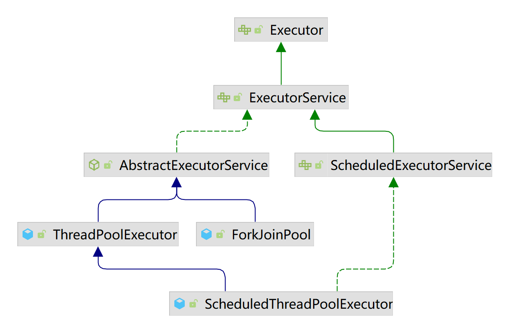
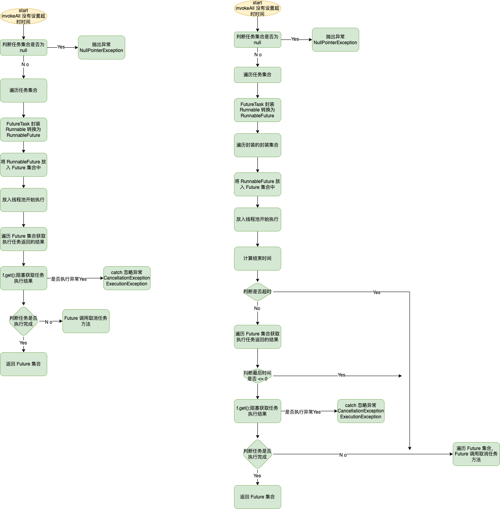
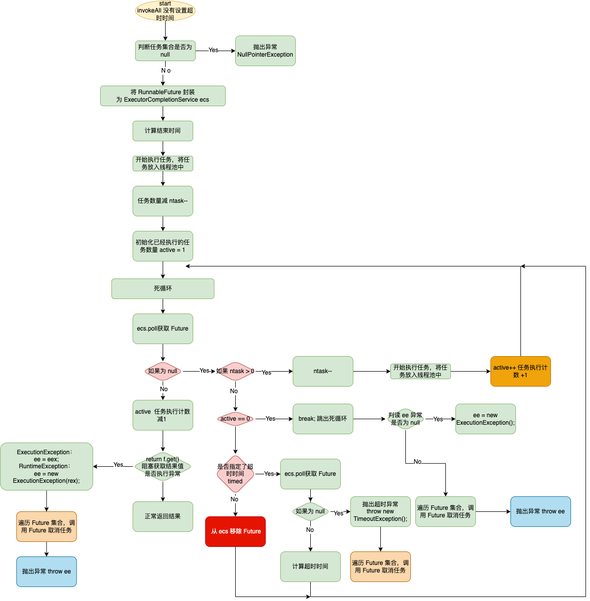
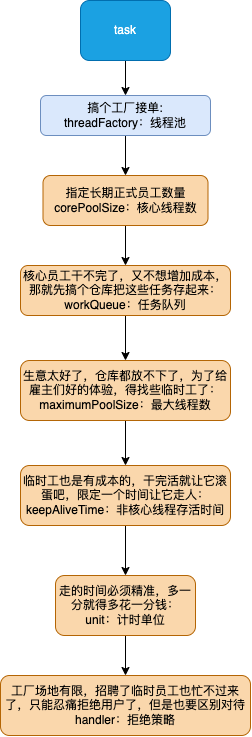

# 线程池
## 背景:
随着计算机行业的飞速发展，摩尔定律逐渐失效，多核CPU成为主流。使用多线程并行计算逐渐成为开发人员提升服务器性能的基本武器。J.U.C提供的线程池：
ThreadPoolExecutor类，帮助开发人员管理线程并方便地执行并行任务
## 线程池是什么:
线程池（Thread Pool）是一种基于池化思想管理线程的工具，经常出现在多线程服务器中，如MySQL。
## 作用:
线程过多会带来额外的开销，其中包括创建销毁线程的开销、调度线程的开销等等，同时也降低了计算机的整体性能。线程池维护多个线程，等待监督管理者分配可并
发执行的任务。这种做法，一方面避免了处理任务时创建销毁线程开销的代价，另一方面避免了线程数量膨胀导致的过分调度问题，保证了对内核的充分利用。
## 带来的好处
1. 降低资源消耗：通过池化技术重复利用已创建的线程，降低线程创建和销毁造成的损耗。 
2. 提高响应速度：任务到达时，无需等待线程创建即可立即执行。 
3. 提高线程的可管理性：线程是稀缺资源，如果无限制创建，不仅会消耗系统资源，还会因为线程的不合理分布导致资源调度失衡，降低系统的稳定性。使用线程池可以进行统一的分配、调优和监控。 
4. 提供更多更强大的功能：线程池具备可拓展性，允许开发人员向其中增加更多的功能。比如延时定时线程池ScheduledThreadPoolExecutor，就允许任务延期执行或定期执行。
## 解决的实际问题:
线程池解决的核心问题就是资源管理问题。在并发环境下，系统不能够确定在任意时刻中，有多少任务需要执行，有多少资源需要投入。这种不确定性将带来以下若干问题：

1. 频繁申请/销毁资源和调度资源，将带来额外的消耗，可能会非常巨大。
2. 对资源无限申请缺少抑制手段，易引发系统资源耗尽的风险。
3. 系统无法合理管理内部的资源分布，会降低系统的稳定性。
4. 为解决资源分配这个问题，线程池采用了“池化”（Pooling）思想。池化，顾名思义，是为了最大化收益并最小化风险，而将资源统一在一起管理的一种思想。

Pooling is the grouping together of resources (assets, equipment, personnel, effort, etc.) for the purposes of maximizing advantage or minimizing risk to the users. The term is used in finance, computing and equipment management.——wikipedia

“池化”思想不仅仅能应用在计算机领域，在金融、设备、人员管理、工作管理等领域也有相关的应用。

在计算机领域中的表现为：统一管理IT资源，包括服务器、存储、和网络资源等等。通过共享资源，使用户在低投入中获益。除去线程池，还有其他比较典型的几种使用策略包括：

1. 内存池(Memory Pooling)：预先申请内存，提升申请内存速度，减少内存碎片。
2. 连接池(Connection Pooling)：预先申请数据库连接，提升申请连接的速度，降低系统的开销。
3. 实例池(Object Pooling)：循环使用对象，减少资源在初始化和释放时的昂贵损耗。
在了解完“是什么”和“为什么”之后，下面我们来一起深入一下线程池的内部实现原理。

(以上内容来自: [Java线程池实现原理及其在美团业务中的实践](https://tech.meituan.com/2020/04/02/java-pooling-pratice-in-meituan.html))

# Executor 和 Service

首先来看下类图:

1. Executor: 线程池顶级接口;
2. ExecutorService: 线程池次级接口，对 Executor 做了一些扩展，增加一些功能;
3. ScheduledExecutorService: 对 ExecutorService 做了一些扩展，增加一些定时任务相关的功能;
4. AbstractExecutorService: 抽象类, 运用模板方法设计模式实现了一部分方法;
5. ThreadPoolExecutor: 普通线程池类, 包含最基本的一些线程池操作相关的方法实现;
6. ScheduledThreadPoolExecutor: 定时任务线程池类,用于实现定时任务相关功能;
7. ForkJoinPool: 新线程池类, java7中新增的线程池类, 基于工作窃取理论实现, 用于大任务拆小任务, 任务比较多的场景;
8. Executors: 线程池工具类, 定义了一些快速实现线程池的方法;

## Executor

线程池顶级接口, 定义一个无返回值任务的方法。源码定义如下:
```java
public interface Executor {

    /**
     * 执行无返回任务
     * 根据 Executor 的实现判断, 可能是在新线程、线程池、线程调用中执行
     * 抽象线程的会执行的动作
     */
    void execute(Runnable command);
}
```

## ExecutorService
线程池次级接口，对 Executor 做了一些扩展，增加一些功能; 介绍一些线程常用的操作即动作方法; 当我们将 ExecutorService 拆分为
Executor + Service 就能更好的理解这个接口类的定义: 为 Executor 线程池提供 Service 服务的类。
摘取部分服务方法介绍:
```java
public interface ExecutorService extends Executor {
    /**
     * 关闭线程池, 不会立即关闭, 等待线程池中的任务执行完成
     */
    void shutdown();

    /**
     * 立即关闭线程池
     */
    List<Runnable> shutdownNow();

    /**
     * 判断线程池是否关闭
     */
    boolean isShutdown();

    /**
     * 执行有返回值的任务, 通过 Future.get() 获取返回值
     */
    <T> Future<T> submit(Callable<T> task);

    /**
     * 在超时时间内返回任意一个已完成任务的执行结果, 未执行完成的任务将被取消
     */
    <T> T invokeAny(Collection<? extends Callable<T>> tasks,
                    long timeout, TimeUnit unit)
            throws InterruptedException, ExecutionException, TimeoutException;

    /**
     * 任意一个已完成任务的执行结果, 未执行完成的任务将被取消
     */
    <T> T invokeAny(Collection<? extends Callable<T>> tasks)
            throws InterruptedException, ExecutionException;

    /**
     * 在超时时间内返回所有给定任务的执行结果
     */
    <T> List<Future<T>> invokeAll(Collection<? extends Callable<T>> tasks,
                                  long timeout, TimeUnit unit)
            throws InterruptedException;

    /**
     * 返回给定任务集合的结果
     */
    <T> List<Future<T>> invokeAll(Collection<? extends Callable<T>> tasks)
            throws InterruptedException;
}
```

## AbstractExecutorService
抽象类, 运用模板方法设计模式实现了一部分方法; 拆分解释: Abstract + Executor + Service 定义为: 将线程池中的服务方法具体会做什么通用的操作
再次进行抽象剥离;
```java
public abstract class AbstractExecutorService implements ExecutorService {
    /**
     * @throws RejectedExecutionException {@inheritDoc}
     * @throws NullPointerException       {@inheritDoc}
     */
    public Future<?> submit(Runnable task) {
        if (task == null) throw new NullPointerException();
        // 将创建的任务封装到 RunnableFuture 类中, 可以看到这是一个无返回值的任务 void
        RunnableFuture<Void> ftask = newTaskFor(task, null);
        // 执行 task 任务
        execute(ftask);
        return ftask;
    }

    /**
     * @throws RejectedExecutionException {@inheritDoc}
     * @throws NullPointerException       {@inheritDoc}
     */
    public <T> Future<T> submit(Runnable task, T result) {
        // 有返回值的任务封装创建
        if (task == null) throw new NullPointerException();
        RunnableFuture<T> ftask = newTaskFor(task, result);
        // 执行 task 任务
        execute(ftask);
        return ftask;
    }
    
    
}
```
newTaskFor(task, result) 创建了一个 new FutureTask<T>(runnable, value)。FutureTask 继承了 RunnableFuture, RunnableFuture 继承了
Runnable, Future<V>, 这个接口整合了 Runnable 和 Future 动作。具体的实现在 FutureTask 中。
```java
public interface RunnableFuture<V> extends Runnable, Future<V> {
    /**
     * 作为 Runnable 的 Future。成功执行 run 方法可以完成 Future 并允许访问其结果。 
     * Sets this Future to the result of its computation
     * unless it has been cancelled.
     */
    void run();
}
```

这也就表明了 newTaskFor(task, result);  RunnableFuture 被具象成一个 FutureTask 对象。那么 FutureTask 必然是实现了 RunnableFuture
的接口类。该类定义如下:
```java
public class FutureTask<V> implements RunnableFuture<V> {
    
}
```

再回到最初的地方: AbstractExecutorService 类, 来看下其公共的逻辑方法:
```java
public abstract class AbstractExecutorService implements ExecutorService {
    // 没有超时时间
    public <T> List<Future<T>> invokeAll(Collection<? extends Callable<T>> tasks)
            throws InterruptedException {
        if (tasks == null)
            throw new NullPointerException();
        // 保存 Future 返回结果
        ArrayList<Future<T>> futures = new ArrayList<Future<T>>(tasks.size());
        boolean done = false;
        try {
            for (Callable<T> t : tasks) {
                // 封装 task 对象
                RunnableFuture<T> f = newTaskFor(t);
                // 将需要执行的 FutureTask 放入返回结果集合中
                futures.add(f);
                // 放入线程池中执行
                execute(f);
            }
            // 循环结果集合通过 FutureTask.get 获取结果
            for (int i = 0, size = futures.size(); i < size; i++) {
                Future<T> f = futures.get(i);
                if (!f.isDone()) {
                    try {
                        // 阻塞获取结果只
                        f.get();
                        // 忽略了取消执行异常
                    } catch (CancellationException ignore) {
                    } catch (ExecutionException ignore) {
                    }
                }
            }
            done = true;
            return futures;
        } finally {
            if (!done)
                // 取消执行
                for (int i = 0, size = futures.size(); i < size; i++)
                    futures.get(i).cancel(true);
        }
    }
    
    // 有设置超时时间
    public <T> List<Future<T>> invokeAll(Collection<? extends Callable<T>> tasks,
                                         long timeout, TimeUnit unit)
            throws InterruptedException {
        if (tasks == null)
            throw new NullPointerException();
        // 将超时时间转换为 纳秒
        long nanos = unit.toNanos(timeout);
        // 添加到返回结果集合中
        ArrayList<Future<T>> futures = new ArrayList<Future<T>>(tasks.size());
        boolean done = false;
        try {
            // 先将所有的 task 任务添加到集合中
            for (Callable<T> t : tasks)
                futures.add(newTaskFor(t));
            // 然后再计算结束时间，这样计算时间会比较精准
            final long deadline = System.nanoTime() + nanos;
            final int size = futures.size();

            // Interleave time checks and calls to execute in case
            // executor doesn't have any/much parallelism.
            for (int i = 0; i < size; i++) {
                // 开始放入线程池中执行
                execute((Runnable)futures.get(i));
                // 计算执行是否超时
                nanos = deadline - System.nanoTime();
                if (nanos <= 0L)
                    // 当超时立刻返回, 结束循环, 这就存在返回结果集中存在
                    // 没有执行完成的任务
                    return futures;
            }

            for (int i = 0; i < size; i++) {
                Future<T> f = futures.get(i);
                if (!f.isDone()) {
                    // 同样当获取结果超时会导致结果集中存在没有
                    // 获取到结果的 FutureTask
                    if (nanos <= 0L)
                        return futures;
                    try {
                        // 阻塞获取结果超时时间
                        f.get(nanos, TimeUnit.NANOSECONDS);
                    } catch (CancellationException ignore) {
                    } catch (ExecutionException ignore) {
                    } catch (TimeoutException toe) {
                        return futures;
                    }
                    nanos = deadline - System.nanoTime();
                }
            }
            done = true;
            return futures;
        } finally {
            if (!done)
                // 超时取消执行任务
                for (int i = 0, size = futures.size(); i < size; i++)
                    futures.get(i).cancel(true);
        }
    }
    
    // 返回任意一个结果, 就结束线程池中所有线程 无设置超时时间
    public <T> T invokeAny(Collection<? extends Callable<T>> tasks)
            throws InterruptedException, ExecutionException {
        try {
            return doInvokeAny(tasks, false, 0);
        } catch (TimeoutException cannotHappen) {
            assert false;
            return null;
        }
    }

    // 返回任意一个结果, 就结束线程池中所有线程 有设置超时时间
    public <T> T invokeAny(Collection<? extends Callable<T>> tasks,
                           long timeout, TimeUnit unit)
            throws InterruptedException, ExecutionException, TimeoutException {
        return doInvokeAny(tasks, true, unit.toNanos(timeout));
    }

    // 具体执行
    private <T> T doInvokeAny(Collection<? extends Callable<T>> tasks,
                              boolean timed, long nanos)
            throws InterruptedException, ExecutionException, TimeoutException {
        if (tasks == null)
            throw new NullPointerException();
        int ntasks = tasks.size();
        if (ntasks == 0)
            throw new IllegalArgumentException();
        ArrayList<Future<T>> futures = new ArrayList<Future<T>>(ntasks);
        ExecutorCompletionService<T> ecs =
                new ExecutorCompletionService<T>(this);

        try {
            // 将任务提交到了 ExecutorCompletionService 并执行
            // 将执行 Future 放入 Future 集合中
            futures.add(ecs.submit(it.next()));
            // 提交一个 task, 未执行的 task -1
            --ntasks;
            // 执行的线程 +1
            int active = 1;
            // 死循环
            for (;;) {
                // 获取结果, 什么时候将 任务放入到 ecs 中的呢？
                Future<T> f = ecs.poll();
                // 没有获取到
                if (f == null) {
                    if (ntasks > 0) {
                        // 减去一个未执行任务
                        --ntasks;
                        // 将下一个任务放入
                        futures.add(ecs.submit(it.next()));
                        // 执行任务 +1
                        ++active;
                    }
                    else if (active == 0)
                        break;
                    else if (timed) { // 判读是否设置了超时时间
                        // 在指定的时间内获取任务执行
                        f = ecs.poll(nanos, TimeUnit.NANOSECONDS);
                        // 未获取到 Future 抛出超时异常
                        if (f == null)
                            throw new TimeoutException();
                        // 计算剩余时间
                        nanos = deadline - System.nanoTime();
                    }
                    // 没有设置超时时间
                    else
                        f = ecs.take(); // 如果获取结果集成功，从 ece 中删除该任务
                }
                if (f != null) {
                    // 激活任务 -1
                    --active;
                    try {
                        // 返回该任务执行结果
                        return f.get();
                    } catch (ExecutionException eex) {
                        // 执行异常
                        ee = eex;
                    } catch (RuntimeException rex) {
                        // 运行异常
                        ee = new ExecutionException(rex);
                    }
                }
            }

            if (ee == null)
                ee = new ExecutionException();
            throw ee;

        } finally {
            // 将为执行的任务取消
            for (int i = 0, size = futures.size(); i < size; i++)
                futures.get(i).cancel(true);
        }
    }

}
```

### invokeAll 方法小结:
超时与不超时的方法导致流程一致, 区别是多了超时时间的判断。
1. 将 Runnable 封装为 FutureTask 对象；
2. 初始化 FutureTask 返回结果集;
3. 放入线程池中执行 execute();
4. 最后遍历结果集取消任务;
执行流程图如下:

### invokeAny
1. 将 AbstractExecutorService 封装为 ExecutorCompletionService；
2. 提交线程并执行，将执行返回的 Future 放入 Future 集合中；
3. 执行 for 死循环, 判断第一次是否成功执行并返回了 Future；如果有直接返回，最后将其他任务取消；反之再次从 ecs 获取 future，再次判断是否
成功执行；直到所有任务都执行完成仍然没有执行成功，然后将 Future 从 ecs 的队列汇中移除；最后遍历 Future 集合取消任务；反之通过返回的 future 获取结果值返回；
获取异常则抛出异常，最后遍历 Future 集合取消任务；
4. 如果是设置了获取结果的超时时间，那么在步骤 3 中，在限定的时间获取不到结果会抛出超时异常，最后遍历 Future 集合取消任务；反之通过返回的 future 获取结果值返回；
   获取异常则抛出异常，最后遍历 Future 集合取消任务；

流程图如下:


在代码中还有个疑惑：ecs.poll 获取的 Future 是什么时候添加的？创建该对象的时候是放入了一个 AbstractExecutorService; 没有传其他值，所以不会在
这里放入，那么大概率是在 submit 的时候。来看下源码:
```java
public interface BlockingQueue<E> extends Queue<E> {
    public Future<V> submit(Callable<V> task) {
        if (task == null) throw new NullPointerException();
        // newTaskFor 就是创建了一个 FutureTask 对象
        RunnableFuture<V> f = newTaskFor(task);
        // 所以应该是在 new QueueingFuture(f) 或者 execute 中 
        executor.execute(new QueueingFuture(f));
        return f;
    }
}
```
来看下: 创建 QueueingFuture 对象的时候做了些什么:
```java
public class ExecutorCompletionService<V> implements CompletionService<V> {
    /**
     * FutureTask extension to enqueue upon completion
     */
    private class QueueingFuture extends FutureTask<Void> {
        // 装饰者模式
        QueueingFuture(RunnableFuture<V> task) {
            super(task, null);
            this.task = task;
        }
        // 
        protected void done() {
            //  在这里将 FutureTask 添加到了队列中
            completionQueue.add(task);
        }

        private final Future<V> task;
    }
}
```
到这里就明白了 FutureTask 是什么时候加入 ecs 的队列中的。而且通过装饰模式，可以对 ecs 的作用做个总结：
回到原点:
```java
public interface BlockingQueue<E> extends Queue<E> {
    public Future<V> submit(Callable<V> task) {
        if (task == null) throw new NullPointerException();
        // newTaskFor 就是创建了一个 FutureTask 对象
        RunnableFuture<V> f = newTaskFor(task);
        // 所以应该是在 new QueueingFuture(f) 或者 execute 中 
        executor.execute(new QueueingFuture(f));
        return f;
    }
}
```
ecs 的作用就是代替线程池执行，包装 RunnableFuture 为 FutureTask； 并提供了一个阻塞队列, 供外部分服务方法获取执行结果

还有另外一个问题：invokeAny 当有两个任务同时进来: A、B。当 B 执行完程，此时 A 可以被取消吗?
来看下取笑任务的源码:
```java
public class FutureTask<V> implements RunnableFuture<V> {

    /**
     * The run state of this task, initially NEW.  The run state
     * transitions to a terminal state only in methods set,
     * setException, and cancel.  During completion, state may take on
     * transient values of COMPLETING (while outcome is being set) or
     * INTERRUPTING (only while interrupting the runner to satisfy a
     * cancel(true)). Transitions from these intermediate to final
     * states use cheaper ordered/lazy writes because values are unique
     * and cannot be further modified.
     *
     * Possible state transitions:
     * NEW -> COMPLETING -> NORMAL
     * NEW -> COMPLETING -> EXCEPTIONAL
     * NEW -> CANCELLED
     * NEW -> INTERRUPTING -> INTERRUPTED
     */
    private volatile int state;
    private static final int NEW          = 0;
    private static final int COMPLETING   = 1;
    private static final int NORMAL       = 2;
    private static final int EXCEPTIONAL  = 3;
    private static final int CANCELLED    = 4;
    private static final int INTERRUPTING = 5;
    private static final int INTERRUPTED  = 6;
    
    public boolean cancel(boolean mayInterruptIfRunning) {
        if (!(state == NEW &&
                UNSAFE.compareAndSwapInt(this, stateOffset, NEW,
                        mayInterruptIfRunning ? INTERRUPTING : CANCELLED)))
            return false;
        try {    // in case call to interrupt throws exception
            if (mayInterruptIfRunning) {
                try {
                    Thread t = runner;
                    if (t != null)
                        t.interrupt();
                } finally { // final state
                    UNSAFE.putOrderedInt(this, stateOffset, INTERRUPTED);
                }
            }
        } finally {
            finishCompletion();
        }
        return true;
    }

    /**
     * Future 计算完成后该方法由 run 方法调用
     */
    protected void set(V v) {
        if (UNSAFE.compareAndSwapInt(this, stateOffset, NEW, COMPLETING)) {
            outcome = v;
            UNSAFE.putOrderedInt(this, stateOffset, NORMAL); // final state
            finishCompletion();
        }
    }
}
```
可以看到 cancel 并不是真正的取消线程，而是调用了 t.interrupt(); 设置线程中断标志位。然后我们再来解答完成的线程是否能被取消：当线程处于初始
状态 new 的时候线程才不会被中断。那么就可以找一下在 Future 完成的时候，state 是被设置了一个什么值: 根据 set 源码我们可以直到 NEW 的状态已经被改变；
所以已经完成的任务不会被取消。

小结： 对 cancel() 时线程可能存在的状态：当创建了Future实例，任务可能有以下三种状态：
1. 等待状态。此时调用cancel()方法不管传入true还是false都会标记为取消，任务依然保存在任务队列中，但当轮到此任务运行时会直接跳过。 
2. 完成状态。此时cancel()不会起任何作用，因为任务已经完成了。 
3. 运行中。此时传入true会中断正在执行的任务，传入false则不会中断。

# ThreadPoolExecutor 线程池设计原理
如图：



线程池的设计流程与上图类似。结下来我们来看细节:

## 线程池中的拒绝策略

### AbortPolicy: 直接拒绝，一律平等；
```java
public class NamedThreadFactory implements ThreadFactory {

   private static final AtomicInteger poolNumber = new AtomicInteger(1);
   private final ThreadGroup group;
   private final AtomicInteger threadNumber = new AtomicInteger(1);
   private final String namePrefix;

   NamedThreadFactory(String namePrefix) {
      SecurityManager s = System.getSecurityManager();
      group = (s != null) ? s.getThreadGroup() :
              Thread.currentThread().getThreadGroup();
      this.namePrefix = "pool-" + namePrefix +
              poolNumber.getAndIncrement() +
              "-thread-";
   }

   public Thread newThread(Runnable r) {
      Thread t = new Thread(group, r,
              namePrefix + threadNumber.getAndIncrement(),
              0);
      if (t.isDaemon())
         t.setDaemon(false);
      if (t.getPriority() != Thread.NORM_PRIORITY)
         t.setPriority(Thread.NORM_PRIORITY);
      return t;
   }
}

public class ThreadPoolDemo {
    public static void main(String[] args) {
        Thread.currentThread().setName("MainThread");
        int cps = Runtime.getRuntime().availableProcessors();
        int mps = Runtime.getRuntime().availableProcessors() * 2 - 1;
        int c= 5;
        int size = mps + 5;
        ThreadPoolExecutor threadPoolExecutor = new ThreadPoolExecutor(cps, mps,
                600L, TimeUnit.SECONDS,
                new LinkedBlockingQueue<>(c),
                new NamedThreadFactory("threadPoolDemo"),
                new ThreadPoolExecutor.AbortPolicy());

        // 测试直接决绝策略
        for(int i=0; i<size; i++){
            threadPoolExecutor.execute(()->{
                try {
                    System.out.println("--------------------" + Thread.currentThread().getName());
                    Thread.sleep(1000000);
                } catch (InterruptedException e) {
                    // doNothing
                }
            });
        }

        ThreadPoolExecutor tpe = ((ThreadPoolExecutor) threadPoolExecutor);
        System.out.println("current queue wait count = " + tpe.getQueue().size());
        System.out.println("current active Thread count = " + tpe.getActiveCount());
        System.out.println("current completed Thread count = " + tpe.getCompletedTaskCount());
        System.out.println("current task Thread count = " + tpe.getTaskCount());

        threadPoolExecutor.execute(()->{
            System.out.println("add task");
        });

        System.out.println(Thread.currentThread().getName() + "---------- wait" );
    }
}
```

输出结果:
```text
--------------------pool-threadPoolDemo1-thread-1
--------------------pool-threadPoolDemo1-thread-3
--------------------pool-threadPoolDemo1-thread-2
--------------------pool-threadPoolDemo1-thread-5
--------------------pool-threadPoolDemo1-thread-4
--------------------pool-threadPoolDemo1-thread-6
--------------------pool-threadPoolDemo1-thread-7
--------------------pool-threadPoolDemo1-thread-8
--------------------pool-threadPoolDemo1-thread-9
//  省略
current queue wait count = 5
--------------------pool-threadPoolDemo1-thread-31
current active Thread count = 31
current completed Thread count = 0
current task Thread count = 36
Exception in thread "MainThread" java.util.concurrent.RejectedExecutionException: Task com.anzhi.threadpollprocess.ThreadPoolDemo$$Lambda$2/883049899@7cc355be rejected from java.util.concurrent.ThreadPoolExecutor@6e8cf4c6[Running, pool size = 31, active threads = 31, queued tasks = 5, completed tasks = 0]
	at java.util.concurrent.ThreadPoolExecutor$AbortPolicy.rejectedExecution(ThreadPoolExecutor.java:2063)
	at java.util.concurrent.ThreadPoolExecutor.reject(ThreadPoolExecutor.java:830)
	at java.util.concurrent.ThreadPoolExecutor.execute(ThreadPoolExecutor.java:1379)
	at com.anzhi.threadpollprocess.ThreadPoolDemo.main(ThreadPoolDemo.java:39)

```

可以看到当核心线程、任务队列、非核心线程都打满的时候，再提交任务 AbortPolicy 直接抛出异常。

### CallerRunsPolicy

CallerRunsPolicy: 那个线程拒绝了任务，那个线程负责执行。
```java
public class ThreadPoolCallerRunsPolicyDemo {

    private static boolean flag = true;

    public static void main(String[] args) {
        Thread.currentThread().setName("MainThread");
        int cps = Runtime.getRuntime().availableProcessors();
        int mps = Runtime.getRuntime().availableProcessors() * 2 - 1;
        int c= 5;
        int size = mps + 5;
        ThreadPoolExecutor abortPolicyThread = new ThreadPoolExecutor(cps, mps,
                600L, TimeUnit.SECONDS,
                new LinkedBlockingQueue<>(c),
                new NamedThreadFactory("threadPoolDemo"),
                new ThreadPoolExecutor.CallerRunsPolicy());

        // 测试直接决绝策略 AbortPolicy
        for(int i=0; i<size; i++){
            abortPolicyThread.execute(()->{
                try {
                    System.out.println("--------------------" + Thread.currentThread().getName());
                    Thread.sleep(100);
                } catch (InterruptedException e) {
                    // doNothing
                }
            });
        }

        // 测试 CallerRunsPolicy: 那个任务拒绝那个线程负责执行：类似于产品向开发提要求，开发没有资源，产品自己上手


        ThreadPoolExecutor tpe = ((ThreadPoolExecutor) abortPolicyThread);
        System.out.println("current queue wait count = " + tpe.getQueue().size());
        System.out.println("current active Thread count = " + tpe.getActiveCount());
        System.out.println("current completed Thread count = " + tpe.getCompletedTaskCount());
        System.out.println("current task Thread count = " + tpe.getTaskCount());

        abortPolicyThread.execute(()->{
            flag = false;
            System.out.println(Thread.currentThread().getName() + " start add task");
        });

        System.out.println(Thread.currentThread().getName() + "---------- wait" );

        // 每隔 10 秒查看一下线程池参数
        while(flag){
            System.out.println("current queue wait count = " + tpe.getQueue().size());
            System.out.println("current active Thread count = " + tpe.getActiveCount());
            System.out.println("current completed Thread count = " + tpe.getCompletedTaskCount());
            System.out.println("current task Thread count = " + tpe.getTaskCount());

            try {
                Thread.sleep(10000);
            } catch (InterruptedException e) {
                // doNothing
            }
        }

    }
}
```

执行结果:
```text
--------------------pool-threadPoolDemo1-thread-1
--------------------pool-threadPoolDemo1-thread-3
--------------------pool-threadPoolDemo1-thread-2
--------------------pool-threadPoolDemo1-thread-4
// 省略打印信息
--------------------pool-threadPoolDemo1-thread-30
current queue wait count = 5
--------------------pool-threadPoolDemo1-thread-31
current active Thread count = 31
current completed Thread count = 0
current task Thread count = 36
MainThread start add task
MainThread---------- wait
--------------------pool-threadPoolDemo1-thread-1
--------------------pool-threadPoolDemo1-thread-3
--------------------pool-threadPoolDemo1-thread-2
--------------------pool-threadPoolDemo1-thread-7
--------------------pool-threadPoolDemo1-thread-8
```

可以看到执行添加任务的是 主线线程 main, 并不是我们自己创建的线程池。而是依赖了上一级的工厂创建

### DiscardPolicy
DiscardPolicy：直接抛弃，没有任何输出，不建议使用。
### DiscardOldestPolicy
DiscardOldestPolicy: 将任务队列中等待时间最长的任务丢弃，将新的任务放入。就像来了大客户，优先高，得先做。
代码的区别就是修改一下拒绝策略。所以代码省略了。输出结果如下:
```text
/Users/anzhihong/Dev_AZH/Java_Env/jdk_env/jdk1.8.0_342/Contents/Home/bin/java -Dvisualvm.id=149957254947162 -javaagent:/Applications/IntelliJ IDEA.app/Contents/lib/idea_rt.jar=61765:/Applications/IntelliJ IDEA.app/Contents/bin -Dfile.encoding=UTF-8 -classpath /Users/anzhihong/Dev_AZH/Java_Env/jdk_env/jdk1.8.0_342/Contents/Home/jre/lib/charsets.jar:/Users/anzhihong/Dev_AZH/Java_Env/jdk_env/jdk1.8.0_342/Contents/Home/jre/lib/ext/cldrdata.jar:/Users/anzhihong/Dev_AZH/Java_Env/jdk_env/jdk1.8.0_342/Contents/Home/jre/lib/ext/dnsns.jar:/Users/anzhihong/Dev_AZH/Java_Env/jdk_env/jdk1.8.0_342/Contents/Home/jre/lib/ext/jaccess.jar:/Users/anzhihong/Dev_AZH/Java_Env/jdk_env/jdk1.8.0_342/Contents/Home/jre/lib/ext/jfxrt.jar:/Users/anzhihong/Dev_AZH/Java_Env/jdk_env/jdk1.8.0_342/Contents/Home/jre/lib/ext/localedata.jar:/Users/anzhihong/Dev_AZH/Java_Env/jdk_env/jdk1.8.0_342/Contents/Home/jre/lib/ext/nashorn.jar:/Users/anzhihong/Dev_AZH/Java_Env/jdk_env/jdk1.8.0_342/Contents/Home/jre/lib/ext/sunec.jar:/Users/anzhihong/Dev_AZH/Java_Env/jdk_env/jdk1.8.0_342/Contents/Home/jre/lib/ext/sunjce_provider.jar:/Users/anzhihong/Dev_AZH/Java_Env/jdk_env/jdk1.8.0_342/Contents/Home/jre/lib/ext/sunpkcs11.jar:/Users/anzhihong/Dev_AZH/Java_Env/jdk_env/jdk1.8.0_342/Contents/Home/jre/lib/ext/zipfs.jar:/Users/anzhihong/Dev_AZH/Java_Env/jdk_env/jdk1.8.0_342/Contents/Home/jre/lib/jce.jar:/Users/anzhihong/Dev_AZH/Java_Env/jdk_env/jdk1.8.0_342/Contents/Home/jre/lib/jfr.jar:/Users/anzhihong/Dev_AZH/Java_Env/jdk_env/jdk1.8.0_342/Contents/Home/jre/lib/jfxswt.jar:/Users/anzhihong/Dev_AZH/Java_Env/jdk_env/jdk1.8.0_342/Contents/Home/jre/lib/jsse.jar:/Users/anzhihong/Dev_AZH/Java_Env/jdk_env/jdk1.8.0_342/Contents/Home/jre/lib/management-agent.jar:/Users/anzhihong/Dev_AZH/Java_Env/jdk_env/jdk1.8.0_342/Contents/Home/jre/lib/resources.jar:/Users/anzhihong/Dev_AZH/Java_Env/jdk_env/jdk1.8.0_342/Contents/Home/jre/lib/rt.jar:/Users/anzhihong/Dev_AZH/Java_St/JUC/threadpool/target/classes:/Users/anzhihong/Dev_AZH/Java_Env/maven_env/.m2/repository/com/google/collections/google-collections/1.0/google-collections-1.0.jar com.anzhi.threadpollprocess.ThreadPoolPoolCallerRunsPolicyDemoDemo
--------------------pool-threadPoolDemo1-thread-1
--------------------pool-threadPoolDemo1-thread-4
--------------------pool-threadPoolDemo1-thread-3
// 省略输出信息
--------------------pool-threadPoolDemo1-thread-26
--------------------pool-threadPoolDemo1-thread-27
--------------------pool-threadPoolDemo1-thread-28
--------------------pool-threadPoolDemo1-thread-29
--------------------pool-threadPoolDemo1-thread-30
current queue wait count = 5
--------------------pool-threadPoolDemo1-thread-31
current active Thread count = 31
current completed Thread count = 0
current task Thread count = 36
MainThread---------- wait
current queue wait count = 5
current active Thread count = 31
current completed Thread count = 0
current task Thread count = 36
--------------------pool-threadPoolDemo1-thread-13
pool-threadPoolDemo1-thread-21 start add task
--------------------pool-threadPoolDemo1-thread-2
--------------------pool-threadPoolDemo1-thread-20
--------------------pool-threadPoolDemo1-thread-19

```
可以看到输出信息中线程池执行新添加的任务 pool-threadPoolDemo1-thread-21 start add task。

以上就是比较通用的拒绝策略

## ThreadPoolExecutor 线程池代码分析
逐步分析 ThreadPoolExecutor 如果工作。
## ThreadPool 的 5 种状态
1. RUNNING: 接收新任务和进程队列任务;
2. SHUTDOWN: 不接收新任务, 但是接收进程队列任务;(可以理解为工厂内部还在工作, 但是对外不接收订单了)
3. STOP: 不接收新任务也不接收进程队列任务, 并且打断正在进行中的任务;
4. TERMINATED:  terminated()任务执行完成
5. TIDYING: 所有任务终止, 待处理任务数量为 0; 线程转换为 TIDYING 将会执行 terminated 钩子函数

状态之见的转换:
1. RUNNING -> SHUTDOWN: 调用 shutdown() 方法;
2. RUNNING or SHUTDOWN -> STOP: 调用 shutdownNow()方法;
3. SHUTDOWN -> TIDYING: 队列和线程池为 null;
4. STOP -> TIDYING: 线程池为 null;
5. TIDYING -> TERMINATED: 钩子函数 terminated() 任务执行完成

## execute 方法-》线程启动执行
提交执行任务, 源码如下:
```java
public class ThreadPoolExecutor extends AbstractExecutorService {
   public void execute(Runnable command) {
      if (command == null)
         throw new NullPointerException();
      // 获取正在工作的线程数
      int c = ctl.get();
      // 判断工作线程数量是否小于核心线程数
      if (workerCountOf(c) < corePoolSize) {
          // addworker添加核心线程
         if (addWorker(command, true))
            return;
         c = ctl.get();
      }
      // 判断线程是否正在运行 且 是否可以将任务放入任务队列中
      if (isRunning(c) && workQueue.offer(command)) {
         // 类似单例的 dubble check，再次获取工作线程数
         int recheck = ctl.get();
         // 防止线程添加的时候，线程池关闭了，所以需要从队列移除这个任务，并拒绝
         if (!isRunning(recheck) && remove(command))
            reject(command);
         // 当核心线程资源也被释放，此时需要再次启动一个新的非核心线程执行任务
         // 但是实际工作中不会设置核心线程数超时释放资源
         else if (workerCountOf(recheck) == 0)
            addWorker(null, false);
      } else if (!addWorker(command, false))  // 如果启动非核心线程添加任务失败，表明线程池已打满，调用拒绝函数
         reject(command);
   }
}
```
根据 execute 源码的注释， execute 执行分为三个步骤:
1. 如果运行的线程少于 corePoolSize，尝试使用给定任务作为其启动一个个新线程；
2. 添加完任务之后再次获取执行线程数 ctl.get()，然后再次检查添加的线程是否已经 done 了或者线程池停止了, 是否需要回滚、或者启动一个新的线程；
3. 如果队列无法再存放任务, 执行拒绝策略；

### ctl
ctl原子变量包装了高3位的运行状态和低5位的线程个数，来看下它的定义:
```java
public class ThreadPoolExecutor extends AbstractExecutorService {
   private final AtomicInteger ctl = new AtomicInteger(ctlOf(RUNNING, 0));
   private static final int COUNT_BITS = Integer.SIZE - 3;
   private static final int CAPACITY = (1 << COUNT_BITS) - 1;

   // runState is stored in the high-order bits
   private static final int RUNNING = -1 << COUNT_BITS;
   private static final int SHUTDOWN = 0 << COUNT_BITS;
   private static final int STOP = 1 << COUNT_BITS;
   private static final int TIDYING = 2 << COUNT_BITS;
   private static final int TERMINATED = 3 << COUNT_BITS;
}
```
Integer 占位 32 个字节，所以 COUNT_BITS = 32-3 = 29, 所以可以推算出线程的各个状态值:
```text
// 计算机中存储的数据都是以补码的形式存在，所以 
-1 表示为: 
源码：              1000 0000 0000 0000 0000 0000 0000 0001 
反码(高位符号位不变): 1111 1111 1111 1111 1111 1111 1111 1110 
补码(反码+1):        1111 1111 1111 1111 1111 1111 1111 1111
// 注释中说明线程存储在高位
private static final int RUNNING = -1 << COUNT_BITS; = 111 高位的三个字节
private static final int SHUTDOWN = 0 << COUNT_BITS; = 000 
private static final int STOP = 1 << COUNT_BITS;     = 001
private static final int TIDYING = 2 << COUNT_BITS;  = 010
private static final int TERMINATED = 3 << COUNT_BITS; = 011
```
仔细观察会发现只有 RUNNING 的时候是负数, 那么后续判断线程状态只需判断 ctl<0 就可以判断线程是否正在运行。

### workCount
该方法计算了正在工作的线程数量。
### 核心函数 addWorker
在聊 addWorker 方法前先了解一下 CAS 的实现。(快照实现 CAS ToDo 实现 Demo)


addWorker 源码如下：jdk(1.8)
```java
public class ThreadPoolExecutor extends AbstractExecutorService {
   private boolean addWorker(Runnable firstTask, boolean core) {
      retry:
      // 判断线程状态，CAS 操作工作线程数 +1
      for (; ; ) {
         int c = ctl.get(); // 获取 ctl 值
         int rs = runStateOf(c);  // 线程 ctl 状态快照

         // Check if queue empty only if necessary.
         if (rs >= SHUTDOWN &&  // 线程池关闭
                 !(rs == SHUTDOWN && // 线程池的状态是否处于 SHUTDOWN
                         firstTask == null && // 是否没有新提交的任务
                         !workQueue.isEmpty()))  // 队列中任务是否为空即队列不为空才可以添加任务
            return false;

         // 判断线程状态，工作线程数加 1。
         for (; ; ) {
            int wc = workerCountOf(c); // 获取工作线程数
            if (wc >= CAPACITY ||  // 工作线程数是否大于最大容量
                    wc >= (core ? corePoolSize : maximumPoolSize))   // core 默认传的 false：或者工作线程数是否大于最大线程数
               return false;
            if (compareAndIncrementWorkerCount(c))  //工作线程计数加 1，成功跳出 retry 循环
               break retry; 
            c = ctl.get();  // Re-read ctl  // 否则重新读取工作线程数
            if (runStateOf(c) != rs)  // 状态不一致(防止线程池已经关闭)跳出第二层循环
               continue retry;
            // else CAS failed due to workerCount change; retry inner loop
         }
      }

   }
}
```
上述 addWorker 部分代码的循环完成了 判断线程状态，CAS 操作工作线程数 +1，接下来开始真正地创建线程
```java
public class ThreadPoolExecutor extends AbstractExecutorService {
   private boolean addWorker(Runnable firstTask, boolean core) {
      // CAS 修改 CTL 成功，开始创建线程
      boolean workerStarted = false;
      boolean workerAdded = false;
      Worker w = null;
      try { 
          // 创建线程 new Worker(firstTask)
         w = new Worker(firstTask);
         final Thread t = w.thread;
         if (t != null) {
             // 上锁，这里会有多线程操作
            final ReentrantLock mainLock = this.mainLock;
            mainLock.lock();
            try {
               // Recheck while holding lock.
               // Back out on ThreadFactory failure or if
               // shut down before lock acquired.
               int rs = runStateOf(ctl.get());

               if (rs < SHUTDOWN ||
                       (rs == SHUTDOWN && firstTask == null)) {
                  if (t.isAlive()) // precheck that t is startable
                     throw new IllegalThreadStateException();
                  workers.add(w);  // 将创建的线程添加到 workers 执行的集合中(HashSet() 中)
                  int s = workers.size();
                  if (s > largestPoolSize)
                     largestPoolSize = s;
                  workerAdded = true;  // 表示添加成功
               }
            } finally {
               mainLock.unlock();
            }
            if (workerAdded) {
               t.start();  // 启动线程 调用 runWorker() 方法
               workerStarted = true;  // 线程已经启动
            }
         }
      } finally {
         if (!workerStarted)
            addWorkerFailed(w); // 启动失败回滚计数，移除任务线程
      }
      return workerStarted;
   }
}
```
### new Worker(firstTask)
 
Worker 类实现了 Runnable 接口，继承了 AbstractQueuedSynchronizer 同步队列，实现 Runnable 接口证明这个类也可以当作线程类来使用。
```java
 private final class Worker
     extends AbstractQueuedSynchronizer
     implements Runnable {
   /**
    * This class will never be serialized, but we provide a
    * serialVersionUID to suppress a javac warning.
    */
   private static final long serialVersionUID = 6138294804551838833L;

   /** Thread this worker is running in.  Null if factory fails. */
   final Thread thread;
   /** Initial task to run.  Possibly null. */
   Runnable firstTask;
   /** Per-thread task counter */
   volatile long completedTasks;

   /**
    * Creates with given first task and thread from ThreadFactory.
    * @param firstTask the first task (null if none)
    */
   Worker(Runnable firstTask) {
      setState(-1); // inhibit interrupts until runWorker 防止在执行 runWorker 的时候被中断
      this.firstTask = firstTask; 
      this.thread = getThreadFactory().newThread(this);  // 获取当前工厂调用 newThread 方法创建线程
   }

   /** Delegates main run loop to outer runWorker  */
   public void run() {
      runWorker(this);
   }
}
```

### addWorkerFailed
线程添加失败，移除线程，线程池工作线程减 1，并尝试终止线程
```java
public class ThreadPoolExecutor extends AbstractExecutorService {
   private void addWorkerFailed(Worker w) {
      final ReentrantLock mainLock = this.mainLock;
      mainLock.lock();
      try {
         if (w != null)
            workers.remove(w);  // 移除线程
         decrementWorkerCount();  // 线程池工作线程减 1
         tryTerminate();  // 尝试终止线程
      } finally {
         mainLock.unlock();
      }
   }
}
```

### runWorker(Worker w)
前面提到过 Worker 类实现了 Runnable 接口，线程启动执行的逻辑是通过调用 run 方法。而在 Worker 的 run 方法中调用执行了
runWorker方法，真正开始执行线程逻辑的核心方法：
```java
public class ThreadPoolExecutor extends AbstractExecutorService {
   final void runWorker(Worker w) {
      Thread wt = Thread.currentThread();
      Runnable task = w.firstTask;
      w.firstTask = null;
      w.unlock(); // allow interrupts
      boolean completedAbruptly = true;
      try {
         while (task != null   // 第一个任务的时候 task 就是它本身，不需要从队列中获取
                 || (task = getTask()) != null) {  // 再次执行的时候就需要从队列中获取
            w.lock();
            // If pool is stopping, ensure thread is interrupted;
            // if not, ensure thread is not interrupted.  This
            // requires a recheck in second case to deal with
            // shutdownNow race while clearing interrupt
            if (
                    (
                            // 线程池是否已经停止，则为当前线程设置中断标识位
                            runStateAtLeast(ctl.get(), STOP) ||  
                             // 如果线程池没有停止，则判断当前线程是否已经被中断，如果没有则不设置当前线程中断位
                             // 如果线程已经被中断，则需要再次判断线程池是否已经停止，再次判断的原因是否防止在多线程环境下
                             // 清除中断标识位的时候，线程池一定是停止的，保证 Thread pool stop 然后才是线程中断
                             (Thread.interrupted() && runStateAtLeast(ctl.get(), STOP))
                    )
                    // 如果上述条件符合，这里和再次判断线程是否被中断共同保
                    // 证了线程关闭然后在设置线程中断的顺序
                    && !wt.isInterrupted()
                )
                // 如果 if 的条件满足，则设置当前线程的中断标识位
               wt.interrupt();  // 设置线程中断标志位
            try {
                // 钩子函数，父类留给子类的扩展
               beforeExecute(wt, task);
               Throwable thrown = null;
               try {
                   // 任务开始执行
                  task.run();
               } catch (RuntimeException x) {
                  thrown = x;
                  throw x;
               } catch (Error x) {
                  thrown = x;
                  throw x;
               } catch (Throwable x) {
                  thrown = x;
                  throw new Error(x);
               } finally {
                   // 任务执行异常后的处理，同样是 ThreadFactory 父类留给子类的扩展，
                  // 子类通过重写这个方法可以获取线程池中线程执行的异常
                  afterExecute(task, thrown);
               }
            } finally {
               task = null;
               // 将线程池执行完成的任务数加1
               w.completedTasks++;
               // 释放
               w.unlock();
            }
         }
         completedAbruptly = false;
      } finally {
          // 这里的 try{}finally{}没有捕捉的异常是 
         // 1. task = getTask(); 2. beforeExecute 3. afterExecute 
         // 这三个执行异常会导致中断异常
         processWorkerExit(w, completedAbruptly);
      }
   }
}
```
### 面试的考点
#### 线程池内捕获异常的方式
对于线程池的某一个线程异常并不会影响其他线程执行。那么怎么捕获线程池中的异常：
1. 直接使用 try{}catch{}将任务包起来，捕获异常。但是每来一个任务都要 try{}catch{}一下，代码上看起来并不是那么的……
2. 利用 UncaughtExceptionHandler 类，定义自己的线程池类，在创建线程的时候, 给线程设置 UncaughtExceptionHandler 实现 
uncaughtException 方法处理异常；
3. 通过重写 ThreadFactory 的 afterExecute 方法来获取异常；需要注意的是针对 submit 提交任务的方式，在 afterExecute 处理异常
的时候需要额外地处理；这是因为在 submit 中将异常进行了封装，runable对象被封装成了future ，里面的 try-catch 捕获了所有的异常， 
并设置到了outcome里面， 可以通过future.get获取到outcome

#### 导致线程池中线程中断异常的场景
1. task = getTask(); 执行异常;
2. beforeExecute();  执行异常; 用户导致异常
3. afterExecute(); 执行异常; 用户导致异常

上述执行异常会导致 completedAbruptly = false; 不会执行，最终 completedAbruptly = true 为 true。
后面两条是用户使用可能会导致中断异常。而 getTask 的异常则在自己的方法中捕获了。源码如下：
```java
public class ThreadPoolExecutor extends AbstractExecutorService {
   private Runnable getTask() {
      boolean timedOut = false; // Did the last poll() time out?

      for (; ; ) {
         int c = ctl.get();

         // Check if queue empty only if necessary.
         if (runStateAtLeast(c, SHUTDOWN)
                 && (runStateAtLeast(c, STOP) || workQueue.isEmpty())) {
            decrementWorkerCount();
            return null;
         }

         int wc = workerCountOf(c);

         // Are workers subject to culling?
         boolean timed = allowCoreThreadTimeOut || wc > corePoolSize;

         if ((wc > maximumPoolSize || (timed && timedOut))
                 && (wc > 1 || workQueue.isEmpty())) {
            if (compareAndDecrementWorkerCount(c))
               return null;
            continue;
         }

         try {
            Runnable r = timed ?
                    workQueue.poll(keepAliveTime, TimeUnit.NANOSECONDS) :
                    workQueue.take();
            if (r != null)
               return r;
            timedOut = true;
         } catch (InterruptedException retry) {
            timedOut = false;
         }
      }
   }
}
```
可以看到在 getTask 中已经将异常捕获，所以 getTask 并不会导致线程中断异常。

#### processWorkerExit(w, completedAbruptly); 执行方法
completedAbruptly 为 true 

````java
public class ThreadPoolExecutor extends AbstractExecutorService {
   private void processWorkerExit(Worker w, boolean completedAbruptly) {
       // 如果中断异常，则调用 decrementWorkerCount() 方法递减ctl的workerCount字段。 
       // 这仅在线程突然终止（参见 processWorkerExit）此时 completedAbruptly 为 true
      if (completedAbruptly) // If abrupt, then workerCount wasn't adjusted
          //  当用户线程执行异常 completedAbruptly = true 递减线程数
          decrementWorkerCount();

      final ReentrantLock mainLock = this.mainLock;
      mainLock.lock();
      try {
         completedTaskCount += w.completedTasks;
         // 将线程移除
         workers.remove(w);
      } finally {
         mainLock.unlock();
      }

      tryTerminate();

      // 获取线程状态
      int c = ctl.get();
      // 判断线程状态是否处于 RUNNING 或者 SHUTDOWN 状态
      if (runStateLessThan(c, STOP)) {
          // 如果线程不是被异常中断，那么线程池就重新添加一个非核心线程
         if (!completedAbruptly) {
             // 如果线程没有被异常中断：
             // 线程池中最小工作线程数赋值： allowCoreThreadTimeOut 标识位：判断是否设置了核心线程等待任务的超时时间
             // 如果 allowCoreThreadTimeOut=true，核心线程数为 0，false 则核心线程数等于线程池指定的核心线程数量
            int min = allowCoreThreadTimeOut ? 0 : corePoolSize;
            // 如果最小线程数为0 且任务队列不为 null
            if (min == 0 && !workQueue.isEmpty())
               // 将最小核心线程数设置为 1，设置为 1 的原因是如果最少保留的Worker数为0的话，那么就会判断当前的任务队列是否为空，
                // 如果任务队列不为空的话而且线程池没有停止，那么说明至少还需要1个线程继续将任务完成。
               min = 1;
            // 判断工作线程数是否大于线程池中最小线程数量，如果大于等于则不用再创建新的线程
            // 直接 return；反之则需要创建新的非核心线程
            if (workerCountOf(c) >= min)
               return; // replacement not needed
         }
         // 如果线程被中断异常，线程池就重新添加一个非核心线程
         addWorker(null, false);
      }
   }
}
````
根据上述代码的分析，我们可以 Get 到一个点，那就是线程池中，如果线程中断异常，线程池会创建一个新的非核心线程。

## shutdown() 方法 -》线程关闭
```java
public class ThreadPoolExecutor extends AbstractExecutorService {
   public void shutdown() {
      final ReentrantLock mainLock = this.mainLock;
      mainLock.lock();
      try {
          // 权限检测，调用方是否有权限操作线程。可以不用太多关注
         checkShutdownAccess();
         // 将线程状态设置为 SHUTDOWN: 不接受新任务，但是会执行队列中的任务
         advanceRunState(SHUTDOWN);
         // 中断空闲线程
         interruptIdleWorkers();
         onShutdown(); // hook for ScheduledThreadPoolExecutor
      } finally {
         mainLock.unlock();
      }
      tryTerminate();
   }


   // 改变线程状态，类似自旋锁的实现
   private void advanceRunState(int targetState) {
      // assert targetState == SHUTDOWN || targetState == STOP;
      // 死循环设置线程状态
      for (;;) {
         int c = ctl.get();
         if (runStateAtLeast(c, targetState) ||
                 // CAS 操作赋值
                 ctl.compareAndSet(c, ctlOf(targetState, workerCountOf(c))))
            break;
      }
   }

   // 中断空闲线程
   private void interruptIdleWorkers() {
      interruptIdleWorkers(false);
   }

   private void interruptIdleWorkers(boolean onlyOne) {
      final ReentrantLock mainLock = this.mainLock;
      mainLock.lock();
      try {
         for (Worker w : workers) {
            Thread t = w.thread;
            // 判断线程是否已经中断且当前线程是否正在执行任务
            // tryLock 在 runWorker 中线程开始就会 w.lock,执行完成后会释放锁 w.unlock
            if (!t.isInterrupted() && w.tryLock()) {
               try {
                   // 执行线程中断，线程中断后，在 runWorker 方法中在获取
                  // 任务的时候，会抛出中断异常
                  t.interrupt();
               } catch (SecurityException ignore) {
               } finally {
                  w.unlock();
               }
            }
            // 是否只对当前线程中断
            if (onlyOne)
               break;
         }
      } finally {
         mainLock.unlock();
      }
   }

   final void tryTerminate() {
      for (;;) {
          // 获取线程状态
         int c = ctl.get();
         // 判断线程状态是否在运行
         if (isRunning(c) ||
                 // 或者线程处于 TIDYING，所有任务已经处理完成，将要执行钩子函数
                 runStateAtLeast(c, TIDYING) ||
                 //或者线程处于 STOP 不接收任务，也不执行任务且工作队列不为空
                 (runStateLessThan(c, STOP) && ! workQueue.isEmpty()))
             // 直接返回
            return;
         // 如果线程活跃数量不为 0
         if (workerCountOf(c) != 0) { // Eligible to terminate
             // 那么只中断一个线程，然后返回
            interruptIdleWorkers(ONLY_ONE);
            return;
         }
         // 上面这一段逻辑主要保证只有一个线程去执行下面的线程状态转换即可

         final ReentrantLock mainLock = this.mainLock;
         mainLock.lock();
         try {
             // 如果线程处于 TIDYINGTIDYING
            if (ctl.compareAndSet(c, ctlOf(TIDYING, 0))) {
               try {
                   // 执行线程销毁
                  terminated();
               } finally {
                   // 将线程状态改为 TERMINATED 
                  ctl.set(ctlOf(TERMINATED, 0));
                  // 唤醒等待 termination 线程，线程池关闭
                  termination.signalAll();
               }
               return;
            }
         } finally {
            mainLock.unlock();
         }
         // else retry on failed CAS
      }
   }

   // 负责延时以及检测线程池状态
   public boolean awaitTermination(long timeout, TimeUnit unit)
           throws InterruptedException {
      long nanos = unit.toNanos(timeout);
      final ReentrantLock mainLock = this.mainLock;
      mainLock.lock();
      try {
          // 线程属否处于 TERMINATED，如果大于 TERMINATED 表明线程池已经关闭
         while (runStateLessThan(ctl.get(), TERMINATED)) {
             // 已经超时，返回 false 否则继续等待延时
            if (nanos <= 0L)
               return false;
            nanos = termination.awaitNanos(nanos);
         }
         return true;
      } finally {
         mainLock.unlock();
      }
   }
}
```

## shutdownNow() -》立刻关闭线程
```java
public class ThreadPoolExecutor extends AbstractExecutorService {
   public List<Runnable> shutdownNow() {
      List<Runnable> tasks;
      final ReentrantLock mainLock = this.mainLock;
      mainLock.lock();
      try {
         checkShutdownAccess();
         // 将线程状态设置为 STOP: 不接收新任务，也不执行队列中的任务
         advanceRunState(STOP);
         interruptWorkers();
         // 需要将队列中的任务取出
         tasks = drainQueue();
      } finally {
         mainLock.unlock();
      }
      tryTerminate();
      // 将取出的任务返回
      return tasks;
   }

   // 修改线程状态
   private void advanceRunState(int targetState) {
      // assert targetState == SHUTDOWN || targetState == STOP;
      for (;;) {
         int c = ctl.get();
         if (runStateAtLeast(c, targetState) ||
                 ctl.compareAndSet(c, ctlOf(targetState, workerCountOf(c))))
            break;
      }
   }

   // 中断所有线程
   private void interruptWorkers() {
      // assert mainLock.isHeldByCurrentThread();
      for (Worker w : workers)
         w.interruptIfStarted();
   }
   
}
```
# ScheduledThreadPoolExecutor 线程池
1. ScheduledThreadPoolExecutor 继承自 ThreadPoolExecutor 主要用来在给定的延迟之后运行任务或者定期执行任务。
2. 使用自定义任务类型 ScheduledFutureTask 即使不需要调度的任务也会被认为是延时为 0 的延时任务；
3. 使用自定义的队列 DelayedWorkQueue，DelayQueue 是无界队列，与 ThreadPoolExecutor 比较缺少容量的限制、 corePoolSize、maximumPoolSize
有效的简化了一些执行机制。

## 任务队列 DelayedWorkQueue
DelayedWorkQueue 基于堆的数据结构，ScheduledFutureTask 将索引记录在堆数组
```java
static class DelayedWorkQueue extends AbstractQueue<Runnable>
  implements BlockingQueue<Runnable> {
    // 初始化数组大小
   private static final int INITIAL_CAPACITY = 16;
   // 存储任务的数组
   private RunnableScheduledFuture<?>[] queue =
           new RunnableScheduledFuture<?>[INITIAL_CAPACITY];
   // 线程安全锁
   private final ReentrantLock lock = new ReentrantLock();
   // 元素数量
   private int size;
   // 领导线程
   private Thread leader;
   // 和 lock 对应的 Condition 用于线程的等待和唤醒
   private final Condition available = lock.newCondition();
  }
```
## 任务对象
```java
private class ScheduledFutureTask<V>
      extends FutureTask<V> implements RunnableScheduledFuture<V> {
   private final long sequenceNumber; // 任务序列号
   private volatile long time; // 任务执行的时间单位是毫秒
   private final long period; // 重复执行任务的周期 正数表示固定周期执行 负数表示固定延时执行 0 表示不是周期任务
   RunnableScheduledFuture<V> outerTask = this; // this 的包装任务，用于周期任务的提交
   int heapIndex; // 延时队列的索引号
      }
```
主要方法分析：
1. 任务对象大小比较-compareTo(Delayed other)
2. run()、取消任务-cancel()

## 方法的使用
任务延时执行：
```java
public class ScheduleExecutorDemo {
    public static void main(String[] args) {
        // 创建延时线程池
        ScheduledThreadPoolExecutor executor = new ScheduledThreadPoolExecutor(1);
        // 延时任务执行 延迟 1s
        executor.schedule(new Runnable() {
            @Override
            public void run() {
                System.out.printf("<h1>Thread-A更新成功</h1><h1>耗时: %sm", System.currentTimeMillis()/1000);
                System.out.println();
            }
        }, 1, TimeUnit.SECONDS);
        // 按照周期执行, 不延时，
        executor.scheduleAtFixedRate(new Runnable() {
            @Override
            public void run() {
                try {
                    Thread.sleep(3000);
                } catch (InterruptedException e) {
                    // doNothing
                }
                System.out.printf("<h1>Thread-B更新成功</h1><h1>耗时: %sm", System.currentTimeMillis()/1000);
                System.out.println();
            }
        }, 0, 2, TimeUnit.SECONDS);

        // 按照周期执行，延时, 从延时之后的时间开始算起
        executor.scheduleAtFixedRate(new Runnable() {
            @Override
            public void run() {
                try {
                    Thread.sleep(3000);
                } catch (InterruptedException e) {
                    // doNothing
                }
                System.out.printf("<h1>Thread-C更新成功</h1><h1>耗时: %sm", System.currentTimeMillis()/1000);
                System.out.println();
            }
        }, 2, 2, TimeUnit.SECONDS);
    }
}
```

### 构造函数
```java
public class ScheduledThreadPoolExecutor
        extends ThreadPoolExecutor
        implements ScheduledExecutorService {
    
   public ScheduledThreadPoolExecutor(int corePoolSize) {
       // 调用父类的 ThreadPoolExecutor 的构造方法，除了需要用户指定
      // 核心线程数，其他参数都默认使用 ScheduledThreadPoolExecutor 类的默认参数
      // 线程存活时间在 JDK8 中是 0
      // 非核心线程是 Integer.MAX_VALUE 需要注意这些参数生效的前提是
      // DelayedWorkQueue 是一个有界队列
      super(corePoolSize, Integer.MAX_VALUE,
              DEFAULT_KEEPALIVE_MILLIS, MILLISECONDS,
              new DelayedWorkQueue());
   }

   // 该队列是一个内置类，通过查找，并没有发现它的构造函数，所以可以认为它是一个无界队列
   // 所以上述生效的参数只有一个 核心线程数
   static class DelayedWorkQueue extends AbstractQueue<Runnable>
           implements BlockingQueue<Runnable> {
       
   }
}
```
### executor.schedule
```java
public class ScheduledThreadPoolExecutor
        extends ThreadPoolExecutor
        implements ScheduledExecutorService {
   public ScheduledFuture<?> schedule(Runnable command,
                                      long delay,
                                      TimeUnit unit) {
      if (command == null || unit == null)
         throw new NullPointerException();
      // RunnableScheduledFuture 接口继承了 RunnableFuture、以及 ScheduledFuture
      // 接口的设计遵循单一原则，如果想要整合多个接口的功能，就可以采取继承的方式
      // 该接口继承了 getDelay 方法，扩展了一个 isPeriodic(); 是否是周期性的方法
      // decorateTask 钩子函数，返回当前任务。可以自行扩展
      RunnableScheduledFuture<Void> t = decorateTask(command,
              new ScheduledFutureTask<Void>(command, null,
                      triggerTime(delay, unit),
                      sequencer.getAndIncrement()));
      // 开始执行
      delayedExecute(t);
      return t;
   }

   // 非周期期性的线程池
   ScheduledFutureTask(Runnable r, V result, long triggerTime,
                       long sequenceNumber) {
       // 调用父类初始化 FutureTask
      super(r, result);
      this.time = triggerTime;
      this.period = 0;
      this.sequenceNumber = sequenceNumber;
   }

   // 周期性的线程池
   ScheduledFutureTask(Runnable r, V result, long triggerTime,
                       long period, long sequenceNumber) {
      super(r, result);
      this.time = triggerTime;
      this.period = period;
      this.sequenceNumber = sequenceNumber;
   }

   // 开始执行线程
   private void delayedExecute(RunnableScheduledFuture<?> task) {
       // 判断线程是否关闭
      if (isShutdown())
          // 关闭则拒绝任务
         reject(task);
      else {
          // 调用父类向队列中添加任务
         super.getQueue().add(task);
         // 判断当前线程是否可以运行并且该任务是否移除成功
         if (!canRunInCurrentRunState(task) && remove(task))
             // 任务取消
            task.cancel(false);
         else
             // 否则判断一下是否可以立即执行线程
            // 可以看到执行的是父类  ThreadPoolExecutor 的方法
            ensurePrestart();
      }
   }
   
   // 最终执行调用 run 方法
   public void run() {
       // 还是判断运行状态
      if (!canRunInCurrentRunState(this))
         cancel(false);
      // 是否是周期性运行
      else if (!isPeriodic())
          // 调用父类执行，从 DelayQueue 中获取任务
         super.run();
      // 重置当前线程实体，并计算下次线程运行时间
      else if (super.runAndReset()) {
          // 计算下次运行时间
         setNextRunTime();
         // 周期性任务：再次执行
         reExecutePeriodic(outerTask);
      }
   }

   // 从队列中获取 task
   public RunnableScheduledFuture<?> take() throws InterruptedException {
       // 创建锁 ReentrantLock 对象
      final ReentrantLock lock = this.lock;
      // 可响应中断的加锁等待
      lock.lockInterruptibly();
      try {
         for (;;) {
             // 获取第一个任务，前面说到过，队列是小顶堆存放
            RunnableScheduledFuture<?> first = queue[0];
            if (first == null)
               available.await();
            else {
               long delay = first.getDelay(NANOSECONDS);
               // 表示执行超时
               if (delay <= 0L)
                   // 将第一个任务取出
                  return finishPoll(first);
               first = null; // don't retain ref while waiting
               // 为什么定义一个 leader，避免线程不必要的唤醒。
               // 当有多个线程同时进来，将多余的代码去掉，只留下 available.awaitNanos(delay);
               // 每次唤醒的时候都会将所有线程唤醒，但是执行任务的线程只有一个。所以设置leader避免无意义的唤醒线程
               if (leader != null)
                  available.await();
               else {
                  Thread thisThread = Thread.currentThread();
                  leader = thisThread;
                  try {
                     available.awaitNanos(delay);
                  } finally {
                     if (leader == thisThread)
                        leader = null;
                  }
               }
            }
         }
      } finally {
          // 保证 leader 线程执行完成之后，且队列中还有任务的话，唤醒一个线程执行任务
         // 没有这段代码的话，这段代码就是死循环了。
         // 当队列中没有任务的时候，最后一个阻塞的线程是在队列存放任务的时候进行唤醒
         // 比如有队列中有 3 个任务，此时有 4 个线程，当队列中的的任务执行完成的时候，还剩一个线程被阻塞
         // 这个线程最终会在存放队列任务的时候被唤醒
         if (leader == null && queue[0] != null)
            available.signal();
         lock.unlock();
      }
   }

}

public class ThreadPoolExecutor extends AbstractExecutorService {
   void ensurePrestart() {
       // 获取线程数量
      int wc = workerCountOf(ctl.get());
      // 如果当前线程数小于核心线程数
      if (wc < corePoolSize)
          // 将任务添加到队列中
         addWorker(null, true);
      // 如果核心线程数为 0，则需要创建非核心线程
      else if (wc == 0)
         addWorker(null, false);
   }
}
```

# ForkJoinPool