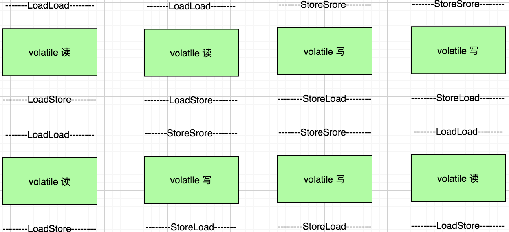
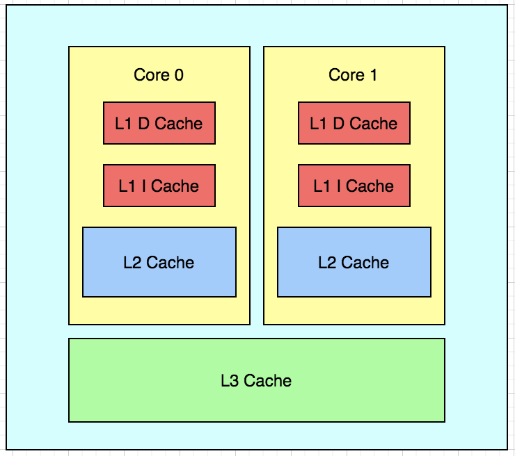
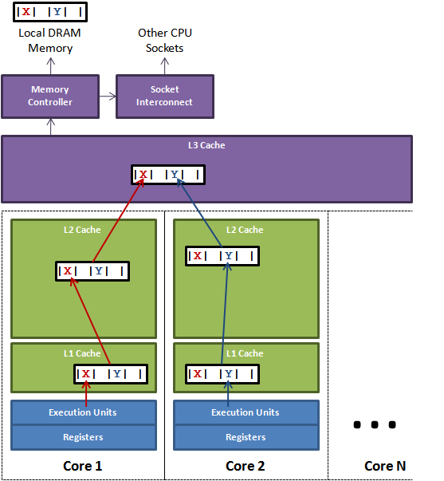

# Volatile 关键字

在多线程的领域中， volatile 关键字也是非常重要的。Volatile 在使用上具有以下特性

## 1.可见性：

B 线程能马上看到 A 线程更改的数据

先来看一个死循环的例子

创建 VolatileVisibilityDemo 类

```java
@Data
public class VolatileVisibilityDemo implements Runnable{
    private /*volatile*/ boolean isContinuePrintPrint = true;

    public void printStringMethodMethod(){
        try{
            while (Boolean.TRUE.equals(isContinuePrintPrint)) {
            }
            System.out.println("printStringMethodMethod stop");
        }catch (Exception e){
            // doNothing
        }
    }

    public void run() {
        printStringMethodMethod();
    }
}
```

创建测试类

```java
public class VolatileVisibilityDemoTest {
    public static void main(String[] args) {
        VolatileVisibilityDemo volatileVisibilityDemo = new VolatileVisibilityDemo();
        Thread thread = new Thread(volatileVisibilityDemo);

        thread.start();

        try {
            Thread.sleep(5000);
        } catch (InterruptedException e) {
            // doNothing
        }
        System.out.println("stop volatileVisibilityDemo method");
        volatileVisibilityDemo.setContinuePrintPrint(false);
    }
}
```

在程序运行一段时间后, 将循环条件 isContinuePrintPrint 置为 false, 终止循环。运行程序看下结果:

```text
start run printStringMethodMethod isContinuePrintPrint = true
stop volatileVisibilityDemo method
……

```

可以看到线程并没有结束, 一直在等待。 这是因为线程之间变量的不可见性。举个例子, 如图


每个线程都会各自开辟自己的工作空间并且会从主内从中拷贝一份共享变量到自己的工作内存中

假设此时这个系统刚好有两个线程同时运行：A、B, 这两个线程都会将从主内存中复制一份共享变量到自己的工作内存中, 共享变量的修改对于其他线程来说并不可见, 因此
线程没有被终止。

在《深入理解 Java 虚拟机》 一书中对于主内存与工作内存有这样的一段描述:

Java 内存模型规定了所有变量都存储在主内存中。每条线程具有自己的工作内存, 工作内存中保存了被该线程使用的变量的主内存副本, 线程对变量的所有操作都必须在
工作内存中进行, 而不能直接读写主存中的数据。同时不同线程之间也无法直接访问对方工作内存中的变量。

这也就导致了上述示例线程无法停止的原因。

当我们使用 volatile 修饰 isContinuePrintPrint 变量, 此时再次运行程序观察结果

```text
start run printStringMethodMethod isContinuePrintPrint = true
stop volatileVisibilityDemo method
printStringMethodMethod stop isContinuePrintPrint = false
```

可以看到线程结束了。使用 volatile关键字, 可以强制线程每次修改变量后要刷新到主存，线程每次都要从主内存中读取变量的值。

关于 volatile 变量的可见性需要注意：既然 volatile 变量对所有线程都是可见的，那么是不是基于 volatile 变量的运算在并发下线程是安全的。这句话的
前半部分是并没有错, 但是基于前半部分得出的结论是有问题。因为在 Java 中的运算操作符并非都是原子操作。下面验证一下 volatile 是否能保证 java 中
操作符的原子性

## 2.不保证原子性

即一个操作或者多个操作 要么全部执行并且执行的过程不会被任何因素打断，要么就都不执行。

```java
public class AtomicityDemo {
    public static volatile int race = 0;

    private static final int THREADS_COUNT = 20;

    public static void increase(){
        race++;
    }

    public static void main(String[] args) throws InterruptedException {
        Thread[] threads = new Thread[THREADS_COUNT];

        for(int i=0; i<THREADS_COUNT; i++){
            threads[i] = new Thread(new Runnable() {
                public void run() {
                    for (int i=0; i<1000; i++){
                        increase();
                    }
                }
            });
            threads[i].start();
        }

        // 等待所有累加线程都结束
        // idea 会自动创建一条名为 Monitor Ctrl-Break 的线程
        while (Thread.activeCount() > 2){
            Thread.yield();
        }


        System.out.println("race 的值为: " + race);
    }
}

```

运行结果：

```text
race 的值为: 19320
```

启动 20 个线程, 每个线程都对 race 变量进行 1000 次自增操作, 但是最终结果都是小于 20000。问题就在于 race++; 在启动参数中添加 
-XX:+UnlockDiagnosticVMOptions -XX:+PrintAssembly, 运行程序可以看到, race++ 并不是一个原子操作

```text
……
# 静态变量 race 的地址为 0x68, 将 race 的值赋值给 edi 寄存器
0x0000000111ac3e62: mov    0x68(%rsi),%edi    ;*getstatic race
                                            ; - com.anzhi.atomicity.AtomicityDemo::increase@0 (line 9)
# 将 edi 寄存器中的值加1
0x0000000111ac3e65: inc    %edi
# 再将 edi 值赋值给 race
0x0000000111ac3e67: mov    %edi,0x68(%rsi)
#带lock前缀的加指令，把rsp所指向的地址中值加0，这个指令没啥用，主要使用lock前缀做内存屏障的
#防止lock之后的指令在lock之前执行，这里没使用mfence指令，主要是mfence在某些情况下比lock效率慢
0x0000000111ac3e6a: lock addl $0x0,(%rsp)     ;*putstatic race
……

```
经过 4 条指令后, race 才完成了自加操作。 多线程下, 在执行 `lock addl $0x0,(%rsp)` 之前, race 的值可能已经被改变了, 
最终导致 race 的值小于 20000。要保证原子性, 最终还是需要加锁。

这里解释一下 lock 的作用: 

1. 在 lock 锁定的时候，如果操作某个数据，那么其他 CPU 核是不能同时操作的，即锁定了
2. lock 锁定的指令，不能上下文随意排序执行，必须按照程序上下顺序执行
3. 在 lock 锁定操作完毕之后，如果某个数据被修改了，那么需要立即告诉其他 CPU 这个值被修改了，使它们的缓存数据立即失效，需要重新到内存获取

### 解决 volatile 不保证原子性

1. 使用 synchronized 修饰方法(不要杀鸡用牛刀)

2. 使用 JDK 提供的 AtomicInteger

```java
public class AtomicityDemo {
    public static volatile int race = 0;

    private static final int THREADS_COUNT = 20;

    private static AtomicInteger atomicInteger = new AtomicInteger();


    public static void increase(){
        atomicInteger.getAndIncrement();
        race++;
    }

    public static void main(String[] args) throws InterruptedException {
        Thread[] threads = new Thread[THREADS_COUNT];

        for(int i=0; i<THREADS_COUNT; i++){
            threads[i] = new Thread(new Runnable() {
                public void run() {
                    for (int i=0; i<1000; i++){
                        increase();
                    }
                }
            });
            threads[i].start();
        }

        // 等待所有累加线程都结束
        // idea 会自动创建一条名为 Monitor Ctrl-Break 的线程
        while (Thread.activeCount() > 2){
            Thread.yield();
        }


        System.out.println("race 的值为: " + race + " atomicInteger= " + atomicInteger.get());
    }
}
```

输出结果为:

```text
race 的值为: 19484 atomicInteger= 20000
```

看下 JVM 代码汇编的结果:

```text

```

## 3.禁止指令重排序(有序性)

为什么会有指令重排:

就像多线程一样, CPU 运行效率相比于缓存、内存、硬盘 IO 之间效率有着指数级的差别。为了提高 CPU 的利用率, 提高计算机系统的性能, 才有了指令重排序的优化
思想。就像平时利用烧水的时间去洗菜, 利用洗衣服的时间去拖地一样。

### 三种重排序的场景

1.编译器重排序: 针对程序代码语而言，编译器可以在不改变单线程程序语义的情况下，可以对代码语句顺序进行调整重新排序。

2.指令集并行的重排序: 这个是针对于CPU指令级别来说的，处理器采用了指令集并行技术来讲多条指令重叠执行，如果不存在数据依赖性，处理器可以改变主句对应的
   机器指令执行顺序。
   
3.内存重排序: 因为CPU缓存使用 缓冲区的方式(Store Buffere )进行延迟写入，这个过程会造成多个CPU缓存可见性的问题，这种可见性的问题导致结果的对于
   指令的先后执行显示不一致，从表面结果上来看好像指令的顺序被改变了，内存重排序其实是造成可见性问题的主要原因所在。参考 CSDN 作者 givemefive_001
   指令重排一文中的例子:

3.1 Memory Bank 的划分:
一般 Memory bank 是按 cache address 来划分的。比如 偶数 adress 0×12345000 分到 bank 0, 奇数 address 0×12345100 分到 bank1

3.2 重排序分析：
理想的内存访问指令顺序：

CPU0 往 cache address 0×12345000 写入一个数字 1 。因为address 0×12345000 是偶数，所以值被写入 bank0.
CPU1 读取 bank0 address 0×12345000 的值，即数字1 。

CPU0 往 cache 地址 0×12345100 写入一个数字 2 。因为address 0×12345100 是奇数，所以值被写入 bank1.

CPU1 读取 bank1 address 0×12345100 的值，即数字2 。

重排序后的内存访问指令顺序：

CPU0 准备往 bank0 address 0×12345000 写入数字 1 。

CPU0 检查 bank0 的可用性。发现 bank0 处于 busy 状态。

CPU0 为了防止 cache 等待，发挥最大效能，将内存访问指令重排序。即先执行后面的 bank1 address 0×12345100 数字2 的写入请求。

CPU0 检查 bank1 可用性，发现bank1 处于 idle 状态。

CPU0 将数字2 写入 bank 1 address 0×12345100 。

CPU1 来读取 0×12345000 ，未读到 数字1 ，出错。

CPU0 继续检查 bank0 的可用性，发现这次 bank0 可用了，然后将数字1 写入 0×12345000 。

CPU1 读取 0×12345100 ，读到数字2 ，正确。

从上述触发步骤中，可以看到第 3 步发生了指令重排序，并导致第 6 步读到错误的数据。

通过对指令重排，CPU 可以获得更快地响应速度， 但也给编写并发程序的程序员带来了诸多挑战。

###volatile 的有序是通过 JVM 提供的四种基本的内存屏障保证。

1. LoadLoad 作用于：Load1；LoadLoad：Load2，确保 Load1 一定是在 Load2 以及其后的指令之前完成，在指令执行的时候，Load1 绝对不会到 Load2 之后执行；

2. StoreStore 作用于：Store1；StoreStore：Store2，确保 Store1 一定是在 Store2 以及其后的指令之前完成（同时，Store1 的写入数据会立即被其他 CPU 
看到，也就是可见性），在指令执行的时候，Store1 绝对不会到 Store2 之后执行；

3. LoadStore 作用于：Load1；LoadStore：Store2，确保 Load1 一定是在 Store2 以及其后的指令之前完成，并且 Load1 绝对不会到 Store2 之后执行；

4. StoreLoad 作用于：Store1；StoreLoad：Load2，确保 Store1 一定在 Load2 以及其后的指令之前完成，并且 Store1 绝对不会到 Load2 之后执行；

从以上的四种内存屏障说明中我们可以看到，volatile 的「有序性」会得到保证，并且 Store 指令也会保证「可见性」。

参考 《Createchance 的博客: 一次深入骨髓的 volatile 研究》:

在 JVM 内部实现 volatile 访问的时候都需要如下格式:


如上两个图描述 volatile 字段在读和写的时候需要的内存屏障操作，我们首先来看读操作，在读操作之前的 LoadLoad 屏障要求这个读操作之前的所有读
操作不能在这个读操作之后完成，必须按照上下顺序执行，读操作之后的 LoadStore 要求这个读操作不能在之后的写操作之后完成，必须在之前完成。同样的，
写操作前后的屏障也是定义了类似的有序性要求。对于上下文读写操作来说，无非就是如下几种组合：



### 指令重排的验证

验证 demo 如下: 

```java
public class MemoryReorderingDemo {
    private static  int x = 0, y = 0;
    private static  int a = 0, b =0;

    public static void main(String[] args) throws InterruptedException {
        int i = 0;
        for(;;) {
            i++;
            x = 0;
            y = 0;
            a = 0;
            b = 0;
            Thread one = new Thread(new Runnable() {
                public void run() {
                    //由于线程one先启动，下面这句话让它等一等线程two. 读着可根据自己电脑的实际性能适当调整等待时间.
                    shortWait(100000);
                    a = 1;
                    x = b;
                }
            });

            Thread other = new Thread(new Runnable() {
                public void run() {
                    b = 1;
                    y = a;
                }
            });
            one.start();
            other.start();

            one.join();
            other.join();

            String result = "第" + i + "次 (" + x + "," + y + "）";
            if(x == 0 && y == 0) {  // 当两个线程中的 a = 1;x = b; 以及 b = 1; y = a; 指令换位置的时候, 就会出现 x=y=0的情况
                System.err.println("当两个线程中的 a = 1;x = b; 以及 b = 1; y = a; 指令换位置的时候, 就会出现 x=y=0的情况" + result);
                break;
            } else {
                //System.out.println(result);
            }
        }
    }


    public static void shortWait(long interval){
        long start = System.nanoTime();
        long end;
        do{
            end = System.nanoTime();
        }while(start + interval >= end);
    }
}
```

如果没有指令重排序的话, x、y 的值永远不会等于 0, 这个程序会一直循环不会结束。 运行看下结果: 

```text
当两个线程中的 a = 1;x = b; 以及 b = 1; y = a; 指令换位置的时候, 就会出现 x=y=0的情况第2249次 (0,0）
```

当用 volatile 修饰变量的时候, 在运行 demo 观察结果：

```java
public class MemoryReorderingDemo {
   private static volatile int x = 0, y = 0;
   private static volatile int a = 0, b = 0;
}
```

观察运行结果, 发现程序一直在执行, 没有出现终止的情况。

## volatile 性能如何

前面分析过 volatile 修饰的字段是通过内存屏障实现有序, 通过 lock 指令保证可见。保证有序和可见的同时, 变量字段的读写性能
却会受到影响。demo 如下:

```java
public class ReadWriteVolatilePrefDemo {

    private volatile int volatileValue = 0;
    private int plainValue = 0;

    public void ReadWriteVolatilePrefMethod() {
        long start = System.nanoTime();
        for (int i = 0; i < 1000000000; i++) {
            volatileValue = i;
        }
        long end = System.nanoTime();
        System.out.println("Volatile write duration: " + (end - start) / 100_0000);
        start = System.nanoTime();
        for (int i = 0; i < 1000000000; i++) {
            int dump = volatileValue;
        }
        end = System.nanoTime();
        System.out.println("Volatile read duration: " + (end - start) / 100_0000);
        start = System.nanoTime();
        for (int i = 0; i < 1000000000; i++) {
            plainValue = i;
        }
        end = System.nanoTime();
        System.out.println("Plain write duration: " + (end - start) / 100_0000);
        start = System.nanoTime();
        for (int i = 0; i < 1000000000; i++) {
            int dump = plainValue;
        }
        end = System.nanoTime();
        System.out.println("Plain read duration: " + (end - start) / 100_0000);
    }
}

public class ReadWriteVolatilePrefDemoTest {
   public static void main(String[] args) {
      ReadWriteVolatilePrefDemo volatilePrefDemo = new ReadWriteVolatilePrefDemo();
      volatilePrefDemo.ReadWriteVolatilePrefMethod();
   }
}
```

运行结果如下:

```text
Volatile write duration: 1931
Volatile read duration: 73
Plain write duration: 106
Plain read duration: 6
```

根据结果我们可以看出使用 volatile 修饰的字段读写耗时要明显长于不使用 volatile 修饰的字段。volatile 的写耗时最长的原因是因为 volatile
写入会通知各层级的 cache 都失效(防止读的时候从各自的缓存中读取), 然后将修改的值更新的主存中。那么 Java 中的 volatile 性能可以优化吗？

### CPU封装架构

现代 CPU 多核架构如下: 



随着 CPU 的运行速度不断提升, CPU 和内存之间的工作频率差距越来越大, 最终导致内存并不能直接和CPU一起工作。因此设计了中间缓存来平衡 CPU 与内存的
工作频率。 CPU 每次访问数据的时候, 不仅仅只摘取想要的数据, 而是把数据周围前后的某一 “块” 数据都读取出来, 这样下次就可以快速访问这个数据的附近的
数据了, 这种方式被称为: 程序的局部性原理。

随着技术的不断发展, 为了在速度和成本之间进行平衡, 缓存也出现了分层架构。 分层依据是按照缓存与 CPU 的距离, 离 CPU 越近, 工作速度越快, 价格也
很“喜人”, 反之离 CPU 越远, 工作速度就越慢, 成本也就低。因此就形成了上图的分层缓存架构。

1. L1 Cache：也就是第一级缓存，这个离 CPU 非常近，速度最快，并且价格极其昂贵，分为两种：D Cache 数据缓存和 I Cache 指令缓存
2. L2 Cache：第二级缓存，提供较高速度访问，价格较为低廉，大小比 L1 大
3. L3 Cache：第三级缓存，提供低速度的访问，价格低廉，大小比 L2 大

### 缓存行和伪共享

缓存行的数据来源于内存。刚刚提到缓存一次从内存中是读取一 "块" 数据, 这里的一 "块" 被称作 cache line。不同机器的 cache line 是不同的, 但是其
大小都是 2 的幂次方。下面这个图展示了缓存行的概念:



图中，core 1 将缓存行中的 X 修改了，core 2 将 Y 修改了，最终的修改都会映射到 L3 Cache 中，并最终写会内存。

缓存行充分利用了程序的「局部性原理」，可以极大提升整体性能。但是这里有一个问题，就是如果一个 CPU 修改了它自己内部缓存中的缓存行，那么这个修改怎么
让其他的 CPU 知道呢？其实需要一种机制和方案来确保这件事情，那么这个机制就称为缓存一致性协议。上面我们看到某个变量在内存中，看起来各个 CPU 之间是
共享这个内存空间的，但是实际上每个 CPU 直接通过访问各自内部的 cache 来访问的，并不是直接访问的，这是看起来像是共享的，实际上并不是共享的，
这就是伪共享（false sharing）。

### 缓存一致性协议

缓存一致性协议保证了一个核修改了自己 cache 可以让其他核能及时感知。这里以 Intel 的 MESI 分析一下(其他的原理大同小异):

#### 已修改Modified (M)

缓存行是脏的（*dirty*），与主存的值不同。如果别的CPU内核要读主存这块数据，该缓存行必须回写到主存，状态变为共享(S)。

#### 独占Exclusive (E)

缓存行只在当前缓存中，但是干净的（clean），缓存数据同于主存数据。当别的缓存读取它时，状态变为共享；当前写数据时，变为已修改状态。

#### 共享Shared (S)

缓存行也存在于其它缓存中且是干净的。缓存行可以在任意时刻抛弃。

#### 无效Invalid (I)

缓存行是无效的，再次访问的时候，必须立即从下一级中获取

这四种状态对于任意一个缓存行的相容关系如下（来自维基百科)）：


上表中的 ✘ 表示不可相容的操作，√ 表示可以相容的操作。

上面我们看到了 CPU 中的缓存行，这个缓存行在大部分的机器上都是 64 个字节，那么如果我们有两个变量，然后这两个变量在同一个缓存行上的话，如果有两个
线程独立修改这两个变量的话，可能会知道两个 CPU 核中的 cache line 反复失效，不时地去内存上读取，这样可能性能会急剧下降，下面我们要做一个实验。

测试 1:

```java
public class CpuCacheLineDemo1 {
   private static  long[] array = new long[2];

   public static void main(String[] args) throws Exception{
      final long CYCLE_TIMES = 10_0000_0000L;
      Thread t1 = new Thread(new Runnable() {
         @Override
         public void run() {
            for (long i = 0; i < CYCLE_TIMES; i++) {
               array[0] = i;
            }
         }
      });
      Thread t2 = new Thread(new Runnable() {
         @Override
         public void run() {
            for (long i = 0; i < CYCLE_TIMES; i++) {
               array[1] = i;
            }
         }
      });

      System.out.println("------------------------修改long数组大小为16, 并发修改数组中第 0、1 个元素-----------------------");
      long start = System.nanoTime();
      t1.start();
      t2.start();
      t1.join();
      t2.join();
      long end = System.nanoTime();
      System.out.println("Duration: " + (end - start) / 100_0000);
   }
}
```

这段代码创建了大小为 2 的 long 数组, 然后有两个线程同时并发修改第一个元素和第二个元素。运行 demo 查看结果: 下面是在 win10 执行多次后的结果

```text
------------------------修改long数组大小为16, 并发修改数组中第 0、1 个元素-----------------------
Duration: 2254
------------------------修改long数组大小为16, 并发修改数组中第 0、1 个元素-----------------------
Duration: 2667
------------------------修改long数组大小为16, 并发修改数组中第 0、1 个元素-----------------------
Duration: 2364
------------------------修改long数组大小为16, 并发修改数组中第 0、1 个元素-----------------------
Duration: 1568
------------------------修改long数组大小为16, 并发修改数组中第 0、1 个元素-----------------------
Duration: 2221
------------------------修改long数组大小为16, 并发修改数组中第 0、1 个元素-----------------------
Duration: 2530
------------------------修改long数组大小为16, 并发修改数组中第 0、1 个元素-----------------------
Duration: 2443

```

将上述测试代码中 long 数组大小修改为 16, 两个线程并发修改第一个元素和第8个元素, 这样避免缓存行伪共享带来的性能问题。
运行 demo 查看结果: 下面是在 win10 执行多次后的结果

两种测试结果对比如下:

```text
------------------------修改long数组大小为16, 并发修改数组中第 0、8 个元素-----------------------
Duration: 938
------------------------修改long数组大小为16, 并发修改数组中第 0、8 个元素-----------------------
Duration: 978
------------------------修改long数组大小为16, 并发修改数组中第 0、8 个元素-----------------------
Duration: 973
------------------------修改long数组大小为16, 并发修改数组中第 0、8 个元素-----------------------
Duration: 927
------------------------修改long数组大小为16, 并发修改数组中第 0、8 个元素-----------------------
Duration: 1018
------------------------修改long数组大小为16, 并发修改数组中第 0、8 个元素-----------------------
Duration: 915
------------------------修改long数组大小为16, 并发修改数组中第 0、8 个元素-----------------------
Duration: 987
```
整体上来看，貌似比上一个快一点，但是差距不明显。

这是因为，CPU 将一个缓存行修改之后，其他 CPU 虽然知道这个被修改了，但是并不一定会立即去内存访问，而是有一定的周期的。因此这里的差距不会太明显。

这时，我们将 long 数组大小为 2 的用 volatile 修饰，让每次缓存行失效都强制 CPU 去内存读，看看这一次差距会不会被拉大。

```text
------------------------修改long数组大小为2, 并发修改数组中第 0、1 个元素-----------------------
Duration: 8121
------------------------修改long数组大小为2, 并发修改数组中第 0、1 个元素-----------------------
Duration: 8685
------------------------修改long数组大小为2, 并发修改数组中第 0、1 个元素-----------------------
Duration: 7303
------------------------修改long数组大小为2, 并发修改数组中第 0、1 个元素-----------------------
Duration: 8803
------------------------修改long数组大小为2, 并发修改数组中第 0、1 个元素-----------------------
Duration: 8469
```

可以看到与不加 volatile 相比, 整体的运行速度相差很大。这是因为每次都要通知其他 CPU Cache line 的数据修改了。

将 long 数组大小为 16 的用 volatile 修饰，让每次缓存行失效都强制 CPU 去内存读，看看这一次与 volatile 修饰 long 数组大小为 2 的
差距会不会被拉大。

```text
------------------------修改long数组大小为16, 并发修改数组中第 0、8 个元素-----------------------
Duration: 3611
------------------------修改long数组大小为16, 并发修改数组中第 0、8 个元素-----------------------
Duration: 1349
------------------------修改long数组大小为16, 并发修改数组中第 0、8 个元素-----------------------
Duration: 4315
------------------------修改long数组大小为16, 并发修改数组中第 0、8 个元素-----------------------
Duration: 4601
------------------------修改long数组大小为16, 并发修改数组中第 0、8 个元素-----------------------
Duration: 4138
------------------------修改long数组大小为16, 并发修改数组中第 0、8 个元素-----------------------
Duration: 4631
```
果然，根据结果判断, 整体性能提升 1 倍有余！

上面我们使用一个长长的数组来填充缓存行，有的时候我们不能使用数组，那我们是不是可以使用 long 数据来手动填充呢？

```java
public class FillManuallyCacheLine1 {
   private static final long CYCLE_TIMES = 10_0000_0000L;
   private static class Inner {
      volatile long value = 0L;
   }
   private static Inner[] array = new Inner[2];
   static {
      array[0] = new Inner();
      array[1] = new Inner();
   }

   public static void main(String[] args) throws Exception{

      Thread t1 = new Thread(new Runnable() {
         @Override
         public void run() {
            for (long i = 0; i < CYCLE_TIMES; i++) {
               array[0].value = i;
            }
         }
      });
      Thread t2 = new Thread(new Runnable() {
         @Override
         public void run() {
            for (long i = 0; i < CYCLE_TIMES; i++) {
               array[1].value = i;
            }
         }
      });
      System.out.println("------------------------ 手动填充 Cacheline -----------------------");
      long start = System.nanoTime();
      t1.start();
      t2.start();
      t1.join();
      t2.join();
      long end = System.nanoTime();
      System.out.println("Duration: " + (end - start) / 100_0000);
   }
}
```

多次运行结果为:

```text
------------------------ 手动填充 Cacheline -----------------------
Duration: 22836
------------------------ 手动填充 Cacheline -----------------------
Duration: 19507
------------------------ 手动填充 Cacheline -----------------------
Duration: 33707
------------------------ 手动填充 Cacheline -----------------------
Duration: 24647
------------------------ 手动填充 Cacheline -----------------------
Duration: 20023
------------------------ 手动填充 Cacheline -----------------------
Duration: 20037
------------------------ 手动填充 Cacheline -----------------------
Duration: 22148
```
然后修改程序如下:

```java
public class FillManuallyCacheLine2 {
    private static final long CYCLE_TIMES = 10_0000_0000L;
    private static class Inner {
        private long p1, p2, p3, p4, p5, p6, p7;
        volatile long value = 0L;
    }
    private static Inner[] array = new Inner[2];
    static {
        array[0] = new Inner();
        array[1] = new Inner();
    }

    public static void main(String[] args) throws Exception{

        Thread t1 = new Thread(new Runnable() {
            @Override
            public void run() {
                for (long i = 0; i < CYCLE_TIMES; i++) {
                    array[0].value = i;
                }
            }
        });
        Thread t2 = new Thread(new Runnable() {
            @Override
            public void run() {
                for (long i = 0; i < CYCLE_TIMES; i++) {
                    array[1].value = i;
                }
            }
        });
        System.out.println("------------------------ 手动填充 Cacheline 保证字节对齐-----------------------");
        long start = System.nanoTime();
        t1.start();
        t2.start();
        t1.join();
        t2.join();
        long end = System.nanoTime();
        System.out.println("Duration: " + (end - start) / 100_0000);
    }
}
```
这一次，我们只是在 Inner 的 value 前加了一系列的占位字段，目的是填充 cache line，只要把 64 Byte 占满就行。

多次运行结果如下:

```text
------------------------ 手动填充 Cacheline 保证字节对齐-----------------------
Duration: 7819
------------------------ 手动填充 Cacheline 保证字节对齐-----------------------
Duration: 9719
------------------------ 手动填充 Cacheline 保证字节对齐-----------------------
Duration: 12631
------------------------ 手动填充 Cacheline 保证字节对齐-----------------------
Duration: 13029
------------------------ 手动填充 Cacheline 保证字节对齐-----------------------
Duration: 11575
------------------------ 手动填充 Cacheline 保证字节对齐-----------------------
Duration: 6513
------------------------ 手动填充 Cacheline 保证字节对齐-----------------------
Duration: 9257
```
根据结果可以明显地感受到填充缓存行确实提高程序的运行速度。

在 Java 中提供了自动填充的注解 `Contended`, 定义如下:

```java
@Retention(RetentionPolicy.RUNTIME)
@Target({ElementType.FIELD, ElementType.TYPE})
public @interface Contended {
    String value() default "";
}
```
这个注解是运行时的，并且只能作用于类型和字段。

需要注意的是，这个注解只供 JDK 内部使用，外部是不能「直接」使用的，就像 unsafe 那样！

但是我们仍然有办法使用，看下代码:

```java
public class FillManuallyCacheLineAnnotation {
    private static final long CYCLE_TIMES = 10_0000_0000L;
    private static class Inner {
        @sun.misc.Contended
        volatile long contendedField = 0L;
    }
    private static Inner[] array = new Inner[2];
    static {
        array[0] = new Inner();
        array[1] = new Inner();
    }
    public static void main(String[] args)throws InterruptedException {
        Thread t1 = new Thread(new Runnable() {
            @Override
            public void run() {
                for (long i = 0; i < CYCLE_TIMES; i++) {
                    array[0].contendedField = i;
                }
            }
        });
        Thread t2 = new Thread(new Runnable() {
            @Override
            public void run() {
                for (long i = 0; i < CYCLE_TIMES; i++) {
                    array[1].contendedField = i;
                }
            }
        });
        System.out.println("------------------------ 自动填充 Cacheline 保证字节对齐-----------------------");
        long start = System.nanoTime();
        t1.start();
        t2.start();
        t1.join();
        t2.join();
        long end = System.nanoTime();
        System.out.println("Duration: " + (end - start) / 100_0000);
    }
}
```
多次运行程序结果:

```text
------------------------ 自动填充 Cacheline 保证字节对齐-----------------------
Duration: 7069
------------------------ 自动填充 Cacheline 保证字节对齐-----------------------
Duration: 9012
------------------------ 自动填充 Cacheline 保证字节对齐-----------------------
Duration: 10998
------------------------ 自动填充 Cacheline 保证字节对齐-----------------------
Duration: 13351
------------------------ 自动填充 Cacheline 保证字节对齐-----------------------
Duration: 11356
------------------------ 自动填充 Cacheline 保证字节对齐-----------------------
Duration: 8506
```

