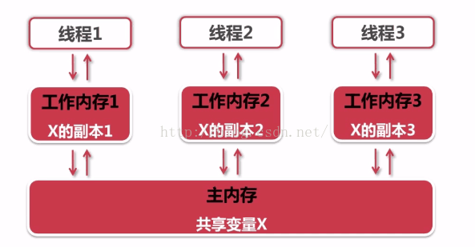
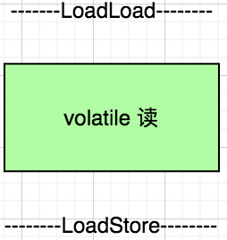
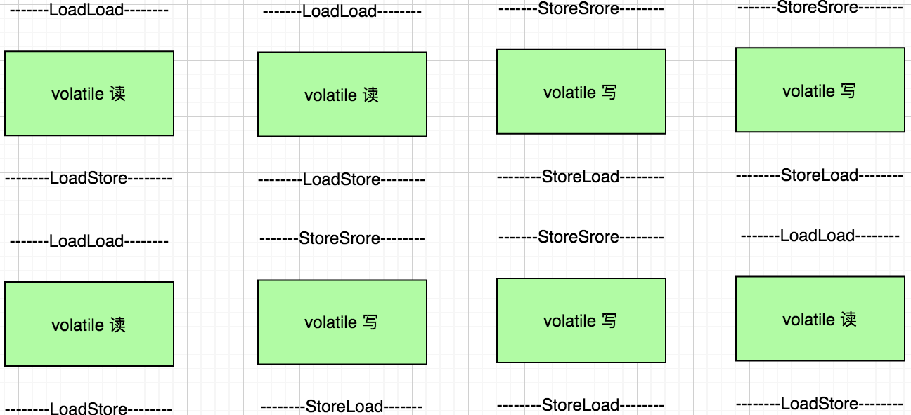

# Volatile 关键字

在多线程的领域中， volatile 关键字也是非常重要的。Volatile 在使用上具有以下特性

## 1.可见性：

B 线程能马上看到 A 线程更改的数据

先来看一个死循环的例子

创建 VolatileVisibilityDemo 类

```java
@Data
public class VolatileVisibilityDemo implements Runnable{
    private /*volatile*/ boolean isContinuePrintPrint = true;

    public void printStringMethodMethod(){
        try{
            while (Boolean.TRUE.equals(isContinuePrintPrint)) {
            }
            System.out.println("printStringMethodMethod stop");
        }catch (Exception e){
            // doNothing
        }
    }

    public void run() {
        printStringMethodMethod();
    }
}
```

创建测试类

```java
public class VolatileVisibilityDemoTest {
    public static void main(String[] args) {
        VolatileVisibilityDemo volatileVisibilityDemo = new VolatileVisibilityDemo();
        Thread thread = new Thread(volatileVisibilityDemo);

        thread.start();

        try {
            Thread.sleep(5000);
        } catch (InterruptedException e) {
            // doNothing
        }
        System.out.println("stop volatileVisibilityDemo method");
        volatileVisibilityDemo.setContinuePrintPrint(false);
    }
}
```

在程序运行一段时间后, 将循环条件 isContinuePrintPrint 置为 false, 终止循环。运行程序看下结果:

```text
start run printStringMethodMethod isContinuePrintPrint = true
stop volatileVisibilityDemo method
……

```

可以看到线程并没有结束, 一直在等待。 这是因为线程之间变量的不可见性。举个例子, 如图



每个线程都会各自开辟自己的工作空间并且会从主内从中拷贝一份共享变量到自己的工作内存中

假设此时这个系统刚好有两个线程同时运行：A、B, 这两个线程都会将从主内存中复制一份共享变量到自己的工作内存中, 共享变量的修改对于其他线程来说并不可见, 因此
线程没有被终止。

在《深入理解 Java 虚拟机》 一书中对于主内存与工作内存有这样的一段描述:

Java 内存模型规定了所有变量都存储在主内存中。每条线程具有自己的工作内存, 工作内存中保存了被该线程使用的变量的主内存副本, 线程对变量的所有操作都必须在
工作内存中进行, 而不能直接读写主存中的数据。同时不同线程之间也无法直接访问对方工作内存中的变量。

这也就导致了上述示例线程无法停止的原因。

当我们使用 volatile 修饰 isContinuePrintPrint 变量, 此时再次运行程序观察结果

```text
start run printStringMethodMethod isContinuePrintPrint = true
stop volatileVisibilityDemo method
printStringMethodMethod stop isContinuePrintPrint = false
```

可以看到线程结束了。使用 volatile关键字, 可以强制线程每次修改变量后要刷新到主存，线程每次都要从主内存中读取变量的值。

关于 volatile 变量的可见性需要注意：既然 volatile 变量对所有线程都是可见的，那么是不是基于 volatile 变量的运算在并发下线程是安全的。这句话的
前半部分是并没有错, 但是基于前半部分得出的结论是有问题。因为在 Java 中的运算操作符并非都是原子操作。下面验证一下 volatile 是否能保证 java 中
操作符的原子性

## 2.不保证原子性

即一个操作或者多个操作 要么全部执行并且执行的过程不会被任何因素打断，要么就都不执行。

```java
public class AtomicityDemo {
    public static volatile int race = 0;

    private static final int THREADS_COUNT = 20;

    public static void increase(){
        race++;
    }

    public static void main(String[] args) throws InterruptedException {
        Thread[] threads = new Thread[THREADS_COUNT];

        for(int i=0; i<THREADS_COUNT; i++){
            threads[i] = new Thread(new Runnable() {
                public void run() {
                    for (int i=0; i<1000; i++){
                        increase();
                    }
                }
            });
            threads[i].start();
        }

        // 等待所有累加线程都结束
        // idea 会自动创建一条名为 Monitor Ctrl-Break 的线程
        while (Thread.activeCount() > 2){
            Thread.yield();
        }


        System.out.println("race 的值为: " + race);
    }
}

```

运行结果：

```text
race 的值为: 19320
```

启动 20 个线程, 每个线程都对 race 变量进行 1000 次自增操作, 但是最终结果都是小于 20000。问题就在于 race++; 在启动参数中添加 
-XX:+UnlockDiagnosticVMOptions -XX:+PrintAssembly, 运行程序可以看到, race++ 并不是一个原子操作

```text
……
# 静态变量 race 的地址为 0x68, 将 race 的值赋值给 edi 寄存器
0x0000000111ac3e62: mov    0x68(%rsi),%edi    ;*getstatic race
                                            ; - com.anzhi.atomicity.AtomicityDemo::increase@0 (line 9)
# 将 edi 寄存器中的值加1
0x0000000111ac3e65: inc    %edi
# 再将 edi 值赋值给 race
0x0000000111ac3e67: mov    %edi,0x68(%rsi)
#带lock前缀的加指令，把rsp所指向的地址中值加0，这个指令没啥用，主要使用lock前缀做内存屏障的
#防止lock之后的指令在lock之前执行，这里没使用mfence指令，主要是mfence在某些情况下比lock效率慢
0x0000000111ac3e6a: lock addl $0x0,(%rsp)     ;*putstatic race
……

```
经过 4 条指令后, race 才完成了自加操作。 多线程下, 在执行 `lock addl $0x0,(%rsp)` 之前, race 的值可能已经被改变了, 
最终导致 race 的值小于 20000。要保证原子性, 最终还是需要加锁。

这里解释一下 lock 的作用: 

1. 在 lock 锁定的时候，如果操作某个数据，那么其他 CPU 核是不能同时操作的，即锁定了
2. lock 锁定的指令，不能上下文随意排序执行，必须按照程序上下顺序执行
3. 在 lock 锁定操作完毕之后，如果某个数据被修改了，那么需要立即告诉其他 CPU 这个值被修改了，使它们的缓存数据立即失效，需要重新到内存获取

### 解决 volatile 不保证原子性

1. 使用 synchronized 修饰方法(不要杀鸡用牛刀)

2. 使用 JDK 提供的 AtomicInteger

```java
public class AtomicityDemo {
    public static volatile int race = 0;

    private static final int THREADS_COUNT = 20;

    private static AtomicInteger atomicInteger = new AtomicInteger();


    public static void increase(){
        atomicInteger.getAndIncrement();
        race++;
    }

    public static void main(String[] args) throws InterruptedException {
        Thread[] threads = new Thread[THREADS_COUNT];

        for(int i=0; i<THREADS_COUNT; i++){
            threads[i] = new Thread(new Runnable() {
                public void run() {
                    for (int i=0; i<1000; i++){
                        increase();
                    }
                }
            });
            threads[i].start();
        }

        // 等待所有累加线程都结束
        // idea 会自动创建一条名为 Monitor Ctrl-Break 的线程
        while (Thread.activeCount() > 2){
            Thread.yield();
        }


        System.out.println("race 的值为: " + race + " atomicInteger= " + atomicInteger.get());
    }
}
```

输出结果为:

```text
race 的值为: 19484 atomicInteger= 20000
```

看下 JVM 代码汇编的结果:

```text

```

## 3.禁止指令重排序(有序性)

为什么会有指令重排:

就像多线程一样, CPU 运行效率相比于缓存、内存、硬盘 IO 之间效率有着指数级的差别。为了提高 CPU 的利用率, 提高计算机系统的性能, 才有了指令重排序的优化
思想。就像平时利用烧水的时间去洗菜, 利用洗衣服的时间去拖地一样。

### 三种重排序的场景

1.编译器重排序: 针对程序代码语而言，编译器可以在不改变单线程程序语义的情况下，可以对代码语句顺序进行调整重新排序。

2.指令集并行的重排序: 这个是针对于CPU指令级别来说的，处理器采用了指令集并行技术来讲多条指令重叠执行，如果不存在数据依赖性，处理器可以改变主句对应的
   机器指令执行顺序。
   
3.内存重排序: 因为CPU缓存使用 缓冲区的方式(Store Buffere )进行延迟写入，这个过程会造成多个CPU缓存可见性的问题，这种可见性的问题导致结果的对于
   指令的先后执行显示不一致，从表面结果上来看好像指令的顺序被改变了，内存重排序其实是造成可见性问题的主要原因所在。参考 CSDN 作者 givemefive_001
   指令重排一文中的例子:

3.1 Memory Bank 的划分:
一般 Memory bank 是按 cache address 来划分的。比如 偶数 adress 0×12345000 分到 bank 0, 奇数 address 0×12345100 分到 bank1

3.2 重排序分析：
理想的内存访问指令顺序：

CPU0 往 cache address 0×12345000 写入一个数字 1 。因为address 0×12345000 是偶数，所以值被写入 bank0.
CPU1 读取 bank0 address 0×12345000 的值，即数字1 。

CPU0 往 cache 地址 0×12345100 写入一个数字 2 。因为address 0×12345100 是奇数，所以值被写入 bank1.

CPU1 读取 bank1 address 0×12345100 的值，即数字2 。

重排序后的内存访问指令顺序：

CPU0 准备往 bank0 address 0×12345000 写入数字 1 。

CPU0 检查 bank0 的可用性。发现 bank0 处于 busy 状态。

CPU0 为了防止 cache 等待，发挥最大效能，将内存访问指令重排序。即先执行后面的 bank1 address 0×12345100 数字2 的写入请求。

CPU0 检查 bank1 可用性，发现bank1 处于 idle 状态。

CPU0 将数字2 写入 bank 1 address 0×12345100 。

CPU1 来读取 0×12345000 ，未读到 数字1 ，出错。

CPU0 继续检查 bank0 的可用性，发现这次 bank0 可用了，然后将数字1 写入 0×12345000 。

CPU1 读取 0×12345100 ，读到数字2 ，正确。

从上述触发步骤中，可以看到第 3 步发生了指令重排序，并导致第 6 步读到错误的数据。

通过对指令重排，CPU 可以获得更快地响应速度， 但也给编写并发程序的程序员带来了诸多挑战。

###volatile 的有序是通过 JVM 提供的四种基本的内存屏障保证。

1. LoadLoad 作用于：Load1；LoadLoad：Load2，确保 Load1 一定是在 Load2 以及其后的指令之前完成，在指令执行的时候，Load1 绝对不会到 Load2 之后执行；

2. StoreStore 作用于：Store1；StoreStore：Store2，确保 Store1 一定是在 Store2 以及其后的指令之前完成（同时，Store1 的写入数据会立即被其他 CPU 
看到，也就是可见性），在指令执行的时候，Store1 绝对不会到 Store2 之后执行；

3. LoadStore 作用于：Load1；LoadStore：Store2，确保 Load1 一定是在 Store2 以及其后的指令之前完成，并且 Load1 绝对不会到 Store2 之后执行；

4. StoreLoad 作用于：Store1；StoreLoad：Load2，确保 Store1 一定在 Load2 以及其后的指令之前完成，并且 Store1 绝对不会到 Load2 之后执行；

从以上的四种内存屏障说明中我们可以看到，volatile 的「有序性」会得到保证，并且 Store 指令也会保证「可见性」。

参考 《Createchance 的博客: 一次深入骨髓的 volatile 研究》:

在 JVM 内部实现 volatile 访问的时候都需要如下格式:



如上两个图描述 volatile 字段在读和写的时候需要的内存屏障操作，我们首先来看读操作，在读操作之前的 LoadLoad 屏障要求这个读操作之前的所有读
操作不能在这个读操作之后完成，必须按照上下顺序执行，读操作之后的 LoadStore 要求这个读操作不能在之后的写操作之后完成，必须在之前完成。同样的，
写操作前后的屏障也是定义了类似的有序性要求。对于上下文读写操作来说，无非就是如下几种组合：



### 指令重排的验证


